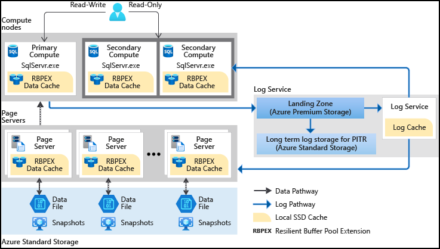
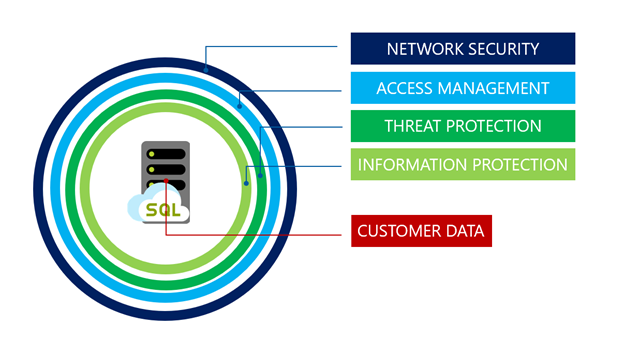
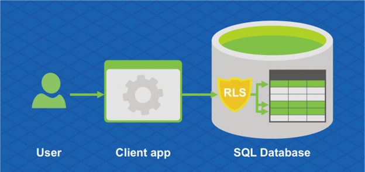
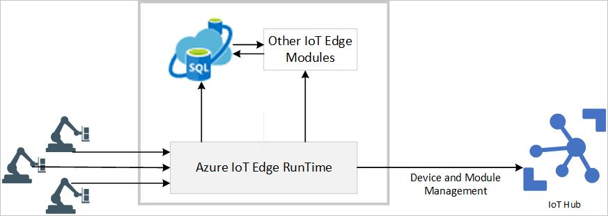
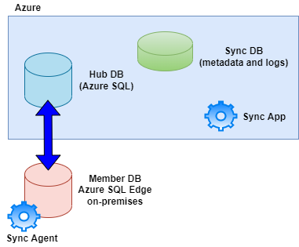

# Deploy IaaS Solutions with Azure SQL

**************************************

## IaaS options to deploy SQL Server in Azure

Many applications will require a VM running SQL Server for some reasons:

- Older version of SQL Server - for vendor supporting, runnig inside a VM is the best option.
- User of other SQL Server Services - many users maximize their licensing by running SQL Server Analysis Services, Integration Services, or Reporting Services on the same machine as the database engine.
- General application incompatibility - some applications may require aditional services to be co-located with the database instance in a manner that isn't compatible with a PaaS offering, like cross-database querying support.

IaaS allows the administrator to have more granular access over specific settings of the underlying infrastructure than other offerings. You have access to the virtual storage, virtual networking configuration, and might install any additional software within the virtual machine.

In SaaS offerings the administrator is responsible only for user security and data management. PaaS services, the operating system and other software are managed by the cloud provider. IaaS you are responsible for OS patching, optimal configuration of network and storage, and software configuration.

IaaS solutions, Microsoft will manage resources below the operating system, including physical servers, storage and physical networking. The database administrator is responsible for configuration of SQL Server instances running on the operating system.

Some applications may require specific operating conditions, including, specific combination of SQL Server and Windows version for vendor support purposes, or aditional software that needs to be installed alongside of SQL Server, which requires direct access to the underlying operating system. These applications may not be suited for PaaS offerings.

## SQL Server IaaS Agent Extension

When you deploy an SQL Server VM from the Azure Marketplace, part of the process installs the IaaS Extension.
Extensions are code that is executed on your VM post-deployment, to perform configurations. Some examples are installing anti-viruses, or installing Windows features. SQL Server IaaS Extension prodev the following features:

- Automated backup
- Automated patching
- Azure key vault integration
- Defender for Cloud portal integration
- View disk utilization in the portal
- Flexibe licensing
- Flexibe version or edition
- SQL best practices assesments

## SQL Server licensing models

There are differents options related to how SQL Server is licensed when using IaaS offering.

If your aren't participating in the Microsoft Software Assurance program, you can defloy an image from the Azure Marketplace containing a pre-configured SQL Server in a Pay as you Go model, the cost of the SQL Server license is included with the cost of the virtual machine.

If you are participating in the Microsoft Software Assurance:

- You can use the Pay as you Go model deploying a VM from the Marketplace
- You can Bring Your Own License (BYOL) when deployng a virtual machine that doesn't contain a pre-configured SQL Server instance. This option is possible when you already have a valid SQL Server license for on-premise infrastructure. This license can be applied to the virtual Machine, you must report the usage of licenses by using the License Mobility verification form within 10 day of implementing the virtual machine. When chosing this method you can manually install SQL Server through media you have obtained, or upload a virtual machine image to Azure.

Similar to applying SQL Server license you already purchased, there are also Windows Server licensing known as Azure Hybrid Benefit (AHB).

Reserving a virtual machine for one to three years provides another option for costing savings. This commitment doesn't require an upfront payment and can be billed monthly. This option is benefical if you know the workloads are going to be persisted. The cost savings can be significant, especially for larger VMs.

## Virtual machine families

When deploying virtual machines, there are serires, or "families" of sizes than can be selected. Each series is a combination of memory, CPU, and storage, allowing you to select an appropriate configuration for the expected workload.

- General purpose - Balanced ratio of CPU to memory, ideal for testing and development, small to medium database servers, and webservers with low to medium traffic.
- Computed optimized - High CPU-to-memory ratio, good for webservers with a medium traffic, network appliances, batch processes, application servers. Can also support machine learning that can't be benefit from GPU-based VMs.
- Memory optimized - High memory-to-CPU ratio, broad range of CPU and memory options (upt to 4TB of RAM), suited for database workloads.
- Storage optimized - provide fast, local, NVMe storage that is ephemeral. Good candidates for scale-out data workloads such as Cassandra. Is is possible to use them with SQL Server, however since the storage is ephemeral, you need to ensure you configure data protection using features like Always On Availability Groups or Log Shipping.
- GPU - graphics processing operations and massively parallel machine learning workloads.
- High performance compute - support applications that can scale horizontally to thousand of CPU cores. This support is provides by high-performance CPU and remote direct memory access (RDMA) networkingggggg that provides low latency communications between VMs.

## Azure Marketplace

Centralized location that provides the ability to create Azure resources based on a pre-designed template with a couple of clicks of the mouse and with some basic information. The disadvantage of using the portal to create Azure resources is that it is not an easily repeatable process.

## SQL Server Configuration

When provisioning SQL Server VM you can configure specific SQL Server settings such as, Security and Networking, SQL Authentication preferences, SQL instance setting and a few other options on the SQL Server settings tab.

## Understand hybrid scenarios

Implementinh a hybrid infraestructure is an excellent first step in evaluating cloud computing for organizations that have been traditionally on-premises and skeptical of the cloud. They hybrid SQL Server platform offers the benefits of both  on-premises and cloud services; it's a complimentary middle ground.
In addition to extending on-premises solutions, hybrid infraestructure may be applied to existing cloud solutions, enabling cloud-to-cloud hybrid implementations.

### Hybrid scenarios for SQL Server

#### Disaster Recovery

Is the most common scenario, organizations may distribute deployments across multiple data centers for failover in an on-premises approach. The cost of spinning up Azure SQL Server virtual machines in various geographical regions is much less than estabilishing a new physical data center in another geography. In the approach Azure is used for DR failover while the regular day-to-day processing continues to use on-premises servers fol local high availability.


#### SQL Server Backups

Is another common hybrid scenario, backups may be done directly into Azure Storage via URL or Azure file share (SMB). This scenario protects against data loss when on-site backup storage fails. These backups may be restored to virtual machines in Azure and tested as part of Disaster Recovery procedures.
Another scenario uses Azure Storage to store on-premises SQL Server data files for user databases. In the case of local storage failure, user files are safely stored in the cloud. For this hybrid scenario, it's essential to keep the network communication secure, evaluate the network latency, and ensure the storage account is locked down using ACLs and Azure AD.

#### Azure Arc enabled SQL Servers

Extends and centralizes Azure management services to SQL Server instances hosted on-premises, in your data centers, on the edge, and in multicloud environments. In this hybrid scenario, Azure Arc enables the inventory of all registered SQL Server deployments, assesses their configurations, usage patterns and security to provide actions and recommendations based on best practices. By using Azure Arc enabled SQL Servers, you gain the benefits of centralized server management, Azure Defender real-time security alerts and vulnerability reporting on both on-premises SQL Server and their hosting operating system, and Azure Sentinel that can provide more security threat introspection.


#### Security considerations

When deploying a hybrid SQL solution, all core infrastructure, such as Active Directory and DNS, must exist on-premises and in Azure. In addition, secure two-way communication must exist between the on-premises network and Azure. This secured communication can take form of a site-to-site (S2S) VPN or a dedicated ExpressRoute.
When evaluating different connectivity methods, it's vital to determine the amount of latency acceptable for you organization.

S2S VPN solution tends to cost less, however with this solution, all communications occurs over the public internet and  is limited by the organization's internet speeds.


ExpressRoute tends to be mory costly, provides the best security and lowest latency as all communications flows over a direct secured channel independent of the public internet. However, common detractors for this solutions include overall cost and the inability to apply ExpressRoute between cloud providers in a multicloud solution.

## Performance and security

Azure offers several performance and security options for SQL Server VM.

### Storage considerations

SQL Server requires good storage performance to deliver robust application performance. While Azure offers various types of starage (blob, file, queue, table) in most cases SQL Server workloads will use Azure managed disks. The exceptions are that a Failover Cluster Instance can be build on file storage and backups will use blob storage. Managed disks act as a block-level storage device and offer 99.999% availability, scalable deployment (up to 50.000 disks per subscription per region), integration with availability sets and zones to offer resiliency in case of failure.

Managed disks offer two types of encryption. Azure Server-side encryption is provided by the storage service and acts as encryption-at-rest provided by the storage service. Azure Disk Encryption usus BitLocker on Windows, and DM-Crypt on Linux to provide OS and Data disk encryption inside of the VM. Both integrate with Azure Key Vault and allow to bring your own encrytion key.

Each VM will have at least two disks:

- Operating System disk - Each VM will require an operating system disk that contains the boot volume. This disk would be the C: drive on Windows and /dev/sda1 on Linux. The operating system are installed automatically.
- Temporary disk- Each VM will include one disk for temporary storage. Intended to be used for data that doesn't need to durable, such as page or swap files. You shouldn't use it for storing critical information like database or transaction log files, they'll be lost during maintenance or a reboot. This drive will be mounted as D: on Windows and /dev/sdb2 on Linux.
- Dat disks - You should add additional data disks to you VMs running SQL Server. The term data disk is used in the Azure portal, but these are just additional managed disks added to a VM. These disks can be pooled to increase IOPs and storage capacity, using Storage Spaces on Windows or Logical Volume Management on Linux.

Types of disk:

| Feature | Ultra Disk | Premium SSD | Standard SSD | Standard HDD |
| ------- | ---------- | ----------- | ------------ | ------------ |
| Disk type | SSD | SSD | SSD | HDD |
| Best for | IO-intensie workload | Performance sensitive workload | Lightweight workloads | Backup, non-critical workloads |
| Max disk size | 65.536 GiB | 32.767 GiB | 32.767 GiB | 32.767 GiB |
| Max throughput | 2000 MB/s | 900 MB/s | 750 MB/s | 500 MB/s |
| Max IOPS | 160.000 | 20.000 | 6.000 | 2.000 |

The best practices for SQL on Azure recommend using Premium Disks pooled for increased IOPs and storage capacity. Data files should be stored in their own pool with read-caching on the Azure disks.

Transaction log files won't benefit from this caching, so those files should go into their own pool without caching. TempDB can optionally go into its own pool, or using the VMs temporary disks, which offers low latency sincy it's physically attached to the physical server. Properly configured Premium SSD will see latency in single digit milliseconds. For mission critical workload that require latency lower that that, you should consider Ultra Disks.

### Security considerations

Azure complies with several industry regulations and standard with make possible to build a compliant solution with SQL Server VM.

#### Microsoft Defender for SQL

Provides Azure Security Center security features such as vulnerability assesments and security alerts.
Used to identify and mitigate potential vulnerabilities in your SQL Server instance and database.

#### Azure Security Center

Unified security management system that evaluates and offers opportunities for improving security aspects of your data environment. Provides a view of the security health af all your hybrid cloud assets.

### Performance considerations

Most of the existing on-premises SQL Server performance features are available on Azure VMs. Among the options is data compression, which can improve the performance of IO-intensive workloads while decreasing the size of the database. Similarly, table and index partitioning improve query performance of large tables, improving performance and scalability.

#### Table partitioning

Provides many benefits, but is only considered when the table becomes large enough that starts compromising query performance. Identifying which tables are candidate for table partitioning is a good practice. When you filter your data using your partition column, only a subset of the data is accessed. Maintenance operations on a partitioned table will reduce maintenance duration, for example compressing data in a particular partition or rebuilding specific partitions of an index.

There are for main steps required to define a table partition:

- Filegroups creation - defines the files involver when the partitions are created.
- Partition function creation - defines the partition rules based on the specified column.
- Partition scheme creation - defines the filegroup of each partition
- Table to be partitioned

```
CREATE PARTITION FUNCTION PartitionByMonth (datetime2)
    AS RANGE RIGHT
    FOR VALUES ('20210101', '20210201', '20210301',
    '20210401', '20210501', '20210601',
    '20210701', '20210801', '20210901',
    '20211001', '20211101', '20211201');

-- create partition schme that use the partition function PartitionByMonth, and assign each partition to a specific filegroup.
CREATE PARTITION SCHEME PartitionByMonthSch
    AS PARTITION PartitionByMonth
    TO (FILEGROUP1, FILEGROUP2, FILEGROUP3, FILEGROUP4' FILEGROUP5, FILEGROUP6, FILEGROUP7, FILEGROUP8, FILEGROUP9, FILEGROUP10, FILEGROUP11, FILEGROUP12);

-- creates a partitioned table called order  that applies PartitionByMonthSch to the OrderDate column
CREATE TABLE Order ([Id] int PRIMARY KEY, OrderDate datetime2)
    ON PartitionByMonthSch (OrderDate);
    
GO
```

#### Data compression

SQL Server stores compressed data on 8KB pages, when data is compressed, more rows of data can be stored on a give page, which allows the query to read fewer pages. Reading fewer pages has twofold benefit: 

- reduces the amount of physical IO performed
- allows more rows to be stored in the buffer pool, making more efficient use of memory.

Enabling database page compressing is recommended where appropriate.

The tradeoffs to compression are that it does require a small amount of CPU overhead, however the storage IO benefits far outweigh any additional processor usage.

Compression is implemented at the object level. Each index or table can be compressed individually, and you have the option of compressing partitions within a partitioned table or index. You can evaluate how much space you'll save by using the sp_estimate_data_compression_savings system stored procedure. Prior to SQL Server 2019, this procedure didn't support columnstore indexes, or columnstore archival compression.

- Row compression - doesn't incur much overhead, however, it doesn't offer the same amount of compression that page compression may offer. Stores each value in each column in a row in the minimum amount of space needed to store that value. It uses a variable-lenght storage format for numeric data types and it stores fixed-lenght character string using variable lenght format.
- Page compression - a superset of row compression, all pages will initially be row compressed prior applying the page compression. Then a combination of techniques called prefix and dictionary compression are applied to the data. Prefix compression eliminates redudant data in a single column, storing pointers back to the page header. After that step, dictionary compression searches for repeated values on a page and replaces them with pointers, further reducing storagee. The more redundancy in your data, the greater the space savings when you compress your data.
- Columnstore archival compression - columnstore objects are always compressed, however they can be further compressed using archival compression, which uses the Microsoft XPRESS compression algorithm on the data. This typo of compression is best used for data that is infrequently read, but needs to be retained for regulatory or business reasons. While this data is further compressed, the CPU cost of decompression tends to outweigh any performance gains from IO reduction.

### Aditional options

List of additional SQL Server features and actions to consider for production workloads:

- Enable backup compression
- Enable instant file initialization for data files
- Limit autogrowth of the database
- Disable autoshrink/autoclose for the databases
- Move all databases to data disks, including system databases
- Move SQL Server error log and trace file directories to data disks
- Set max SQL Server memory limit
- Enable lock pages in memory
- Enable optimize for adhoc workloads for OLTP heavy environments
- Enable Query Store
- Schedule SQL Server Agent jobs to run DBCC CHECKDB, index reorganize, index rebuild, and update statistics jobs
- Monitor and manage the health and size of the transaction log files

## High availability and disaster recovery options

Availability Zones and Availability Sets protect your workloads from planned maintenance activity and potential hardware failures.

### High availability options

Most SQL Server high availability solutions are available on Azure VMs.

#### Availability Zones

Unique physical locations within a region. Each zone is made up of one or more data centers equipped with independent power, cooling, and networking. Within regions that support Availability Zones, you con specify in which zone you wants the VM to reside. There are three Availability Zones within each supported Azure region.
Availability Zones provide high availability against data center failures when you deploy multiple VMs into different zones. They also provide a means for Microsoft to perform maintenance (using a grouping called update domain) within each region by only updating one zone at any given time. Availability Zones in conjunction with Azure VMs raises your uptime to 99.99% which equates to a maximum of 52.60 minutes of downtime per year.


#### Availability Sets

Are similar to Availability Zones, except instead of spreading workloads across data centers in a region, they spread workloads across servers and racks in a data center. Since nearly all workloads in Azure are virtual, you can use availability sets to guarantee that the two VMs containing you Always On Availability Group members are not running on the same physical host. Provide up to 99.95% availability, and should be used when Availability Zones are unavailable in a region, or an application cannot tolerate intra-zone latency.

### Always On availability groups (AG)

Can be implemented between two or a maximum of nine SQL Server intances runnig on Azure VMs across on-premises data center and Azure. In an availability group, database transactions are committed to the primary replica, and then the transactions are sent either synchronously or asynchronously to all secondary replicas. The physical distance between the servers dictates which availability mode you should choose. Generally, if the workload requires the lowest possible latency or the secondary replicas are geographically spread apart, asynchronous availability mode is recommended. If the replicas are within the same Azure region and the applications can withstand some level of latency, synchronous commit mode shoud be considered.
Synchronous mode will help to ensure that each transaction is committed to one or more secondaries before allowing the application to continue. Always On availability groups provide both high availability and disaster recovery, because a single availability group can support both synchronous and asynchronous availability modes. The unit of failover for an availability group is a group of databases, and not the entire instance.

Always On Availability Groups can also be used for disaster recovery. You can implement up to nine replicas of a database across Azure regions, and strech this architecture even further using Distributed Availability Groups. Availability Groups ensure that a viable copy of your databases is in another location beyound the primary region. 

Always On Availability Group, running on a Windows Server Failover Cluster. The unit of failver is the group of databases and not the instance. While a failover cluster instance provides HA at an instance level, it doesn't provide disaster recovery


#### SQL Server Failover Cluster instances

If you need to protect the entire instance, you could use a SQL Server Failover Cluster (FCI) which provides high availability for an entire instance, in a single region. A FCI doesn't provide disaster recovery without being combined with another feature like availability groups or log shipping. FCI require shared storage that can be provided on Azure by using shared file storage or using Storage Spaces Direct on Windows Server.

For Azure workloads, availability groups are the preferred solution for newer deployments because the shared storage require of FCIs increases the complexity of deployments. However, for migrations from on-premises solutions, an FCI may be required for application support.

### Disaster Recovery options

There are two components to protect in case of disaster. First, there are Azure platform options like ger-replicated storage for backups and Azure Site Recovery which is a disaster recovery solution for all of your workloads. Second, there are SQL Server specific offerings like Availability Groups and backups.

#### Native SQL Server backups

With SQL Server VM you have granular control of when backups occur and where they're stored. You can use SQL agent jobs to back up directly to a URL linked to Azure blob storage. Azure provides the options to use geo-redundant storage (GRS) or read-access geo-redundant storage (RA-GRS) to ensure that your backup files are stored safely across geographic regions.

Additionaly as part of the Azure SQL VM service provider, you can have your backups automatically managed by the platform.

#### Azure Backup for SQL Server

Requires an agent to be installed on the VM. The agent then communicates with an Azure service that manages automatic backups of your SQL Server databases. Also provides a central location that you can use to manage and monitor the backups to ensure meeting any specified RPO/RTO metrics.

Azure Backups solution is an enterprise backup solution that provides long-term data retention, automated management, and additional data protection. This option cost more, but offer a more complete backup feature set.


#### Azure Site Recovery

Low-cost solution that will perform block level replication of your Azure VM. Offers various options, including the ability to test and verify you disaster recovery strategy. Best used for stateless environments versus transactinal database virtual machines.

Is supported for use with SQL Server, but you will need to set a higher recovery point which means potential loss.

1. VM is registered with Azure Site Recovery
2. Data is continously replicated to cache
3. Cache is replicated to the target storage account
4. During failover the virtual machine is added to the target environment


# Deploy PaaS solutions with Azure SQL

**************************************

## PaaS options fol deploying SQL Server in Azure

PaaS provides a complete development and deployment environment which can be used for simple cloud-based apps as well as for advanced entreprise apps.

- Azure SQL Database - build upon SQL Server engine in the cloud. It gives flexibility in building new application services, and granular deployment options at scale. Offers a low maintenance solution.
- Azure SQL Managed Instance - it is best for migration scenarios to che cloud as it provides fully manageds services and capabilities.

### Deployment models

Azure SQL Database is available in two deployment models:

- Single database - is billed and managed on a per database level. You manage each database individually from scale and data size perspective. Each database has its own dedicated resources, even if deployed to the same logical server.
- Elastic Pools - a group of databases that are managed together and share a common set of resources. Provides a cost-efective solution for SaaS application model, since resources are shared between all databases. You can configure resources either on DTU-based or vCore-based purchasing model.

### Purchasing model

#### Database Transaction Unit (DTU)

Are calculated on a formula combining compute, storage, and I/O resources. It is a good choice for who want simple, preconfigured resource options.

Comes in several service tiers, such as Basic, Standard and Premium. Each tier has varying capabilities, providing a wide range of options.

In terms of performance, the Basic tier is used for less demanding workloads, while Premium is used for intensive workloads.

Compute and storage are dependent on the DTU level, and they provide a range of performance at capabilities at a fixed storage limit, backup retention, and cost.

DTU purchasing model is only supported by Azure SQL Database.

#### vCore

Allows you to purchase a specified number of vCores based on your given workloads. It is the default purchasing model for Azure SQL Database. vCore databases have a specific relationship between the number of cores and the amount of memory and storage provided to the database. It is supported by either Azure SQL Database and Azure SQL Managed Instance.

You can purchase in three different service tiers:

- General Purpose: it is backed by Azure premium storage, it will have higher latency than Business Critical. Provides two compute tiers:
  - Provisined - Compute resources are pre-allocated. Billed per hour based on vCores configured.
  - Serveless - compute resources are auto-scalled. Billed per second basend on vCores used.
- Business Critical - it is for high performing workloads, offering the lowest latency. It is backed by local SSDs, instead of Azure blob storage. Offers the highest resilience to failure and provides buit-in read-only database replica, that can be used to off-load reporting workloads.
- Hyperscale - it can scale beyond the 4 TB limit, supports databases of up to 100 TB.

### Serverless

A compute tier that will automatically scale up or down the resources for a given database based on workload demand. If the workload no longer requires compute resources, the database will become "paused" and only storage is billed during the period the database is inactive. When a connection attempt is made, the database will "resume" and become available.


The autopause delay has a min value of 60 minutes and a max value of seven days.

Any applications using serverless should be configured to handle connection errors and include retry logic.

Another difference between serverless and provisioned vCore model is that with serverless you can specify a min and max number of vCores. Memory and I/O limits are proportional to the range that is specified. You can select a minimum of a half of a vCore and a maximum of 16 vCores.

Serverless in not fully compatible with all features in Azure SQL Database since some of them require background processes to run at all times, such as:

- Geo-replication
- Long-term backup retention
- A job database in elastic jobs
- The sync database is SQL Data Sync

Serverless is currently only supported in General Purpose tier.

### Backups

In PaaS offering, backups are performed automatically without any intervertion. Backups are stored in Azure bob geo-redundant storage and by default are retained for between 7 and 35 days, based on the service tier of the database. Basic and vCore databases default to seven days of retention, and on vCore database this value can be adjusted by the administrator. The retention time can be extended by configuring long-term retention (LTR), wich would allow you to retain backups for up to 10 years.

In order to provide redundance, you are able to use read-accessible geo-redundant blob storage (RA-GRS). This storage would replicate your database backups to a secondary region. It would also allow you to read from that secondary region if needed.

Manal backups of databases are not supported, and the platform will deny any request to do so.

Database backups are taken on a given schedule:

- Full - once a week
- Differential - every 12 hours
- Log - every 5-10 minutes depending on transaction log activity

This backup schedule should meet the needs of most recovery point/time objectives (RPO/RTO), however, each customer should evaluate wheter they meet your business requirements.

Due to nature of PaaS, you cannot mannually restore a database using conventional methods, such as issuing the T-SQL command RESTORE DATABASE.

It is not possible to restore over an existing database. The existing database must be dropped or renamed prior to inintiating the restore process. Depending on the platform service tier, restore times are not guaranteed and could fluctuate. It is recommended that you test the restore process the obtain a baseline metric on how long a restore could take.

The restore options available are:

- Restore using the Azure portal - you have the option of restoring to the same Azure SQL Database server, or can create a new database on a new server in any Azure region.
- Restore using scripting Languages - can utilize both PowerShell and Azure CLI

Copy-only backup to Azure blob storage is available only for SQL Managed Instance

### Active geo-replication

It's a business continuity feature that asynchronously replicates a database to up to four secondary replicas. As transactions are committed to the primary (and its replicas within the same region), the transactions are sent to the secondaries to be replayed. Because this communication is done asynchronously, the calling applications does not have to waity the secondary replica to commit the transaction prior to SQL Server returning control to the caller.

The secondary databases are readable and can be used to offload read-only workloads, thus freeing up resources for transactional workloads on the primary or placing data closer to the end users. Secondary databases can be in the same region as the primary or in another Azure region.

With geo-replication you can initiate a failover either manually by the user or from the application. If a failover occurs, you will need to update the application connection strings to reflect the new endpoint.

#### Failover groups

Are built on top of the technology used in geo-replication, but provide a single endpoint for connection, which can be utilized to route traffic to the appropriate replica. Your application can then connect after a failover without connection string changes.

### Deploying Azure SQL Database via PowerShell/CLI

PowerShell example where you are creating a new resource group, and defining an admin called SqlAdmin and then creating a new server, database, and firewall rule.

```
# Connect-AzAccount

# The SubscriptionId in which to create these objects
$SubscriptionId = ''

# Set the resource group name and location for your server
$resourceGroupName = "myResourceGroup-$(Get-Random)"
$location = "westus2"

# Set an admin login and password for your server
$adminSqlLogin = "SqlAdmin"
$password = "ChangeYourAdminPassword1"

# Set server name - the logical server name has to be unique in the system
$serverName = "server-$(Get-Random)"

# The sample database name
$databaseName = "mySampleDatabase"

# The ip address range that you want to allow to access your server
$startIp = "0.0.0.0"
$endIp = "0.0.0.0"

# Set subscription
Set-AzContext -SubscriptionId $subscriptionId

# Create a resource group
$resourceGroup = New-AzResourceGroup -Name $resourceGroupName -Location $location

# Create a server with a system wide unique server name
$server = New-AzSqlServer -ResourceGroupName $resourceGroupName `
 -ServerName $serverName `
 -Location $location `
 -SqlAdministratorCredentials $(New-Object -TypeName System.Management.Automation.PSCredential -ArgumentList $adminSqlLogin, $(ConvertTo-SecureString -String $password -AsPlainText -Force))

# Create a server firewall rule that allows access from the specified IP range

$serverFirewallRule = New-AzSqlServerFirewallRule -ResourceGroupName $resourceGroupName `
 -ServerName $serverName `
 -FirewallRuleName "AllowedIPs" -StartIpAddress $startIp -EndIpAddress $endIp

# Create a blank database with an S0 performance level

$database = New-AzSqlDatabase -ResourceGroupName $resourceGroupName `
 -ServerName $serverName `
 -DatabaseName $databaseName `
 -RequestedServiceObjectiveName "S0" `
 -SampleName "AdventureWorksLT"
 ```

 The Azure CLI can also be used

 ```
 #!/bin/bash

# set execution context (if necessary)
az account set --subscription <replace with your subscription name or id>

# Set the resource group name and location for your server
resourceGroupName=myResourceGroup-$RANDOM
location=westus2

# Set an admin login and password for your database
adminlogin=ServerAdmin
password=`openssl rand -base64 16`

# password=<EnterYourComplexPasswordHere1>

# The logical server name has to be unique in all of Azure 
servername=server-$RANDOM

# The ip address range that you want to allow to access your DB
startip=0.0.0.0
endip=0.0.0.0

# Create a resource group
az group create \
 --name $resourceGroupName \
 --location $location

# Create a logical server in the resource group
az sql server create \
 --name $servername \
 --resource-group $resourceGroupName \
 --location $location \
 --admin-user $adminlogin \
 --admin-password $password

# Configure a firewall rule for the server

az sql server firewall-rule create \
 --resource-group $resourceGroupName \
 --server $servername \
 -n AllowYourIp \
 --start-ip-address $startip \
 --end-ip-address $endip

# Create a database in the server
az sql db create \
 --resource-group $resourceGroupName \
 --server $servername 
 --name mySampleDatabase \
 --sample-name AdventureWorksLT \
 --edition GeneralPurpose \
 --family Gen4 \
 --capacity 1 \

# Echo random password
echo $password
```

Another method for deploying resources is using an Azure Resource Manager template. Microsoft provides a GitHub repository called “Azure-Quickstart-Templates”, which hosts Azure Resource Manager templates that you can reference.

```
#Define Variables for parameters to pass to template
$projectName = Read-Host -Prompt "Enter a project name"
$location = Read-Host -Prompt "Enter an Azure location (i.e. centralus)"
$adminUser = Read-Host -Prompt "Enter the SQL server administrator username"
$adminPassword = Read-Host -Prompt "Enter the SQl server administrator password" -AsSecureString
$resourceGroupName = "${projectName}rg"

#Create Resource Group and Deploy Template to Resource Group
New-AzResourceGroup -Name $resourceGroupName -Location $location

New-AzResourceGroupDeployment -ResourceGroupName $resourceGroupName `
 -TemplateUri "https://raw.githubusercontent.com/Azure/azure-quickstart-templates/master/101-sql-logical-server/azuredeploy.json" `
 -administratorLogin $adminUser -administratorLoginPassword $adminPassword

Read-Host -Prompt "Press [ENTER] to continue ..."
```

### Deploy SQL Database elastic pool

Elastic pools are a deployment option in which you purchase Azure compute resources (CPU, memory, storage) that is shared among multiple databases defined as belonging to the same pool. An comparison to an on-promises SQL Server is that elasitc pool is like a SQL Server instance that has multiple user databases. 

#### Managing pool resources

The Azure portal delivers information regarding the state and health of the elastic pool, you can view resource utilization and see which database is consuming the most resources. This information can be helpful for diagnosing performance issues or identity a database that might not be a good fit for the pool, such as when one database is consuming the majority of pool resources.

You can decrease or incresae resources allocated to the pool via the Configure option in the Pool settings.

You can adjust:

- Pool size including DTUs, vCores, and storage size.
- Service Tier
- Resources por database
- Which databases are included in the pool, by adding or removing them.

Elastic pool is a good fit for multi-tenant databases where each tenant has its own copy of the database, with even resource utilization.

### SQL database hyperscale

Azure SQL Database has been limited to 4 TB of storage per database. Azure SQL Database Hyperscale allows databases to be 100 TB or more. Hyperscale introduces new horizontal scaling techniques to add compute nodes as the data sizes grow. The cost of Hyperscale is the same as the cost of Azure SQL Database, however, there's a per terabyte cost for storage. Once an Azure SQL Database is converted to Hyperscale, you can't convert it back.

Hyperscale separates the query processing engine, where the semantics of various data engines diverge, from the components that provide long-term storage and durability for the data. In this way, storage can be scaled out as needed.

The Hyperscale service tier in Azure SQL Database is available in the vCore-based purchasing model.

#### Benefits

Hyperscale databases aren't created with a defined max size. A Hyperscale database grows as needed, and you're billed for the capacity you use. For read-intensive workloads, it provides rapid scale-out by provisioning extra replicas as needed for offloading read workloads.

The time required to create database backup or to scale up or down is no longer tied to the volume of data in the database. Hyperscale databases can be backed up instantanously and can scale a database in the tens of terabytes up or down in minutes. Hyperscale also provides fast database restores which run in minutes rather than hours or days.

Provides rapid scalability:

- Scaling Up/Down - you can scale up the primary compute size in terms of resources like CPU and memory, and then scale down, in constant time. Because storage is shared, scaling up and down ins't linked to the volume of data in the database.
- Scaling In/Out - you can provision one or more compute replica as read-only replicas to offlead read workload from the primary compute. these replicas also serve as hot-standbys to failover from the primary. Provisioning these extra compute replicas can be done in constant time and is an online operation. You can connect to read-only replicas by setting the ApplicationIntent argument on your connection string to ReadOnly. Any connections with the ReadONly application internt are automatically routed to one the de read-only replicas.

Hyperscale separates the query processing engine from the components that provide long-term storage and durability for the data. This architecture provides the ability to scale storage capacity as far as needed (initial target is 100 TB) and the ability to scale compute resources rapdly.



#### Security considerations

Hyperscale shares the same security capabilities as other Azure SQL Databases tiers, They're protected by the layered defense-in-depth approach.



- Network Security - the firs layer of defense, uses IP firewall to allow access based on the originating IP address and  Virtual Network firewall rules to allow the ability to accept communications that are sent from selected subnets inside a virtual network.
- Access Management - provides through authetication methods to ensure a user is whom they claim to be:
  - SQL Authentication
  - Azure Active Directory Authentication
  - Windows Authentication for Azure AD Principals

Hyperscale also supports Row-level security that enable users to control access to row in a database tables based on the characteristics of the user executing a query.



- Threat Protection - abilities in auditing and threat detection capabilities. Tracks database activities and helps maintian compliance with security standards by recording database events to an audit log in a Azure storage account. Advanced Threat Protection can be enabled per server for an extra fee and analyzes logs to detect unusual behavior and potentially harmful attempts to access or exploit databases. Alerts are created for suspicious activities such as SQL injection, potential data infiltration, and brute force attacks or for anomalies in access patterns catch privilege escalation and breached credentials use.
- Information Protection - provided in the following ways:
- TLS (Encryption-in-transit)
- Transparet Data Encryption(Encryption-at-rest)
- Key management with Azure Key Vault
- Always Encryted (Encryption-in-use)
- Dynamic data masking

#### Performance considerations

Hyperscale is intended for users who have large on-premises SQL Server databases and want to modernize their applications by moving to the cloud, or for users who are already using Azure SQL Database and want to significantly expand the potential for database growth. It is also intended for users who seek both high performance and high scalability.

Hyperscala performance capabilities:

- Nearly instantaneous database backups (based on file snapshots stored in Azure Blob storage) regardless of size with no IO effect on compute reources.
- Fast database restore (based on file snapshots) in minutes rather than hours or days (not a size data operation).
- Higher overall performance due to higher transaction log throughput and faster transaction commit times regardless of data volumes.
- Rapid scale out - you can provision one or more read-only replicas for offloading read workloads and for use as hot-standbys
- Rapid scale up - you can in constant time, scale up compute resources to accommodate heavy workloads when needed, and the scale down when not needed.

SQL Database Hyperscale doesn't support:

- SQL Managed Instance
- Elastic Pools
- Geo-replication
- Query Performance Insights

### SQL managed instance

Azure SQL Managed Instance is a fully functional SQL Server instance that is almost 100% compatible with on-premises ecosystem. It includes features like SQL Agent, access to tempdb, cross-database query and common language runtime (CLR). The service uses the same infrastructure as Azure SQL Database and all the benefits of the PaaS service such as automatic backups, automatic patching, and built-in high availability.

#### Azure SQL Managed Instance features

Azure SQL Managed Instance allows for easy migration path for existing applications by allowing restore from on-premises backups. It provides an entire SQL Server instance, allowing up to 100 databases, and providing access to the system databases. It also provides features that aren't available in Azure SQL Database, including cross-database queries, CLR and along with the msdb system database, it allows the use of SQL Agent.

#### Options

Managed instance is purchased using the vCore model and is available in two service tiers, Business Critical and General Purpose. There are minimal functionality differences between them, the main two are that Business Critical includes In-Memory OLTP and offers a readable secondary, neither of which is available with the General Purpose tier. Both tiers offer the same levels of availability and allow for independent configuration of storage and compute.

#### Link feature

Link feature provides hybrid capability of replicating databases from SQL Server instances to Azure SQL Managed Instance. It replicates data using distributed availability groups available on Always On availability group technology. Transaction log records are replicated as part of distributed availability groups.

The transaction log records on the primary instance can't be truncated untill they've been replicated to the secondary instance. Regular transaction log backups reduce the risk of running out of space on your primary instance.

Link feature can also be used as a hybrid disaster recover solution, where you can fail over your SQL Server databases hosted anywhere to a database running on SQL Managed Instance. Likewise, you can use link feature to provide a read-only secondary database in SQL Database to offload intensive read-only operations.

#### Instance pool

Instance ppol provides a cost-efficient way to migrate smaller SQL Server instances to the cloud. Instead of consolidating smaller databases into a larger managed instance, which requires extra governance and security planning, instance pools allow you to pre-provision your resources based on your total migration resources and requirements.

The instance pool provides a fast deployment time of up to five minutes, which is a good option for scenarios where deployment duration is important. All instances in a pool share the same virtual machine, and the total IP allocation is independent of the number of instances deployed.

#### High availability

Azure SQL Managed Instance offers 99.99% availability Service Level Agreement (SLA). The architecture is the same as Azure SQL Database with Genepal Purpose, which uses storage replication for availability, and Business critical using multiple replicas.

#### Backups

Backups are automatically configured for Azure SQL Managed Instance. One key difference between Azure SQL Managed Instance and Azure SQL Databases is that with Managed Instance you can manually make a copy-only backup of a database. You must back up to a URL, as access to the local storage ins't permissible. You can also configure long-term retention (LTR) for retaining automatic backups for up to 10 years in geo-redundant Azure blob storage.

Database backups occur on the same schedule as with Azure SQL Database

- Full - once a week
- Differential - every 12 hours
- Transaction Log - every 5-10 minutes depeding on transaction log usage

Restory a database to an Azure SQL Managed Instance is also similar to the process with Azure SQL Database.
You can use:

- Azure portal
- PowerShell
- Azure CLI

There are some limitations when restoring. In order to restore from one instance to another, both instances must reside within the same Azure subscription and the same Azure region. You can't restore the entire managed instance, only individual databases within the SQL Managed Instance itself.

You can't restore over an existing database. You need to drop or rename prior to restoring it from backup. Since SQL Managed Instance is a fully functional SQL Server instance, you can execute a RESTORE command. However there are some limitations:

- You must restore from a URL endpoint. You don't have access to local drives.
- You can use the following options
  - FILELISTONLY
  - HEADERONLY
  - LABELONLY
  - VERIFYONLY
- Backup files containing multiple log files can't be restored
- Backup files containing multiple backup sets can't be restored
- Backup containing In-Memory/FILESTREAM can't be restored.

By default, the databases in a managed instance are encrypted using Transparent Data Encryption (TDE) with a Microsoft managed key. In order to take a user-initiated copy only backup, you must turn off TDE for the specific database. If a database is encrypted, you can restore it, however, you'll need to ensure that you have access to either the certificate or asymmetric key that was used to encrypt the database. If you don't have either of those two items, you won't be able to restore the database.

#### Disaster recovery

Azure SQL Managed Instance offers auto-failover groups as a means to implement disaster recovery. This feature protects the entire managed instance and all of the databases contained within it, not just specific databases. This proccess asynchronously replicates data from the Azure SQL Managed Instance to a secondary, however, it's currently limited to the paired Azure region of the primary copy, and only one replica is allowed.

Auto-failover groups offer read-write and read-only listener endpoints, which facilitate easy connection string management. If there is a failover, application connection strings will automatically be routed to the appropriate instance. These endpoints follow a slightly different format, ``` <fog-name>.zone_id.database.windows.net whereas Azure SQL Database is in the <fog-name>.secondary.database.windows.ne ``` format.

Each managed instance, primary and secondary, must be within the same DNS zone. This placement will ensure that the same multi-domain certificate can be used for client connection authentication between either of the two instances in the same failover group.

### Azure SQL Edge

Azure SQL Edge is an optimized relational database engine purposefully designed for IoT workloads. It provides capabilities to stream, process, and analyze relational and non-relational data such as JSON, graph, and time-series data. Azure SQL Edge is built on the latest version of the SQL Server Database Engine. Azure SQL Edge brings T-SQL programming, industry-leading performance, security, and query processing capabilities to the Edge.



#### Beneficts

##### Familiar T-SQL syntax and tooling

SQL Developers and administrators can continue to leverage familiar T-SQL syntax and tooling sice it is based on the SQL Server Database Engine. Tooling available includes Azure portal, SQL Server Management Studio, Azure Data Studio, Visual Studio Code, and SQL Server Data Tools in Visual Studio.

##### Portability

Azure SQL Edge is a containerized version of the SQL Server Database Engine optimized for IoT. It is deployable to Windows and Linux-based servers capable of running the IoT Edge runtime, ranging from full-fledge servers, to smaller ARM-based devices.

##### Support for multiple connection states and data sync

In IoT, internet connectivity isn't always possible or reliable. Therefore, IoT Edge modules need to support all states of connectivity. Azure SQL Edge supports connected, disconnected, and hybrid semi-connected scenarios. Incremental data synchronization is possible with the Azure SQL Data Sync service and configuring sync groups to synchronize the tables you choose bi-directionally across multiple databases in Azure SQL and SQL Server instances.

The synchronization process uses a sync agent on the Azure SQL Edge to sync data with the Hub database. From the Hub perspective, the synchronization process is driven by a Sync app guided by details available in the Sync database, where the synchronization metadata and logs get stored.



##### Built-in data streaming and machine learning

Azure SQL Edge has built-in support for data streaming to and from multiple inputs and outputs. This functionality borrows the same technology that powers Azure Stream Analytics and allows introspection of incoming time-series data using anomaly detection, time-windowing, aggregation, and filtering. It also has T-SQL functions that support querying time-series data. Furthermore, Azure SQL Edge supports machine learning inference and the ``` PREDICT ``` statement.

#### Security considerations

Security on Azure SQL Edge brings data encryption, classification, and access controls from the SQL Server Database Engine. It provides row-level security, dynamic data masking, and TDE as an extra security benefit.
It's also benefical to encrypt any backu files created using a certificate or asymmetric key.

As for network transport, Azure SQL Edge utilizes TLS and certificates to encrypt all communication. Lastly, Microsoft Defender for IoT provides a centralized and unified security solution to discover and identify IoT devices, vulnerabilities, and threats.

# Strategies for migrating to Azure SQL

## Compatibility level

Software vendors who build software for SQL Server have certified their software to run on a specific version of the database engine. This process, called compatibility certification, allows for an application to run on the latest releae of SQL Server, while maintaining its verdor supported compatibility level.

SQL Server compatibility level has always been a database level setting. Setting compatibility level to a specific version allows for specific T-SQL keywords to be used as it also determines certain query optimizer behaviors. For example, if you had a database at a specific compatibility level and migrated it to SQL Server 2019, the execution plan shapes and query syntax should remain the same as they did originally before the migration, if it is a supportd release.

The database engine version for Azure SQL DB and Azure SQL Managed Instance are not comparable with SQL Server internal build numbers, but they do refer to the same compatibility level.

You can check the compatibility level:
```
SELECT name, compatibility_level FROM sys.databases;
```

## Support Policy for SQL Server

In Microsoft support policy for SQL Server, Releases are supported for five years in primary support, and then five additional years in extended support. During the first five years, Microsoft updates all releases with enchanced capabilities, closes feature gaps and addresses performance, functional and security bugs. After a release moves into extended support, Microsoft will only address security bugs.

Benefits to running on the latest release of SQL Server:

- Performance
- Security
- Availability
- Query functionality

These benefits are improved by the one to two-year release cadence of SQL Server, and the nature of the Azure SQL Database services, which means it  never needs to be patched or upgraded where new features are added and fixes are applied automatically.

Microsoft has recommended that vendors certify applications at a specific compatibility level, instead of a software version, This approach helps customers to take advantage of newer releases but maintain vendor support for applications.

Microsoft includes query plan shape protection, which means your query execution plans and their performance should be nearly the same. This feature removes one of the main risks of upgrading SQL Server: optimizer changes that causes degradation in query performance. Microsoft recommends upgrading to a newer compatibility level when possible, but will support databases on older compatibility levels as longs as the release of SQL Server is a supported release.

## Understand Azure preview features

Azure offers preview features that are designed for non-production usage. Previews are subjected to reduced or differents service terms. Depending on the region your resources are hosted, preview features may not be available and may have limited service level agreements (SLA), and functionality.

Microsoft doesn't recommend the use of preview features in a production environment, unless you're working directly with the product team to ensure support.

Preview features are divided into two categories:

- Private preview - features will require that Microsoft add your subscription to an allowlist for a given feature.
- Public preview - features are opted into in the portal but are available to everyone. Experience ins't consistent across Azure services.

After public preview, the status of the feature changes to generally availability (GA), it's the final release status and it means the functionality is complete and accessible to all users.

## Azure database migration options

Many organizations are migrating their databases platform to Azure SQL to reduce licensing costs. Migrating to Azure SQL platform is made easier by the Azure Database Migration Service (DMS). DMS supports both homogenous migrations (MySQL in a Virtual Machine to Azure SQL Database) and heterogenous sources (Oracle in a Virtual Machine to Azure Database for PostgreSQL).

### Azure Migrate tool

Provides a centralized location to asses and migrate on-premises servers, infrastructure, applications, and data to Azure. It provides discoverability and proper assessments of your  servers regardless of whether they are physical or virtual machines.

It helps to esnure that you select the appropriate size of virtual machine so that workloads will have enough resources available. In addition, the tool provide a cost estimation.

In order to utilize the Azure Migrate tolo, you must deploy a light-weight appliance, which can be deployed on a virtual or physical machine. Once the on-premises servers are discovered, the appliance will continually send metadata about each server (along with performance metrics) to Azure Migrate.

Other tools you can use to map your server estate and identify compatibility:

- MAP Toolkit - Microsoft Assessment and Planning Toolkit automatically collects and provide a report containing the invertory of all SQL Servers in your network, version, and server information
- Database Experimentation Assistant - can be used to evaluate version upgrades of SQL Server by checking syntax compatibility and provides a platform to evaluate query performance on the target version.

### Data Migration Assistant

The MAP toolkit and Database Experimentation assistant can help you identify your databases and highlight any incompatibilities or potential performance issues in your database, but Data Migration Assistant (DMA) is a toolkit that assesses, identifies new features you can use to benefit your application, and ultimately performs the migration. This tool can be used to migrate between versions of SQL Server, from on-premises to Azure.

One of the main benefits of DMA is the ability to asses queries both from Extended Event trace files and SQL queries from an external application. The DMA mitigates the risk of moving to a newer version of SQL Server or to Azure.

### Azure Database Migration Service

Is designed to support a wide mix of different migration scenarios with different source and target databases, and both offline (one-time) and online (continuous data sync) migration scenarios.

For online migrations, Azure Database Migration Service provides a highly resilient and self-healing migration service with near-zero downtime. Steps involved:

1. Fully load your on-premises database to Azure Database.
2. Continously syncs new database transactions to the Azure target.
3. Cut over to the target Azure service when prepared. You can stop the replication, and switch the connection strings in the application to the Azure Database.

The Data Migration Service has a few prerequisites. You need to create a virtual network in Azure, and if your migration involve on-premises resources, you will need to create a VPN or ExpressRoute connection from your office to Azure.

There are a number of traditional, more manual approaches to migrating databases to Azure including backup and restore, log shipping, replication, and adding an Availability Group replica in Azure. These solutions were not designed primarily for performing migrations, but they can be used for that purpose. The technique you use for physycally migrating your data will depend on the amount of downtime you can sustain during the migration process.