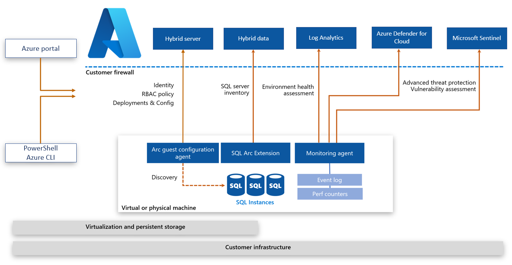
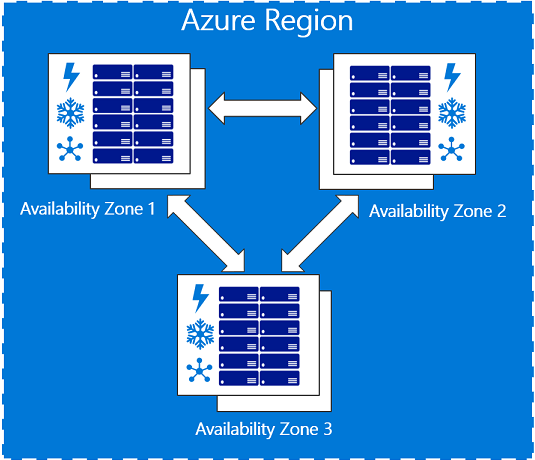
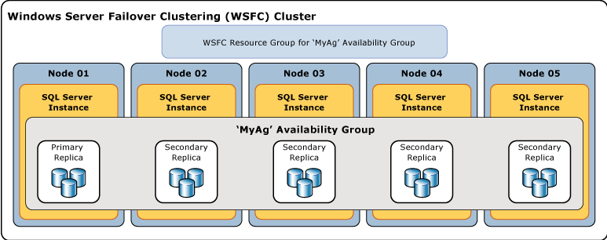
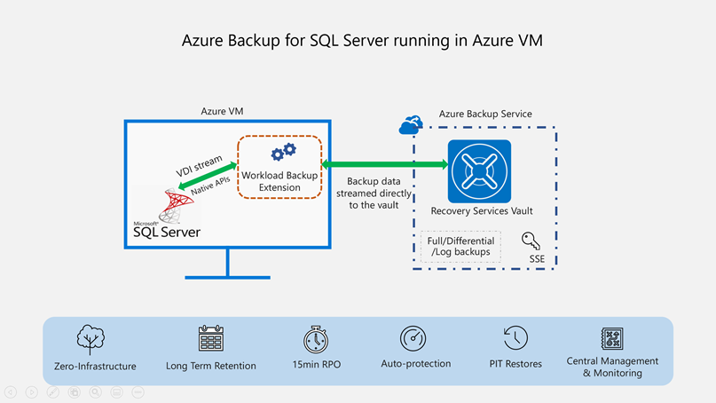
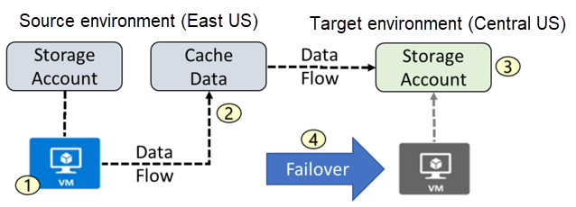

# Deploy IaaS Solutions with Azure SQL

**************************************

## IaaS options to deploy SQL Server in Azure

Many applications will require a VM running SQL Server for some reasons:

- Older version of SQL Server - for vendor supporting, runnig inside a VM is the best option.
- User of other SQL Server Services - many users maximize their licensing by running SQL Server Analysis Services, Integration Services, or Reporting Services on the same machine as the database engine.
- General application incompatibility - some applications may require aditional services to be co-located with the database instance in a manner that isn't compatible with a PaaS offering, like cross-database querying support.

IaaS allows the administrator to have more granular access over specific settings of the underlying infrastructure than other offerings. You have access to the virtual storage, virtual networking configuration, and might install any additional software within the virtual machine.

In SaaS offerings the administrator is responsible only for user security and data management. PaaS services, the operating system and other software are managed by the cloud provider. IaaS you are responsible for OS patching, optimal configuration of network and storage, and software configuration.

IaaS solutions, Microsoft will manage resources below the operating system, including physical servers, storage and physical networking. The database administrator is responsible for configuration of SQL Server instances running on the operating system.

Some applications may require specific operating conditions, including, specific combination of SQL Server and Windows version for vendor support purposes, or aditional software that needs to be installed alongside of SQL Server, which requires direct access to the underlying operating system. These applications may not be suited for PaaS offerings.

## SQL Server IaaS Agent Extension

When you deploy an SQL Server VM from the Azure Marketplace, part of the process installs the IaaS Extension.
Extensions are code that is executed on your VM post-deployment, to perform configurations. Some examples are installing anti-viruses, or installing Windows features. SQL Server IaaS Extension prodev the following features:

- Automated backup
- Automated patching
- Azure key vault integration
- Defender for Cloud portal integration
- View disk utilization in the portal
- Flexibe licensing
- Flexibe version or edition
- SQL best practices assesments

## SQL Server licensing models

There are differents options related to how SQL Server is licensed when using IaaS offering.

If your aren't participating in the Microsoft Software Assurance program, you can defloy an image from the Azure Marketplace containing a pre-configured SQL Server in a Pay as you Go model, the cost of the SQL Server license is included with the cost of the virtual machine.

If you are participating in the Microsoft Software Assurance:

- You can use the Pay as you Go model deploying a VM from the Marketplace
- You can Bring Your Own License (BYOL) when deployng a virtual machine that doesn't contain a pre-configured SQL Server instance. This option is possible when you already have a valid SQL Server license for on-premise infrastructure. This license can be applied to the virtual Machine, you must report the usage of licenses by using the License Mobility verification form within 10 day of implementing the virtual machine. When chosing this method you can manually install SQL Server through media you have obtained, or upload a virtual machine image to Azure.

Similar to applying SQL Server license you already purchased, there are also Windows Server licensing known as Azure Hybrid Benefit (AHB).

Reserving a virtual machine for one to three years provides another option for costing savings. This commitment doesn't require an upfront payment and can be billed monthly. This option is benefical if you know the workloads are going to be persisted. The cost savings can be significant, especially for larger VMs.

## Virtual machine families

When deploying virtual machines, there are serires, or "families" of sizes than can be selected. Each series is a combination of memory, CPU, and storage, allowing you to select an appropriate configuration for the expected workload.

- General purpose - Balanced ratio of CPU to memory, ideal for testing and development, small to medium database servers, and webservers with low to medium traffic.
- Computed optimized - High CPU-to-memory ratio, good for webservers with a medium traffic, network appliances, batch processes, application servers. Can also support machine learning that can't be benefit from GPU-based VMs.
- Memory optimized - High memory-to-CPU ratio, broad range of CPU and memory options (upt to 4TB of RAM), suited for database workloads.
- Storage optimized - provide fast, local, NVMe storage that is ephemeral. Good candidates for scale-out data workloads such as Cassandra. Is is possible to use them with SQL Server, however since the storage is ephemeral, you need to ensure you configure data protection using features like Always On Availability Groups or Log Shipping.
- GPU - graphics processing operations and massively parallel machine learning workloads.
- High performance compute - support applications that can scale horizontally to thousand of CPU cores. This support is provides by high-performance CPU and remote direct memory access (RDMA) networkingggggg that provides low latency communications between VMs.

## Azure Marketplace

Centralized location that provides the ability to create Azure resources based on a pre-designed template with a couple of clicks of the mouse and with some basic information. The disadvantage of using the portal to create Azure resources is that it is not an easily repeatable process.

## SQL Server Configuration

When provisioning SQL Server VM you can configure specific SQL Server settings such as, Security and Networking, SQL Authentication preferences, SQL instance setting and a few other options on the SQL Server settings tab.

## Understand hybrid scenarios

Implementinh a hybrid infraestructure is an excellent first step in evaluating cloud computing for organizations that have been traditionally on-premises and skeptical of the cloud. They hybrid SQL Server platform offers the benefits of both  on-premises and cloud services; it's a complimentary middle ground.
In addition to extending on-premises solutions, hybrid infraestructure may be applied to existing cloud solutions, enabling cloud-to-cloud hybrid implementations.

### Hybrid scenarios for SQL Server

#### Disaster Recovery

Is the most common scenario, organizations may distribute deployments across multiple data centers for failover in an on-premises approach. The cost of spinning up Azure SQL Server virtual machines in various geographical regions is much less than estabilishing a new physical data center in another geography. In the approach Azure is used for DR failover while the regular day-to-day processing continues to use on-premises servers fol local high availability.


#### SQL Server Backups

Is another common hybrid scenario, backups may be done directly into Azure Storage via URL or Azure file share (SMB). This scenario protects against data loss when on-site backup storage fails. These backups may be restored to virtual machines in Azure and tested as part of Disaster Recovery procedures.
Another scenario uses Azure Storage to store on-premises SQL Server data files for user databases. In the case of local storage failure, user files are safely stored in the cloud. For this hybrid scenario, it's essential to keep the network communication secure, evaluate the network latency, and ensure the storage account is locked down using ACLs and Azure AD.

#### Azure Arc enabled SQL Servers

Extends and centralizes Azure management services to SQL Server instances hosted on-premises, in your data centers, on the edge, and in multicloud environments. In this hybrid scenario, Azure Arc enables the inventory of all registered SQL Server deployments, assesses their configurations, usage patterns and security to provide actions and recommendations based on best practices. By using Azure Arc enabled SQL Servers, you gain the benefits of centralized server management, Azure Defender real-time security alerts and vulnerability reporting on both on-premises SQL Server and their hosting operating system, and Azure Sentinel that can provide more security threat introspection.



#### Security considerations

When deploying a hybrid SQL solution, all core infrastructure, such as Active Directory and DNS, must exist on-premises and in Azure. In addition, secure two-way communication must exist between the on-premises network and Azure. This secured communication can take form of a site-to-site (S2S) VPN or a dedicated ExpressRoute.
When evaluating different connectivity methods, it's vital to determine the amount of latency acceptable for you organization.

S2S VPN solution tends to cost less, however with this solution, all communications occurs over the public internet and  is limited by the organization's internet speeds.


ExpressRoute tends to be mory costly, provides the best security and lowest latency as all communications flows over a direct secured channel independent of the public internet. However, common detractors for this solutions include overall cost and the inability to apply ExpressRoute between cloud providers in a multicloud solution.

## Performance and security

Azure offers several performance and security options for SQL Server VM.

### Storage considerations

SQL Server requires good storage performance to deliver robust application performance. While Azure offers various types of starage (blob, file, queue, table) in most cases SQL Server workloads will use Azure managed disks. The exceptions are that a Failover Cluster Instance can be build on file storage and backups will use blob storage. Managed disks act as a block-level storage device and offer 99.999% availability, scalable deployment (up to 50.000 disks per subscription per region), integration with availability sets and zones to offer resiliency in case of failure.

Managed disks offer two types of encryption. Azure Server-side encryption is provided by the storage service and acts as encryption-at-rest provided by the storage service. Azure Disk Encryption usus BitLocker on Windows, and DM-Crypt on Linux to provide OS and Data disk encryption inside of the VM. Both integrate with Azure Key Vault and allow to bring your own encrytion key.

Each VM will have at least two disks:

- Operating System disk - Each VM will require an operating system disk that contains the boot volume. This disk would be the C: drive on Windows and /dev/sda1 on Linux. The operating system are installed automatically.
- Temporary disk- Each VM will include one disk for temporary storage. Intended to be used for data that doesn't need to durable, such as page or swap files. You shouldn't use it for storing critical information like database or transaction log files, they'll be lost during maintenance or a reboot. This drive will be mounted as D: on Windows and /dev/sdb2 on Linux.
- Dat disks - You should add additional data disks to you VMs running SQL Server. The term data disk is used in the Azure portal, but these are just additional managed disks added to a VM. These disks can be pooled to increase IOPs and storage capacity, using Storage Spaces on Windows or Logical Volume Management on Linux.

Types of disk:

| Feature | Ultra Disk | Premium SSD | Standard SSD | Standard HDD |
| ------- | ---------- | ----------- | ------------ | ------------ |
| Disk type | SSD | SSD | SSD | HDD |
| Best for | IO-intensie workload | Performance sensitive workload | Lightweight workloads | Backup, non-critical workloads |
| Max disk size | 65.536 GiB | 32.767 GiB | 32.767 GiB | 32.767 GiB |
| Max throughput | 2000 MB/s | 900 MB/s | 750 MB/s | 500 MB/s |
| Max IOPS | 160.000 | 20.000 | 6.000 | 2.000 |

The best practices for SQL on Azure recommend using Premium Disks pooled for increased IOPs and storage capacity. Data files should be stored in their own pool with read-caching on the Azure disks.

Transaction log files won't benefit from this caching, so those files should go into their own pool without caching. TempDB can optionally go into its own pool, or using the VMs temporary disks, which offers low latency sincy it's physically attached to the physical server. Properly configured Premium SSD will see latency in single digit milliseconds. For mission critical workload that require latency lower that that, you should consider Ultra Disks.

### Security considerations

Azure complies with several industry regulations and standard with make possible to build a compliant solution with SQL Server VM.

#### Microsoft Defender for SQL

Provides Azure Security Center security features such as vulnerability assesments and security alerts.
Used to identify and mitigate potential vulnerabilities in your SQL Server instance and database.

#### Azure Security Center

Unified security management system that evaluates and offers opportunities for improving security aspects of your data environment. Provides a view of the security health af all your hybrid cloud assets.

### Performance considerations

Most of the existing on-premises SQL Server performance features are available on Azure VMs. Among the options is data compression, which can improve the performance of IO-intensive workloads while decreasing the size of the database. Similarly, table and index partitioning improve query performance of large tables, improving performance and scalability.

#### Table partitioning

Provides many benefits, but is only considered when the table becomes large enough that starts compromising query performance. Identifying which tables are candidate for table partitioning is a good practice. When you filter your data using your partition column, only a subset of the data is accessed. Maintenance operations on a partitioned table will reduce maintenance duration, for example compressing data in a particular partition or rebuilding specific partitions of an index.

There are for main steps required to define a table partition:

- Filegroups creation - defines the files involver when the partitions are created.
- Partition function creation - defines the partition rules based on the specified column.
- Partition scheme creation - defines the filegroup of each partition
- Table to be partitioned

```
CREATE PARTITION FUNCTION PartitionByMonth (datetime2)
    AS RANGE RIGHT
    FOR VALUES ('20210101', '20210201', '20210301',
    '20210401', '20210501', '20210601',
    '20210701', '20210801', '20210901',
    '20211001', '20211101', '20211201');

-- create partition schme that use the partition function PartitionByMonth, and assign each partition to a specific filegroup.
CREATE PARTITION SCHEME PartitionByMonthSch
    AS PARTITION PartitionByMonth
    TO (FILEGROUP1, FILEGROUP2, FILEGROUP3, FILEGROUP4' FILEGROUP5, FILEGROUP6, FILEGROUP7, FILEGROUP8, FILEGROUP9, FILEGROUP10, FILEGROUP11, FILEGROUP12);

-- creates a partitioned table called order  that applies PartitionByMonthSch to the OrderDate column
CREATE TABLE Order ([Id] int PRIMARY KEY, OrderDate datetime2)
    ON PartitionByMonthSch (OrderDate);
    
GO
```

#### Data compression

SQL Server stores compressed data on 8KB pages, when data is compressed, more rows of data can be stored on a give page, which allows the query to read fewer pages. Reading fewer pages has twofold benefit: 

- reduces the amount of physical IO performed
- allows more rows to be stored in the buffer pool, making more efficient use of memory.

Enabling database page compressing is recommended where appropriate.

The tradeoffs to compression are that it does require a small amount of CPU overhead, however the storage IO benefits far outweigh any additional processor usage.

Compression is implemented at the object level. Each index or table can be compressed individually, and you have the option of compressing partitions within a partitioned table or index. You can evaluate how much space you'll save by using the sp_estimate_data_compression_savings system stored procedure. Prior to SQL Server 2019, this procedure didn't support columnstore indexes, or columnstore archival compression.

- Row compression - doesn't incur much overhead, however, it doesn't offer the same amount of compression that page compression may offer. Stores each value in each column in a row in the minimum amount of space needed to store that value. It uses a variable-lenght storage format for numeric data types and it stores fixed-lenght character string using variable lenght format.
- Page compression - a superset of row compression, all pages will initially be row compressed prior applying the page compression. Then a combination of techniques called prefix and dictionary compression are applied to the data. Prefix compression eliminates redudant data in a single column, storing pointers back to the page header. After that step, dictionary compression searches for repeated values on a page and replaces them with pointers, further reducing storagee. The more redundancy in your data, the greater the space savings when you compress your data.
- Columnstore archival compression - columnstore objects are always compressed, however they can be further compressed using archival compression, which uses the Microsoft XPRESS compression algorithm on the data. This typo of compression is best used for data that is infrequently read, but needs to be retained for regulatory or business reasons. While this data is further compressed, the CPU cost of decompression tends to outweigh any performance gains from IO reduction.

### Aditional options

List of additional SQL Server features and actions to consider for production workloads:

- Enable backup compression
- Enable instant file initialization for data files
- Limit autogrowth of the database
- Disable autoshrink/autoclose for the databases
- Move all databases to data disks, including system databases
- Move SQL Server error log and trace file directories to data disks
- Set max SQL Server memory limit
- Enable lock pages in memory
- Enable optimize for adhoc workloads for OLTP heavy environments
- Enable Query Store
- Schedule SQL Server Agent jobs to run DBCC CHECKDB, index reorganize, index rebuild, and update statistics jobs
- Monitor and manage the health and size of the transaction log files

## High availability and disaster recovery options

Availability Zones and Availability Sets protect your workloads from planned maintenance activity and potential hardware failures.

### High availability options

Most SQL Server high availability solutions are available on Azure VMs.

#### Availability Zones

Unique physical locations within a region. Each zone is made up of one or more data centers equipped with independent power, cooling, and networking. Within regions that support Availability Zones, you con specify in which zone you wants the VM to reside. There are three Availability Zones within each supported Azure region.
Availability Zones provide high availability against data center failures when you deploy multiple VMs into different zones. They also provide a means for Microsoft to perform maintenance (using a grouping called update domain) within each region by only updating one zone at any given time. Availability Zones in conjunction with Azure VMs raises your uptime to 99.99% which equates to a maximum of 52.60 minutes of downtime per year.



#### Availability Sets

Are similar to Availability Zones, except instead of spreading workloads across data centers in a region, they spread workloads across servers and racks in a data center. Since nearly all workloads in Azure are virtual, you can use availability sets to guarantee that the two VMs containing you Always On Availability Group members are not running on the same physical host. Provide up to 99.95% availability, and should be used when Availability Zones are unavailable in a region, or an application cannot tolerate intra-zone latency.

### Always On availability groups (AG)

Can be implemented between two or a maximum of nine SQL Server intances runnig on Azure VMs across on-premises data center and Azure. In an availability group, database transactions are committed to the primary replica, and then the transactions are sent either synchronously or asynchronously to all secondary replicas. The physical distance between the servers dictates which availability mode you should choose. Generally, if the workload requires the lowest possible latency or the secondary replicas are geographically spread apart, asynchronous availability mode is recommended. If the replicas are within the same Azure region and the applications can withstand some level of latency, synchronous commit mode shoud be considered.
Synchronous mode will help to ensure that each transaction is committed to one or more secondaries before allowing the application to continue. Always On availability groups provide both high availability and disaster recovery, because a single availability group can support both synchronous and asynchronous availability modes. The unit of failover for an availability group is a group of databases, and not the entire instance.

Always On Availability Groups can also be used for disaster recovery. You can implement up to nine replicas of a database across Azure regions, and strech this architecture even further using Distributed Availability Groups. Availability Groups ensure that a viable copy of your databases is in another location beyound the primary region. 

Always On Availability Group, running on a Windows Server Failover Cluster. The unit of failver is the group of databases and not the instance. While a failover cluster instance provides HA at an instance level, it doesn't provide disaster recovery



#### SQL Server Failover Cluster instances

If you need to protect the entire instance, you could use a SQL Server Failover Cluster (FCI) which provides high availability for an entire instance, in a single region. A FCI doesn't provide disaster recovery without being combined with another feature like availability groups or log shipping. FCI require shared storage that can be provided on Azure by using shared file storage or using Storage Spaces Direct on Windows Server.

For Azure workloads, availability groups are the preferred solution for newer deployments because the shared storage require of FCIs increases the complexity of deployments. However, for migrations from on-premises solutions, an FCI may be required for application support.

### Disaster Recovery options

There are two components to protect in case of disaster. First, there are Azure platform options like ger-replicated storage for backups and Azure Site Recovery which is a disaster recovery solution for all of your workloads. Second, there are SQL Server specific offerings like Availability Groups and backups.

#### Native SQL Server backups

With SQL Server VM you have granular control of when backups occur and where they're stored. You can use SQL agent jobs to back up directly to a URL linked to Azure blob storage. Azure provides the options to use geo-redundant storage (GRS) or read-access geo-redundant storage (RA-GRS) to ensure that your backup files are stored safely across geographic regions.

Additionaly as part of the Azure SQL VM service provider, you can have your backups automatically managed by the platform.

#### Azure Backup for SQL Server

Requires an agent to be installed on the VM. The agent then communicates with an Azure service that manages automatic backups of your SQL Server databases. Also provides a central location that you can use to manage and monitor the backups to ensure meeting any specified RPO/RTO metrics.

Azure Backups solution is an enterprise backup solution that provides long-term data retention, automated management, and additional data protection. This option cost more, but offer a more complete backup feature set.



#### Azure Site Recovery

Low-cost solution that will perform block level replication of your Azure VM. Offers various options, including the ability to test and verify you disaster recovery strategy. Best used for stateless environments versus transactinal database virtual machines.

Is supported for use with SQL Server, but you will need to set a higher recovery point which means potential loss.

1. VM is registered with Azure Site Recovery
2. Data is continously replicated to cache
3. Cache is replicated to the target storage account
4. During failover the virtual machine is added to the target environment



# Deploy PaaS solutions with Azure SQL

**************************************

## PaaS options fol deploying SQL Server in Azure

PaaS provides a complete development and deployment environment which can be used for simple cloud-based apps as well as for advanced entreprise apps.

- Azure SQL Database - build upon SQL Server engine in the cloud. It gives flexibility in building new application services, and granular deployment options at scale. Offers a low maintenance solution.
- Azure SQL Managed Instance - it is best for migration scenarios to che cloud as it provides fully manageds services and capabilities.

### Deployment models

Azure SQL Database is available in two deployment models:

- Single database - is billed and managed on a per database level. You manage each database individually from scale and data size perspective. Each database has its own dedicated resources, even if deployed to the same logical server.
- Elastic Pools - a group of databases that are managed together and share a common set of resources. Provides a cost-efective solution for SaaS application model, since resources are shared between all databases. You can configure resources either on DTU-based or vCore-based purchasing model.

### Purchasing model

#### Database Transaction Unit (DTU)

Are calculated on a formula combining compute, storage, and I/O resources. It is a good choice for who want simple, preconfigured resource options.

Comes in several service tiers, such as Basic, Standard and Premium. Each tier has varying capabilities, providing a wide range of options.

In terms of performance, the Basic tier is used for less demanding workloads, while Premium is used for intensive workloads.

Compute and storage are dependent on the DTU level, and they provide a range of performance at capabilities at a fixed storage limit, backup retention, and cost.

DTU purchasing model is only supported by Azure SQL Database.

#### vCore

Allows you to purchase a specified number of vCores based on your given workloads. It is the default purchasing model for Azure SQL Database. vCore databases have a specific relationship between the number of cores and the amount of memory and storage provided to the database. It is supported by either Azure SQL Database and Azure SQL Managed Instance.

You can purchase in three different service tiers:

- General Purpose: it is backed by Azure premium storage, it will have higher latency than Business Critical. Provides two compute tiers:
  - Provisined - Compute resources are pre-allocated. Billed per hour based on vCores configured.
  - Serveless - compute resources are auto-scalled. Billed per second basend on vCores used.
- Business Critical - it is for high performing workloads, offering the lowest latency. It is backed by local SSDs, instead of Azure blob storage. Offers the highest resilience to failure and provides buit-in read-only database replica, that can be used to off-load reporting workloads.
- Hyperscale - it can scale beyond the 4 TB limit, supports databases of up to 100 TB.

### Serverless

A compute tier that will automatically scale up or down the resources for a given database based on workload demand. If the workload no longer requires compute resources, the database will become "paused" and only storage is billed during the period the database is inactive. When a connection attempt is made, the database will "resume" and become available.


The autopause delay has a min value of 60 minutes and a max value of seven days.

Any applications using serverless should be configured to handle connection errors and include retry logic.

Another difference between serverless and provisioned vCore model is that with serverless you can specify a min and max number of vCores. Memory and I/O limits are proportional to the range that is specified. You can select a minimum of a half of a vCore and a maximum of 16 vCores.

Serverless in not fully compatible with all features in Azure SQL Database since some of them require background processes to run at all times, such as:

- Geo-replication
- Long-term backup retention
- A job database in elastic jobs
- The sync database is SQL Data Sync

Serverless is currently only supported in General Purpose tier.

### Backups

In PaaS offering, backups are performed automatically without any intervertion. Backups are stored in Azure bob geo-redundant storage and by default are retained for between 7 and 35 days, based on the service tier of the database. Basic and vCore databases default to seven days of retention, and on vCore database this value can be adjusted by the administrator. The retention time can be extended by configuring long-term retention (LTR), wich would allow you to retain backups for up to 10 years.

In order to provide redundance, you are able to use read-accessible geo-redundant blob storage (RA-GRS). This storage would replicate your database backups to a secondary region. It would also allow you to read from that secondary region if needed.

Manal backups of databases are not supported, and the platform will deny any request to do so.

Database backups are taken on a given schedule:

- Full - once a week
- Differential - every 12 hours
- Log - every 5-10 minutes depending on transaction log activity

This backup schedule should meet the needs of most recovery point/time objectives (RPO/RTO), however, each customer should evaluate wheter they meet your business requirements.

Due to nature of PaaS, you cannot mannually restore a database using conventional methods, such as issuing the T-SQL command RESTORE DATABASE.

It is not possible to restore over an existing database. The existing database must be dropped or renamed prior to inintiating the restore process. Depending on the platform service tier, restore times are not guaranteed and could fluctuate. It is recommended that you test the restore process the obtain a baseline metric on how long a restore could take.

The restore options available are:

- Restore using the Azure portal - you have the option of restoring to the same Azure SQL Database server, or can create a new database on a new server in any Azure region.
- Restore using scripting Languages - can utilize both PowerShell and Azure CLI

Copy-only backup to Azure blob storage is available only for SQL Managed Instance

### Active geo-replication

It's a business continuity feature that asynchronously replicates a database to up to four secondary replicas. As transactions are committed to the primary (and its replicas within the same region), the transactions are sent to the secondaries to be replayed. Because this communication is done asynchronously, the calling applications does not have to waity the secondary replica to commit the transaction prior to SQL Server returning control to the caller.

The secondary databases are readable and can be used to offload read-only workloads, thus freeing up resources for transactional workloads on the primary or placing data closer to the end users. Secondary databases can be in the same region as the primary or in another Azure region.

With geo-replication you can initiate a failover either manually by the user or from the application. If a failover occurs, you will need to update the application connection strings to reflect the new endpoint.

#### Failover groups

Are built on top of the technology used in geo-replication, but provide a single endpoint for connection, which can be utilized to route traffic to the appropriate replica. Your application can then connect after a failover without connection string changes.
