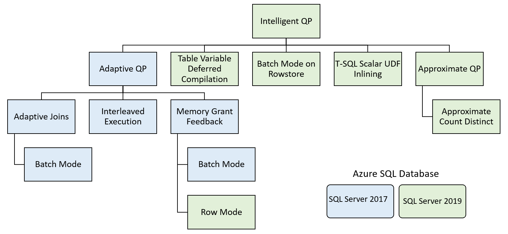

# Performance Monitoring

## Performance monitoring tools

The metrics that you can monitor will vary depending on the type of Azure resource you are monitoring. Azure SQL Database and SQL Server on VM will have different metrics available in the Azure portal.

When you deploy an Azure VM from the Marketplace, an agent is installed in the machine that provides a basic set of operating system metrics that are presented in Azure portal. This agent supplies metrics to a service called Azure monitor which is a platform monitoring solution that collects and displays a standard set of metricts from resources. In the case of VMs the default metrics are CPU, network utilization and disk read/write operations. You can capute additional metricts by enabling Monitoring Insights for your VM. 

These metrics pertain to the OS, not SQL Server. You are unable to view SQL Server-specific metrics from within the portal. For SQL Server-specific metrics you will need to gather them from the VM itself.

Azure Monitoring Insights allows to collect additional data points, like storage latency, available memory, and disk capacity.  This data is stored in an Azure Log Analytics workspace. Azure Log Analytics is the primary tool for storing and querying log file of all kinds in Azure. It's queried using KQL.

If you create a VM with pre-configured SQL Server image the SQL virtuar machine resource provider, which export SQL Server-specific informations like SQL data size, SQL log size, disks capacity, and manage features like automated patching and storage configuration.
This informations can been seen from the Azure portal, going to the VM -> Settings -> SQL Server Configuration -> Manage SQL Virtual Machine.

For machines created manually from outside Marketplace you need to register SQL IaaS Agent extension.

### Performance Monitor with SQL Server on an Azure VM

Windows Server has a native tool called Performance Monitor (commonly shortened to perfmon) that allows to monitor performance metrics. Perfmon operates with counters for both the OS and installed programs. When SQL Server is installed, the database engine creates its own group of specific counters. Perfmon data can be stored locally and analyzed, but you can forward results into Azure Monitor.

## Critical performance metrics

Azure Monitor allows you to to track metrics and trigger alerts or execute automated error responses.

Azure Monitor Metrics allows to not only analyze and visualize performance data, but to also trigger alerts to notify administrators or automated actions that can trigger Azure Automation runbook or a webhook. Azure Metricts data is only stored for 93 days, but you have the option to archive metrics data to Azure Storage.

Azure Monitor Alerts can be scoped in three ways.

- List of resources in one region within a subscription
- All resources in one region in one or more resource groups within a subscription
- All resources in one subscription

To create an alert:

1. In the Azure portal look for Monitor
2. Select Alerts
3. Click on Create new alert rule
4. Select the scope
5. Select the conditions
6. Select the Actions

The alerts can be configured in a static manner (when CPU goes over 95%) or in a dynamic manner using Dynamic Threshoulds. Dynamic Threshoulds learn the historical behavior of the metric and raise an alert when the resoures are operating in an abnormal manner. Dynamic Threshoulds can detect seasonality in workloads and adjust the alerting accordingly.

If Static alerts are used, you must provide a threshould for the selected metrict, for example 80% of CPU utilization.

Both types offor booleans operators such as greater than or less than, and aggegated measurements such as average, minimum, maximum, count, and total.

In order to notify admininstrators or launch an automation process, an action group can be configured.

Defining an action group is optional, and if one is not configured the alert will just log the notification to storage with no further action is taken.

With an action group, there are several ways in which you can respond to the alert.

- Automation Runbook
- Azure Function
- Email Azure Resource Manager Role
- Email/SMS/Push/Voice
- ITSM
- Azure Logic App
- Secure Webhook
- Webhook

There are two categories to these actions - notifications and automations.

### SQL Server metrics

Microsoft SQL Server is well instrumented and collects a great deal of performance metadata. The database engine has metrics that can be monitored to help identify and improve performance-related issues. Some OS metrics are only viewable from perfmom while others can be accessed through T-SQL queries, in particular, by selecting from the dynamic management views (DMVs). There are some metrics that are exposed in both locations. One example of data that can only be captured from DMVs is data and transaction log file read/write latency that is exposed in ```sys.dm_os_volume_stats```. One example of OS metric that is not available through T-SQL is the seconds per disk read and write. Combining these two metrics can help to better understand if a performance issue is related to database structure or physical storage bottleneck.

### Baseline metrics

A baseline is a collection of data measurements that helps to understand the normal "steady state" of your application or server's performance. Having the data collected over time allows to identify changes from the normal state. Baselines can be as simple as a chart of CPU utilization over time, or complex aggregations of metrics. A baseline will help to identify if an ongoing issue should be considered within normal parameters or has exceeded given threshoulds. Without a baseline, every issue could be considered nomal and not require any additional intervention.

### Correlating SQL Server and OS performance

When deploying SQL Server on an Azure VM, it's critical to correlate the performance of SQL Server with the OS. If you are using Linux as the OS, you will need to install InfluxDB, Collectd, and Grafana to capture data similar to Windows Perfmom. These services collect data from SQL Server and provide a graphical interface to review the data. These tools can be used in conjunction to look at SQL Server-specific data such as SQL Server wait statistics. Using these tools together will allow to identify bottlenecks in hardware or cade. 

The following are Performance counters of useful Windows metrics.

- Processor(_Total)%Processor Time - Measures the CPU utilization of all of the proccesors on the server. It's a good idication of the overall workload, and when used with other counters, can identify problems with query performance.
- Paging File(_Total)% Usage - In a properly configured SQL Server, memory should not page to the paging file on disk. However, in some configurations you may have other services running that consume system memory and lead to the OS paging memory to disk resulting in performance degradation
- PhysicalDisk(_Total)\Avg. Disk sec/Read and Avg Disk sec/Write - This counte provides a good metric for how the storage subsystem is working. Your latency values in most cases should not be above 20ms, and with Premium Storage you should see values less than 10ms.
- System\Processor Queue Length - Indicates the number of threads that are waiting for the time on the processor. If it's greater than zero, it indicates CPU pressure, indicating your workload needs more CPUs.
- SQLServer:Buffer Manager\Page life expectancy - Page life expectancy indicates how long SQL Server expects a page to live in memory. There is no proper value for this setting. Older documentation refers to 300 seconds as proper, but what was written in a 32-bit era when servers had far less RAM. You should monitor this value over time, and evaluate sudden drops. Such drops in the counter's value could indicate poor query patterns, external memory pressure (server running in a large SSIS package) or could just be normal system processing like running a consistency check on a large database.
- SQLServer:SQL Statistics\Batch Requests/sec - This counter is good for evaluating how consistently busy a SQL Server is over time. There is no good or bad value, but you can use in conjunction with % Processor time to better understand your workload and baselines.
- SQLServer:SQL Statistics\SQL Compilations/sec and SQL Re-Compilations/sec - These counters will be updated when SQL Server has to compile or recompile execution plan for a query because there is no existing plan in the cache, or because a plan was invalidated because of a change. Recompiles can indicate T-SQL with recompile query hints, or be indicative of memory pressure on the plan cache caused by either many ad-hoc queries or simple memory pressure

### Wait statistics

When a thread is being executed and is forced to wait on an unavailable resource, SQL Server keeps track of these metrics. This information is identifiable via DMV ```sys.dm_os_wait_stats```. This information is important to understading the baseline performance of your database and help to identify specific performance issues with query execution and hardware limitations. Identifying the appropriate wait type and corresponding resolution will be critical for resolving performance issues.

## Extended events

The extended events engine in Azure SQL is a monitoring system that allows to capture information about activity in your databases and servers. The monitoring solutions on the Azure platform allow you to configure monitoring for you environment and provide automated responses to error conditions.

Extended events build on the functionality of SQL Server Profiler by allowing you to trace queries and by exposing additinal data (events) that you can monitor.

Some issues you can troubleshoot with Extended events:

- Troubleshooting blocking and deadlocking performance issues
- Identifying long-running queries
- Monitoring DDL operations
- Logging missing column statistics
- Observing Memory Pressure in your database
- Long-running physical I/O operations

Extended event framework allows you to use filters to limit the amount of data you collect in order to reduce the overhead of data collection, and allows you do identify you performance problem by targeting you focus onto specific areas.

Extended events cove the full surface area of SQL Server, and are divided into four channels:

- Admin - events that are targeted for end users and administrators. The events included indicate a problem within a well-defined set of actions an administrator can take. An examle is the generation of an XML deadlock report to help identify the root cause of the deadlock.
- Operational - events that are used for analysis and diagnostics or common problems. These events can be used to trigger an action or task based on an occurrence of the event. An example would be a database in an availabality group changing state, which would indicate a failover.
- Analytic - events related to performance and are published in high volume. Tracing stored procedure or query execution would be an example.
- Debug - are not necessarily fully documented and should only be used when troubleshooting in conjunction with Microsoft support.

Events are added to sessions, which can host multiple events. Typically event are grouped together in a session to capture a related set of information.

This query obtain a list of the available events, actions and targets:

```SQL
SELECT
    obj.object_type,
    pkg.name AS [package_name],
    obj.name AS [object_name],
    obj.description AS [description]
FROM sys.dm_xe_objects  AS obj
    INNER JOIN sys.dm_xe_packages AS pkg  ON pkg.guid = obj.package_guid
WHERE obj.object_type in ('action',  'event',  'target')
ORDER BY obj.object_type,
    pkg.name,
    obj.name;
```

### Creating extended events session

Basic process of creating an extended event sessiens using the New Session dialog from SSMS.

Expand Management node in SSMS

Expand the Extended Events node, right-click on Sessions and select New Session.

Name the session and select one of the templates. Templates are groupd into four categories:
   - Locks and Blocks
   - Profiler Equivalents
   - Query Execution
   - System Monitoring

Chose the options for when to start the session. You can choose to start whenever the server starts, as soon as it's been created. You also have the option for enabling the causality tracking, which adds a GUID and sequence number to the output of each event, which allow to identify the order that the events occurred.

Add Events to your session - An event represents a point of interest within the database engine code, these can represent internal system operations, or can be associated with user actions like query execution. 

By default the session would capture all instances of events taking place on your session, but you can limit the collection. 

Global fields, allow to choose the data you are collecting, when your event occurs. Global fields are also known as actions, as the action is to add additional data fields to the event. These fields represent the data that is collected when the extended event occurs, and are common across most extended events.

Filters are a powerfull feature of Extended events that allow to control the capture of only specific occurrences of the event. Filters apply to a single field on a single event.

It's a good practice to configure a filter for each event that you are capturing. These are specific to the event being triggered, and can include optional fields for collection.

An extended event session has a target - it can be simply thought of as a place for the engine to keep track of occurrences of an event. Two of the more common targets are event file, which is a file on the file system that can store events, and in SQL PaaS offering this data is written to a blob storage. Another common target is the ring buffer which is within SQL Server's memory. The ring buffer is most commonly used for live observation of an event session as it's a circular buffer and data is not persisted beyond a session. Most targets process data asynchronously, which means the event data is written to memory before being persisted to disk. The exception is Event Tracing for Windown target (ETW) and Event Counter target, which are processed synchronously.

| Target | Description | Processing |
| ------ | ----------- | ---------- |
| Event Counter | Counts all events that occurred during an Extended Event session. It's used to obtain information about workload characteristics about a workload without the overhead of a full event collection | Synchronously |
| Event file | Writes event session output from memory onto persistent file on disk | Asynchronous |
| Event Pairing | Many events that generally occur in pairs (lock acquire, lock release). Can be used to identify when those events do not occur in a matched set | Asynchronous |
| Event Tracing for Windows | Similar to event counter, which counts the occurrences of an event. The difference is that the histogram can count based on a specific event column or action | Asynchronous |
| Ring Buffer | Used to hold data in memory. Data is not persisted to disk and maybe frequently flushed from the buffer | Asynchronous |

You can create an extended event session using T-SQL:

```SQL
IF EXISTS (SELECT * FROM sys.server_event_sessions WHERE name='test_session')
    DROP EVENT session test_session ON SERVER;
GO

CREATE EVENT SESSION test_session
ON SERVER
    ADD EVENT sqlos.async_io_requested,
    ADD EVENT sqlserver.lock_acquired
    ADD TARGET package0.etw_classic_sync_target (SET default_etw_session_logfile_path = N'C:\demo\traces\sqletw.etl' )
    WITH (MAX_MEMORY=4MB, MAX_EVENT_SIZE=4MB);
GO
```

Event sessions can be scoped to a server or a database. After you create the session, you'll have to start it. You can do through T-SQL and ```ALTER```  the session using the ```STATE``` option.

## Azure SQL Insights

SQL Insights is a component that allows you to analyze your queries, and tune performance.

With SQL Insights interactive features, you can customize telemetry collection and frequency, and combine data from multiple sources into a single monitoring.

SQL Insights collects data remotely from DMVs, and it's built on top of the Azure Monitor, giving access to the native alerting and visualizations. It retains a set of metrics over time, which allows you to investigate performance issues.

To user SQL Insights you need a dedicated virtual machine that will monitor and remotely collect data from your SQL servers. This VM needs to have these components installed:

- Azure Monitor agent
- Workload Insights extension

In order to increase control over charges, you can choose which telemetry data to collect, the frequency, and retention policy parameters. Database activity and settings that you've set in your monitoring profiles will determine the amount of data being collected and the cost.

You can access performance data from the SQL Insights workbook template, or directly from the monitoring logs.

### SQL Insights in Azure Monitor

1. from the Azure portal looks for Montior and select SQL (preview), then Create new profile
2. Configure the following components:
   - Monitoring profile - group servers, instances or databases to monitor
   - Log Analytics workspace - where to send the monitoring data
   - Collection settings - customize the data collection for your profile. The default settings cover the majority of monitoring scenarios.
3. Select Create monitoring profile
4. Select Manage profile, then Add monitoring machine. At this time the only supported virtual machine OS is Ubuntu 18.04. the following pre-requisites are satisfied:
   -  Set permission for SQL accounts
   -  Create firewall and networking rules for SQL

### Limitations

SQL Insights has no support or has limited support for the following components:

- Non-Azure instances
- Azure SQL Database elastic pools
- Azure SQL Database running on Basic, S0, S1, and S2 service tiers
- Azure SQL Database serverless tier
- Multiple secondary replicas
- Authentication with Azure ACtive Directory (Only SQL authentication is supported)

SQL Insights brings together performance metricts at scale in a single view.

In addition to visualization and data collection, it has buit-in intelligence for troubleshooting activities. It allows for custom monitoring alerts and rules that allow for quick identification and resolution of issues.

## Query Performance Insight

Identifying which queries are consuming the most resources is the first step in any database performance tuning.

Query Performance Insight allows to identify expensive queries.

Query Performance Insights has three buttons to allow to filter:

- long running queries
- top resource consuming queries
- custom filter

The default vaule is Resource Consuming Queries. This tab shows the top five queries sorted by the particular resource that you select.

The Long Running Queries, the metrics are limited to the top five queries sorted by duration from the previous 24 hours and is a sum aggregation.

In the Custom tab, there's a little more flexibility. It offers sereval metrics, CPU, Log IO, Data IO, and memory.

You can drill into an individual query and see the query ID and the query itself, as well as the query aggregation type and associated time period. The query ID correlates to the query ID located within the Query Store. Metrics from Query Performance Insight can be located within the Query Store for deeper analysis or possibly problem resolution.

Query Performane Insight doesn't show the query's execution plan, but you can quickly identify that query and use the information to extract the plan from the Query Store.

## Optimize Azure storage for SQL Server VMs

Storage performance is a critical component for an I/O heavy application like a database engine. Azure offers an arry of storage options:

- Blob storage - is known as object-based storage. In SQL environment will typically be used for database backups, using SQL Server's backup to URL
- File storage - a file share that can be mounted inside a VM. SQL can user as a storage target for a failover cluster instance
- Disk storage - block storage that are managed like a physical disk, except that they are virtualized. Commonly used for SQL Server data and transaction log files.

### Azure managed disks

Managed disks are block-level storage volumes that are presented to Azure VMs. Block level storage refers to raw volumes of storage that are created and can be treated as an individual hard drive. These block devices can be managed within the operating system, and the storage tier is not aware of the contents of the disks. The alternative is object storage, where files and their metadata are stored on the underlying storage system. Azure Blob storage is an example of object storage.

The configuration of your managed disks is important to the performance of your SQL Server workload. If your are moving from an on-premises environment, it's important to capture metrics like avarage disk seconds/read and average disk seconds/write from Perfmon. Another metric to capture is the I/O Operations per second (IOPs). which can be captured usingthe SQL Server: Resource Pool Stats Disk Read and Write IO/sec counters, which show how many IOPs SQL Server is serving at its peak. It's important to understand your workloads to design you storage and VMs to meet your workload needs without incurring significant latency.

Managed disks come in four types:

- Ultra disk - Support high-IO workloads for mission critical databases with low latency.
- Premium SSD - high-throughput and low latency, can meet the needs of most database workloads.
- Standard SSD - designed for lightly used dev/test workloads or web servers that do small IOPs
- Standard HDD - suitable for backups and file storage infrequently accessed.

Typically, production SQL Server workloads will use either Ultra disk or Premium SSD, or some combination of the two. Ultra disk are used where you need submillisecond latency response time. Premium SSD typically have single digit millisecond response time, but lower costs and more flexibility in design. Premium SSDs support read-caching which can benefit read-heavy database workloads by reducing the number of trips to the disk. The read cache is stored on the local SSD (D:\ on Windows /dev/sdb1 on linux).

### Striping disks for maximum throughput

One way to get more performance and volume out of Azure disks is to stripe data across multiple disks. This technique does not apply to Ultra disk, as you can scale IOPs, throughput and size independently on a single disk. However, Premium SDD can be benefical to scale IOPS and storage. In order to stripe disks in Windows, add the number of disks to the VM, and create a pool using Storage Spaces in Windows. Don't configure redundancy for your pool (would limit performance) as the redundancy is provided by the Azure frameworkk, which keeps three copies of all disks in synchronous replication to protect against disk failures. When you create a pool, it has the sum of the IOPs and volume of all the disks in your pool. For example, if you used 5 disks with 1 TB and 5000 IOPS, you would have 5 TB and 25000 IOPS available.

### SQL Server storage configuration best practices

- Create a separate volume for data and transaction log files
- Enable read caching on the data file volume
- Don't enable caching on the log file volume
- Plan for additional 20% IOPs and throughtput to handle peaks
- Use the read-cache drive (D: | /dev/sdb1/) for TempDB files because it's recreated upon server restart, so there is no risk of data loss
- Enable instant file initialization to reduce the impact of file-growth activities
- Move trace file and error log to data disks
- For workloads requiring submillisecond latency, consider using Ultra disk.

### Azure VM resource provider

One way to reduce the complexity of building storage for your SQL Server on Azure is to use the SQL Server template in Marketplace, which allow to configure your storage as part of your deployment. You can configure the IOPs as needed and the template will perform the work of creating storage spaces pools within Windows. It also support adding TempDB to the local SSD drive and creates a scheduled task to create the folder on startup

## Virtual Machine resizing

There are many size option for Azure VMs. For SQL Server workloads look for the amount of memory available and the number of IOPs the VM can perform.

### Constrained cores

Typically SQL Server is licensed by the core and Azure will use a fixed ratio of CPU cores to memory. However, there are workloads that require large amounts of memory, but do not require the default amount of allocated CPUs to get that amount of memory.

With constrained cores, you can reduce the cost of software licensing while still getting the full amount of memory, storage and I/O bandwidth. This is good for database workloads that are not CPU-intensive and can benefit from high memory, storage and I/O bandwidth, while using a constrained vCPU count.

### Chosing VM families for SQL Server

Most SQL Server production workloads will run on the general purpose or memory optimized families. Larger workloads requiring more memory and/or CPU will land in memory-optimized, but many production applications can run comfortably on general purpose virtual machines.

### Resizing VMs

Azure supports resizing your VM. This operation does require a restart, however, restarting a VM is typically a fast process. In some cases, depending on what virtual machine type you are switching to and from, you may need to deallocate you VM and then resize. This operation extends the duration of the outage but should not take more than a few minutes.

## Optimize database storage

To optimize database storage, you should consider proportional fill and tempdb configuration

### proportional fill

If you are inserting 1 gigabyte of data into a SQL Server database with two data files, you would expect the size of each data files to increase be 500 megabytes. However, this equal growth is not necessarily the case, as SQL Server will insert data into data files in different volumes based on the size of the data file. If your data files were both two gigabytes, you would expect the even distribution. However, if one of your data files was 10 gigabytes, and the other was 1 gigabyte, roughly 900 MB would go into the 10 GB file, and 100 MB into the 1 GB file. While this behavior occurs in any database, with the write-intensive nature of tempdb, an uneven write pattern could cause bottlenecks on the largest file, as more of the writes would happen there.

### Tempdb configuration

SQL Server 2016 changed this behavior, by detecting the number of CPU available at setup, and configuring the proper number of files, up to 8, and sizing the data files evenly. Additionally, the behavior of trace flags 1117 and 1118 are built in to the database engine, but only for tempdb.

For tempdb heavy workloads, where may be benefits to increasing the number of tempdb files beyond eight, to the number of CPUs on your machine.

SQL Server uses tempdb for much more than storing user-defined temporary tables. Work tables that are used to store intermediate query results, sorting operations, and the version store for row versioning are among a few of the uses for tempdb. Because of this, it's important to place tempdb on the lowest latency storage possible, and to properly configure its data files.

Prior to SQL Server 2016, tempdb defaulted to having one data file. This single file meant that there could be contention for multiple precesses trying to access system pages on the tempdb. One common solution was to enable trace flag 1118, which changed the way extents were allocated. Another best-practice was to create multiple tempdb data files. Because SQL Server uses a proportional fill algorithm for databases with multiple data files, it was also important to ensure that those files were the same size and grew at the same rate. To support this the solution was te use trace flag 1117, which forced all databases with multiple data files to grow them at the same rate.

## Control SQL Server resources

While some SLQ Servers only support one application's database, many servers support databases for multiple applications with differing performance requirements and different peak workload cycles. ONe of the ways to balance server resources is to use Resource Governor, which was introduced to SQL Server 2008.

Resource Governor is a feature that allows to control how much CPU, physical IO, and memory resources can be used by an inconming request from an application. Resource Governor is enabled at the instance level and allows you to define how connections are treated by using a classifier function, which subdivides sessions into workload groups. Each workload group is configured to use a specific pool of system resources.

### Resource pools

A resource pool represents physical resource available on the server. SQL Server always has two pools, default and internal, even when Resource Governor is not enabled. The internal pool is used by critical SQL Server functions and cannot be restricted. The default pool, and any resource pools you define, can be configured with limits on the resources it can use.

- Min/Max CPU percent
- Cap of CP percent
- Min/Max memory percent
- NUMA node affinity
- Min/Max IOPs per volume

With the exception of min/max CPU percent, all of the other resource pool settings are hard limits and cannot be exceeded. Min/Max CPU percent will only apply when there is CPU contention. For example, if you have a max 70% , if there is available CPU the workload may use up to 100%. If there are other workloads running, the workload will be restricted to 70%

Changes to a pool only affect new sessions, not existing ones. The exception is external pools used in conjunction with SQL Server Machine Learning Services, which are external to SQL Server and can be limited by a pool change.

### Workload group

A workload group is a container for session requests based on their classification by the classifier function. There are two built-in groups, default and internal, and each workload group can only belong to one resource pool. However, a resource pool can host multiple workload groups. All connections go into the default workload group, unless they passed into another user-defined group by the classifier function. The default workload group uses the resources assigned to the default resource pool.

### Classifier function

The classifier function is run at the time a connection is established to the SQL Server instance and classifies each connection into a given workload group. If the function returns a NULL, default, or the name of the non-existent workload group the session is transferred into the default workload group.

Since the classifier runs at every connection, it should be tested for efficiency. 

Exemple of a classifier function, the more complex a function is, you should verify that it doesn't impact the user login performance.
```SQL
CREATE FUNCTION dbo.RGClassifier()

RETURNS SYSNAME

WITH SCHEMABINDING

AS

BEGIN

DECLARE @WorkloadGroup AS SYSNAME

IF(SUSER_NAME() = 'ReportUser')

SET @WorkloadGroup = 'ReportServerGroup'

ELSE IF (SUSER_NAME() = 'PrimaryUser')

SET @WorkloadGroup = 'PrimaryServerGroup'

ELSE

SET @WorkloadGroup = 'default'

RETURN @WorkloadGroup

END
```

### Resource Governor use cases

Resource Governor is used primarily in multi-tenant scenarios where a group of databases share a single SQL Server instance, and performance needs to be kept consistent for all users of the server. You can use Resource Governor to limit the resources used by maintenance operations like consistency checks and index rebuilds.

## Configure databases for optimal performance

In recent versions of SQL Server, Microsoft has moved many configuration options to the database level.

### Database maintenance checks

The query optimizer utilizes statistical information from the indexes to attempt to build the most optimal execution plan.

Having healthy indexes and statistics will esure that any given plan will perform at optimal efficiency. Index maintenance should be performed regularly as data in your databases changes over time. You could change your index maintenance strategy based on the frequency of modifications to your data.

### Rebuild and reorganize

Index fragmentation occurs when logical ordering within index pages doesn't match the phisical ordering. Pages can out of order during routine data modification statements such as ```UPDATE```, ```DELETE```, and ```INSERT```. Fragmentation can introduce performance issues because of the extra I/O that is required to locate the data that is being referenced by the pointers in the index pages.

As data is inserted, updated and deleeted from indexes the logical ordering will no longer match the physical ordering. Over time data modifications can cause the data to become scattered or fragmented in the database. Fragmentation can degrade query performance when the database engine needs to read extra pages to locate the data.

A reorganization of an index is an online operation that will defrag the leaf level of the index (clustered and nonclustered). This process will physically reorder the leaf-level pages to match the logical order of the nodes from left to right. During this process, the index pages are also compacted based on the configured fillfactor value.

A rebuild can be either online of offline depending on the command executed or the edition of SQR being utilized. An offline rebuild will drop and re-create the index itself. In a online rebuild, a new index will be built in parallel to the existing index, once the new index has been built, the existing one will be dropped and then the new one will be renamed to match the old index name. The online rebuild will require more space as the new index is built in parallel to the existing index.

The common guidance for index maintenance:

- > 5% and < 30% - Reorganize the index
- > 30 % - Rebuild the index

The SQL Server and Azure platform offer DMVs that allow to detect fragmentation in your objects. The most commonly used DMVs are ```sys.dm_db_index_physical_stats``` for b-tree indexes and ```sys.dm_db_column_store_row_group_physical_stats``` for column store indexes.

Index rebuilds cause the statistics on the index to be updated, which can further help performance. Index reorganization doesn't update statistics

Microsoft introduced with SQL Server 2017 resumable rebuild index operations which provides more flexibility in controlling how much time a rebuild operation might impose. With SQL Server 2019, the ability to control an associated maximum degree of parallelism was introduced.

### Statistics

Understanding the importante of statistics is critical.

Statistics are stored in the user database as blobs. These blobs contain statistical information about the distribution of data values in one or more columns of a table or indexed view.

The query optimizer uses column and index statistics in order to determine cardinality, which is the number of rows a query is expected to return.

Cardinality estimates are then used by the query optimizer to generate the execution plan. Cardinality estimates also help the optimizer determine what type of operation to use to retrieve the data (index seek or scan).

To see the list of user defined statistics:

```SQL
SELECT sp.stats_id, 
       name, 
       last_updated, 
       rows, 
       rows_sampled
FROM sys.stats
     CROSS APPLY sys.dm_db_stats_properties(object_id, stats_id) AS sp
WHERE user_created = 1
```

### Create statistics

When you have ```AUTO_CREATE_STATISTICS``` option to ```ON```, the query optimizer creates statistics on the indexed column by default. The query optimizer also creates statistics for single columns in query predicates.
These methods provide high-quelity query plans for most queries. At times, you may need to create more statistics using ```CREATE STATISTICS``` to improve specific query plans.

It's recommended to keep auto create statistics option enabled as it will allow the query optimizer to create statistics for query predicate columns automatically.

Consider creating statistics when:

- The Database Engine Tuning Advisor suggests
- The query predicate contains multiple columns that aren't already in the same index
- The query selects from a subset of data
- The query has missing statistics

### Maintenance tasks automation

Different tools are available to perform database maintenance tasks depending on the platform where the database is running.

#### SQL Server on VM

You have access to services such as SQL Agent or Windows Task Scheduler. These automation tools can help keeping the amount of fragmentation within indexes to a minimum. With larger databases, a balance between a rebuild and a reorganization of indexes must be found to ensure optimal performance.

#### Azure SQL Database

You don't have access to SQL Agent nor Windows Task Scheduler. Index maintenance must be created using other methods:

- Azure Automation runbooks
- SQL Agent Job from SQL Server in an VM (remote call)
- Azure SQL elastic jobs


#### Azure SQL Managed Instance

You can schedule jobs through SQL Agent.

## Database scoped configuration options

As more complex features have been introduced to the database, more options have been added. Many of these options are tied to the compatibility level of the database. Database configuration options break down into two groups:

- Options configured by the ```ALTER DATABASE SCOPED CONFIGURATION```
- Options configured by the ```ALTER DATABASE```

There's no significance to the different ways to set these options. Options that are set using ```ALTER DATABASE```

- Database recovery model - Whether the database is in full or simple recovery model
- Automatic tuning option - Whether to enable the force last good plan
- Auto create and update statistics - Allows the database to create and update statistics and allows for the option of asynchronous statistics updates
- Query store options - The query Store are configured here
- Snapshot isolation - you can configure snapshot isolations and read committed snapshot isolation

Many options previously configured on the server can now be configured at the database level.

- Maximum Degree of Parallelism - allows for a database to configure its own MaxDOP and override the server's setting
- Legacy Cardinality Estimation - allows the database to use the older cardinality estimator. Some queries may have degraded performane under the newer cardinality estimator. If you use this option with a newer compatibility level, you can sitll get the benefits of Intelligent Query Processing in compatibility level 140 or 150
- Last Query Plan Stats - allows to capture the values of the last actual execution plan for a query. Only active in compatibility level 150
- Optimmize for Ad Hoc Workloads - uses the optimizer to store a stub query plan in the plan cache. This help to reduce the size of teh plan cache for workloads that have numerous single user queries.

## Automatic tuning

Automatic tuning is a monitoring and analysis feature that continuously learns about your workload and identifies potential issues and improvements.

The automatic tuning recommendations are based on the data collected from Query Store. Execution plans evolve over time due to schema changes, index modifications, or changes to the data that cause updates to the statistics. This evolution can cause queries to perform poorly as the execution plan no longer meets the demands of the query.

Automatic tuning allows for the gathering and applying machine learning services against performance metrics to provide suggested improvements or even allow for self-correction.

In Azure SQL Database you can improve query performance by index tuning. Azure SQL Database automatic tuning can identify indexes that should be added or even removed from the database to enhance query performance.

### Automatic plan correction

With the help of the Query Store data, the database engine can determine when query execution plans have regressed in performance. While you can manually indentify a regressed plan through the user interface, the Query Store provides the option to notify you automatically.

After the feature is enabled, the database engine will automatically force any recommended query execution plan when:

- The previous plan had a higher error rate than the recommended plan
- The estimated CPU gain was greater than 10 seconds
- The force plan has performed better than the previous one

The plan will rever back to the last known good plan after 15 executions of the query.

When plan forcing occurs automatically, the database engine will apply the last known good plan and will also continue to monitor query execution plan performance. If the forced plan doesn't perform better than the previous plan, it will be then unforced and force a new plan to be compiled. If the forced plan continues to outperform the previously bad plan, it will remain forced until such time as a recompile occurs.

You can enable automatic plan correcton. The Query Store must be enabled and in Read-Write mode. If either of those criteria aren't met, the ```ALTER``` will fail.
```SQL
ALTER DATABASE [WideWorldImporters] 
SET AUTOMATIC_TUNING (FORCE_LAST_GOOD_PLAN = ON);
```

You can examine the automatic tuning recommendations through a DMV ```sys.dm_db_tuning_recommendations``` which is available in SQL Server 2017 or higher. This DMV provides information such as reasons as to why the recommendation was provided, the type of recommendation, and teh state of the recommendation. To confirm that automatic tuning is enabled check the view ```sys.database_automatic_tuning_options```

### Automatic index management

Azure SQL Database can perform automatic index tuning. Over time, database will learn about existing workloads and provide recommendations on adding or removing indexes to provide better performance.

When enabled, the Performance Recommendations page will identify indexes that can be created or dropped depending on query performance. This feature isn't available for on-premises, and only available for Azure SQL Database.

You can use this query to see the automatic tuning features enabled in your database:

```SQL
SELECT name,
    desired_state_desc,
    actual_state_desc,
    reason_desc
FROM sys.database_automatic_tuning_options
```

Creating new indexes can consume resources, Azure SQL will monitor the resources required to implement new indexes to avoid causing performance degradation. The tuning is postponed until the resources are available.

Monitoring ensures any action take won't hapm performance, if an index is dropped and query performance noticeably degrades, the recently dropped index will be automatically recreated.

### Intelligent query processing

In SQL Server 2017, 2019, and Azure SQL, Microsoft has introduced new features into compatibility level 140 and 150. Many of these features correct what were formerly anti-patterns like using user defined scalar value funtions and using table variables.

These features break down into a few families of features:



Intelligent query processing includes features that improve existing workload performance with minimal implementation effort.

To make workloads automatically eligible for intelligent query processing, change the applicable database compatibility level to 150

```SQL
ALTER DATABASE [WideWorldImportersDW] 
SET COMPATIBILITY_LEVEL = 150;
```

### Adaptative query processing

Adaptative query processing includes options that make query processing more dynamic, based on the execution context of a query. These options include features that enhance the processing of queries

- Adaptive Joins - the database engine defers choice of join between hash and nested loops based in the number of rows going into the join. Currently only work in batch execution mode
- Interleaved Execution - Currently this feature supports multi-statement table-valued functions (MSTVF). Prior to SQL Server 2017, MSTVF used a fixed row estimate of either one or 100 rows, depending on the version of SQL Server. This estimate could lead to suboptimal query plans if the function returned many more rows. An actual row count is generated from the MSTVF before the rest of the plan is compiled with interleaved execution.
- Memory Grant Feedback - SQL Server generates a memory grant in the initial plan of the query, based on row count estimates from statistics. Severe data skew could lead to either over or under-estimates of row counts, which can cause over-grants of memory that decrease concurrency, or under-grants, which can cause the query to spill data to tempdb. Wthi Memory Grant Feedback, SQL Server detects these conditions and decrease or increase the amount of memory granted to the query to either avoid the spill or overallocation.

These features are automatically enabled under compatibility mode 150

### Table variable deferred compilaton

Like MSTVF, table variable in SQL Server execution plans carry a fixed row count estimate of one row. This fixed estimate led to poor performance when the variable had a much larger row count than expected. With SQL Server 2019, table variables are now analyzed and have an actual row count. Deferred compilation is similar in nature to interleaved execution for MSTVF, except it's performed at the first compilation of the query rather than dynamically within the execution plan.

### Batch mode on row store

Batch execution mode allows data to be processed in batches instead of row by row. Queries that incur significant CPU costs for calculations and aggregations will se the largest benefits from this processing model. By separating batch processing and columnstore indexes, more workloads can benefit from batch mode processing.

### Scalar user-defined funcitoin inlining

In older versions of SQL, scalar functions performed poorly for several reasons. Scalar functions were executed iteratively, effetively proccesing one row at a time. They didn't have proper cost estimation in an execution plan, and they did'nt allow parallelism in a query plan. With user-defined funcition inlining, these functions are transformed into scalar subqueries in place of the user-defined function operatior in the execution plan. This transformation can lead to significant pains in performance for queries that involve scalar function calls.

### approximate count distinct

A common data warehouse query pattern is to execute a distinct count of order or users. This query pattern can be expensive against a large table. Approximate count distinct introduces a much faster approach to gathering a distinct count by grouping rows. This function guarantees a 2% error rate with a 97% confidence internal.