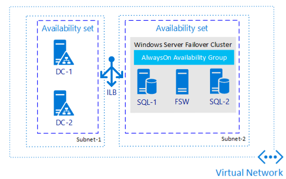

# High Availability and Disaster Recovery

## Describe recovery time objective and recovery point objective

Understanding recovery time and recovery point objectives are crucial to your high availability and disaster recovery (HADR) plan as they are the foundation for any availability solution.

### Recovery Time Objective

Recovery Time Objective (RTO) is the maximum amount of time available to bring resources online after an outage or problem. RTO can be specified for the whole solution, as well for individual components

### Recovery Point Objective

Recovery Point Objective (RPO) is the point in time to which a database should be recovered and equates to the maximum amount of data loss that the business is willing to accept.

## Defining Recovery Time and Recovery Point Objectives

RTOs and RPOs are driven by business requirements but are also based on various technological and other factors. While the business may want no downtime or zero data loss, that may not be realistic or possible. Determining RTO and RPO should be an honest discussion between all parties involved.

One of the aspects crucial for both RTO and RPO is knowing the cost of downtime. If you define that number and the overall effect being down or unavailable has to the business, it is easier to define solutions.

From a non-busines standpoint, RTO should be defined at a component level, as well as for the entire application architecture. The ability to recover from an outage is only as good as its weakest link.

RPO deals specifically with data and directly influences the design of any HADR solution as well as administrative policies and procedures. The features used must support both the RTO and RPO that are defined. If transaction log backups are scheduled every 30 minutes but there is a 15-minutes RPO, a database could only be recovered to the last transaction log backup which in a best case would be 30 minutes. Without doing at least periodic restores, there is no guarantee they are good. Running checks during the backup process can give some degree of confidence.

Specific features, such as Always On Availability Group (AG) or Always On Failover Cluster Instance (FCI) will also affect RTOs and RPOs. Depending on how the features are configured IaaS or PaaS solutions may or may not automatically failover to another location, which could result in longer downtime. By defining RTO and RPO, the technical solution that supports that requirement can be designed knowing the allowances for time and data loss. RTOs and RPOs must be adjusted accordingly. If there is a desiled RTO of two hours but a backup ill take three hours to copy to the destination server for restoring, the RTO is already missed. These types of factors must be accounted for when determining RTOs and RPOs.

There should be RTOs and RPOs for HA and DR. HA is considered a more localized event that can be recovered from more easily. One examplo of high availability would be an AG automatically failing over from one replica to another within an Azure region.

DR would be akin to bringing up a whole data center. Getting everything online may take hours or longer. This is why the RTOs and RPOs are separate.

All RTOs and RPOs should be formally documented and revised periodically.

## SQL Server HADR Features for Azure VM

When using IaaS, you can use the features provided by SQL Server to increase availability. In some cases, they can be combined with Azure-level features to increase availability even further.

| Feature | Protects |
| ------- | -------- |
| Always on Failover Cluster Instance (FCI) | Instance |
| Always On Availability Group (AG) | Database |
| Log Shipping | Database |

An instance of SQL Server in the entire installation of SQL Server (binaries, all objects inside the instance including logins, SQL Server Agent jobs, databases). Instance-level protection means that the entire instance is accounted for in the availability feature.

A database in SQL Server contains the data that end users and applications use. There are system databases that SQL Server relies on, as well as databases created for use by end users and applications. An instance of SQL Server always has its own system databases. Database-level protection means that anything that is in the database, or is captured in the transaction log for a user or application database, is accounted for as part of the availability feature. Anything that exists outside of the database such as SQL Server Agent jobs and linked servers must be manually dealt with to ensure the destination server can function like the primary if there is a failover event.

Both FCIs and AGs require an underlying cluster mechanism. For SQL Server deployments running on Windows Server, it is a Windows Server Failover Cluster (WSFC) and for Linux it is Pacemaker.

### Always On Failover Cluster Instances

An FCI is configured when SQL Server is installed. A standalone instance of SQL Server cannot be converted to an FCI. The FCI is assigned a unique name as well as an IP address that is different from the underlying servers, or nodes, participating in the cluster. The name and IP address must also be different from the underlying cluster mechanism. Applications and end users would use the unique name of the FCI for access. This abstraction enables applications to not have to know where the instance is running. One major difference between Azure-based FCIs versus on-premises FCIs, is that for Azure, an internal load balancer (ILB) is required. The ILB is used to help ensure applications and end users can connect to the FCI's unique name.

When an FCI fails over to another node of a cluster, whether it is initiated manually or due to a problem, the entire instance restarts on another node. That means the failover process is a full stop and a start of SQL Server. Any applications or end users connected to the FCI will be disconnected and only applications that can handle and recover from this interruption can reconnect automatically.

Upon starting on the other node, the instance goes through the recovery process. The FCI will be consistent to the point of failure, so there will be no data loss.

FCI require one copy of a database, but that is also its single point of failure. To ensure another node can access the database, FCIs require some form of shared storage. For Windows Server, this can be achieved via an Azure Premium File Share, iSCSI, Azure Shared Disk, Storage Spaces Direct (S2D), or a supported third-party solution like SIOS DataKeeper. FCIs using Standard Edition of SQL Server can have up to two nodes. FCIs also require the use of ACtive Directory Domain Services (AD DS) and Domain Name Services (DNS), so that means AD DS and DNS must be implemented somewhere in Azure for an FCI to work.

Using Windows Server 2016 or later, FCIs can use Storage Replica to create a native disaster recovery solution for FCIs without having to use another feature such as log shipping on AGs.

### Always On Availability Groups

AGs were introduced in SQL Server 2012 Enterprise Edition and as SQL Server 2016, are also in Standard Edition. In SE, an AG can contain one database whereas in EE, an AG can have more than one database. While AGs share some similarities with FCIs, in most ways they are different.

The biggest difference between an FCI and an AG is that AGs provide database-level protection. The primary replica is the instance participating in an AG that contains the read/write databases. A secondary replica is where the primary sends transactions over the log transport to keep it synchronized. Data movement between a primary replica can be synchronous or asynchronous. The databases on any secondary replica are in a loading state, which means they can receive transactions but cannot be a fully writeable copy until that replica becomes the primary. An AG in SE can have at most two replicas (one primary, one secondary) whereas EE supports up to nine (one primary, eight secondary). A secondary replica is initialized either from a backup of the database, or as of SQL Server 2016, you can use a feature called 'automatic seeding'. Automatic seeding uses the log stream transport to stream the backup to the secondary replica for each database of the availability group using the configured endpoints.

An AG provides abstraction with the listener. The listener functions like the unique name assigned to an FCI and has its own name and IP address that is different from anything else. The listener also requires an ILB and goes through a stop and start. Applications and end users can use the listener to connect, but unlike an FCI, if desired, the listener does not have to be used. Connections directly to the instance can occur. With EE, secondary replicas in EE can also be configured for read-only access if desired and can be used for other functionality such as database consistency checks (DBCC) and backups.

AGs can have a quicker failover time compared to an FCI, which is one reason they are attractive. AGs do not require shared storage, each replica has a copy of the data. which increases the total number of copies of the database and overall storage cost. The storage is local to each replica.

### Log Shipping

This feature is based on backup, copy and restore and is one of the simplest methods of achieving HADR for SQL Server. Log shipping is primarily used for disaster recovery, but it could also be used te enhance availability.

Provides database-level protection. There is no abstraction provided natively by log shipping, so a switch to another server must be able to tolerate a name change. There are methods such as DNS alias, which can be configured at the network layer to mitigate name change issues.

The log shipping is simple: take a full backup of the source database on the primary server, restore it in a loading state (STANDBY or NORECOVERY) on another instance known as secondary server. An automated process buit into SQL Server will then automatically backup the primary database's transaction log, copy the backup to the standby server, and finally restore the backup onto the standby.

## Azure high availability and disaster recovery features for Azure VMs

Azure provides three main options to enhance avilability for IaaS deployments:

### Availability sets

Provide uptime against Azure-related maintenances and single point of failure in a single data center. Can bu thought of as anti-affinity rules for VMs. This means if you had two SQL Server VMs in an availability set or log shipping pair, they would be guaranteed to never run on the same physical server.

Are separated in both fault domains and update domains to support both updates to the underlying Azure Infrastructure. Falut domains are sets of servers within a data center, which use the same power source and network. There can be up to three fault domains in a data center. Update domains, indicate groups of VMs and underlying physical hardware that can be rebooted at the same time.


Availability sets and zones do not protect againt in-guest failures, such as an OS or RDBMS crash; which is why you need to implement additional solutions such as AGs or FCIs. Both availabiliity sets and zones are designed to limit the impact of problems at the Azure level such as datacenter failure, physical hardware failure, network outages, and power interruptions.

For a multi-tier application, you should put each tier into its own availability set.

### Availability zones

Availability zones account for datacenter-level failure in Azure. Each Azure region consists of many data centers with low latency network connection. A zone is a unique physical location, that is, a datacenter, within an Azure region.

Zone numbers are logical representations.

### Azure Site Recovery

Azure Site Recovery provides enhanced availability for VMs at the Azure level and can work with VMs hosting SQL Server.
Azure Site Recoviry replicates a VM from one region to another to create a DR solution. This feature does not know that SQL Server is running in the VM. While Azure Site Recovery may meet RTO, it may not meet RPO since it is not accounting for where data is inside SQL Server. Azure site Recovery has a stated monthly RTO of two hours. While most database professionals may prefer to use a database-based methoud for DR, Azure Site Recovery works well if it meets your RTO and RPO needs.

## HADR options for PaaS deployments

PaaS is different when it come to availability, you can only configure the options that Azure provides.

For the SQL Server-based options for Azure SQL Database and Azure SQL Managed Instance, the options are active geo-replication (Azure SQL Database only) and autofailover groups (SQL Database and SQL Managed Instance).

Azure Database for MySQL has a SLA of 99.99. If a node-level problem happens such as hardware failure, a built-in failover mechanism will kick in. All transactional changes are written synchronously to storage upon commit. If a node-level interruption occurs, the database server automatically creates a new node and attaches the data storage.

From an application standpoint. a retry logic will be needed because all connections are dropped as part of spinning up the new node.

Azure Database for PostgreSQL uses a similar model to MySQL in its standard deployment model; however, Azure PostgreSQL also offers a scale-out hyperscale solution called Citus. Citus provides both scale-out and additional high availability for a server group. If enabled, a standby replica is configured for every node of a server group, which would increase cost since it would double the number of servers in the group. In the event, the original node becoming unresponsive, the standby takes its place. The data is kept in sync via PostgreSQL synchronous streaming replication.

Both Azure Database for MySQL and PostgreSQL supports the option for a read replica.

## IaaS HADR solution

There are many different combinations of features that could be deployed in Azure for IaaS HADR arhitectures.

### Single Region High Availability - Always On availability groups

If you only need high availability and not disaster recovery, configuring an AG is one of the most ubiquitous methods.



- Protects data by having more than one copy on different VMs
- Allows to meet RTO and RPO with minimal data loss if implemented properly
- Provides standardized method for applications to access both primary and secondary replicas
- Provides enhanced availability during patching
- Needs no shared storage

### Single Region High Availability - Always On failover Cluster Instance

FCIs, were designed when physical deployments were dominant. In a virtualized world, FCIs do not provide many of the same protections in the way they would on physical hardware. FCIs were designed to protect against things like network card failure or disk failure.


- Shared storage story is improving with Azure Shared Disk
- Meets RTO and RPO for HA
- Provides standardized methord for applications to access the clusterede instance for SQL Server
- Provides enhanced availability during patching

### Disaster Recovery - Multi-region or Hybrid Always On availability group

If using AG, one option is to configure AG across multiple regions or potentially as a hybrid architecture. This means that all nodes which contain the replicas participate in the same WSFC. This assumes good network connectivity. One of the biggest considerations would be the witness resource for the WSFC. This architecture would require AD DS and DNS to be available in every region.


- This architecture is a proven solutions; is no different than having two datacenters in an AG topology.
- Works with SE and EE editions of SQL Server.
- Provides redundancy with additional copies of data
- Makes use of one feature that provides both HA and DR

### Disaster Recovery - Distributed availability group

Is an Enterprise Edition only feature introduced in SQL Server 2016. It is different than a traditional AG. Instead of having one underlying WSFC where all nodes contain replicas participating in one AG, a distributed AG is made up of multiple AGs. The primary replica containing the read write database is known as the global primary. The primary of the second AG is known as a forwarder and keeps the secondary replicas of that AG in sync.

This architecture makes it easier to deal with things like quorum sinc each cluster would maintain its own quorum, meaning it also has its own witness. A distributed AG would work whether you are using Azure for all resources, or if you are using a hybrid architecture.


- Separates out the WSFC as a single point of failure if all nodes lose communication
- ONe primary is not synchronizing all secondary replicas.
- Provide failing back from one location to another.

### Disaster Recovery - Log shipping

Is one of the oldest HADR methods for SQL Server. The unit of measurement is the transaction log backup. Unless the switch to a warm standby is planned to ensure no data loss, data loss will most likely occur.


- Is a tried-and-true feature that has been around for over 20 years
- Easy to deploy and administer since it is based on backup and restore
- Is tolerant of networks that are not robust
- Meets most RTO and RPO goals for DR.
- Good way to protect FCIs.

### Disaster Recovery - Azure Site Recovery

For those who do not want to implement SQL Server-based disaster solution, Azure Site Recovery is a option.

- Will work with more than just SQL Server.
- may meet RTO and possibly RPO.
- Is provided as part of the Azure platform.

## Hybrid solutions

PaaS solutions by nature are not designed to allow traditional hybrid solutions. HADR is provided by the Azure Infrastructure. There are some exceptions. SQL Server's transactional replication feature can be configured from a publisher located on premises (or another cloud) to an Azure Managed Instance subscriber, but not the other way.

Hybrid solutions are IaaS-based since they rely on traditional infrastructure. Hybrid solutions can be used to help migrate to Azure, but the most common usage is to create a robust disaster recovery solution for an on premises system. A secondary replica for an AG can be added in Azure. That means any associated infrastructure must exist, such as AD DS and DNS.

The most important consideration for a hybrid HADR solution that extends to Azure is networking. Not having the righ bandwidth could mean missing your RTO and RPO. Azure has a fast networking option called ExpressRoute. If it's not something your company can or will implement, configure a secure site-to-site VPN so that Azure VMs will act as an extension of your on premises infrastructure.


## Windows Server Failover Cluster in Azure

Deploying a Windows Server Failover Cluster (WSFC) in Azure is similar to configuring one on premises, but there are some Azure-specific considerations.

One of the most important aspects is deciding what to use for a witness resource. Witness is a core component of the quorum mechanism. Quorum is what helps ensure that everything in the WSFC stays up and running. If you lose quorum, the WSFC will go down taking an AG or FCI with it. The witness resource can be a disk, file share (SMB 2.0 or later), or cloud witness. It's recommended that you use a cloud witness as it is fully Azure-based, especially for solutions that will span multiple Azure regions or are hybrid. The cloud witness feature is available in Windows Server 2016 and later.

The next consideration is the Microsoft Distributed Transaction Coordinator (DTC or MSDTC). Some applications use it, but most applications don't. If you require DTC and are deploying an AG or FCI, you should cluster DTC. Clustering TC requires a shared disk to work properly even though you may not require one otherwise, as in the case of an AG.

Most WSFC deployments require the use of AD DS and DNS; FCI always do. AGs can be configured without requiring AD DS but still needing DNS. In Win Server 2016, there's a variant of WSFC called Workgroup Cluster, which can be used with AG only.

WSFC itself needs a unique name in the domain (and DNS) and requires an object in AD DS called the Cluster Name Object (CNO). Anything created in the context of the WSFC that has a name will require a unique name, and at least one IP address. If the configuration will stay in a single region, IP addresses will be in a single subnet. If the WSFC will span multiple regions, more than one IP address will be associated with the WSFC, and an AG if it spans multiple regions as part of the WSFC.

A typical Azure-based WSFC will only require a single virtual network card (vNIC). Unlike the setup for an on-premises physical or virtual server, the IP address for the vNIC has to be configured in Azure, not in the VM. That means inside the VM it will shouw up as a dynamic address (DHCP).

Considerations for the WSFC IP address is also different from on premises. There's no way to reserve the IP address at the Azure level since it's fully maintained within the guest configuration. This means that if subsequent resources that use an IP address in Azure use DHCP, you must check for conflicts.

### Failover clustering feature

Before WSFC can be configured, the underlying Win feature must be enabled on every node that will participate in the WSFC. This can be done using Server Manager or PowerShell.

```PowerShell
Install-WindowsFeature Failover-Clustering -IncludeManagementTools
```

### Cluster validation

For a WSFC to be considered supported, it must pass cluster validation. It's a buit-in process that checks the nodes via a series of tests to ensure the entire cofiguration is suitable for clustering. After validation, each test will return with an error, a warning, a pass, or a message the test isn't applicable. Warnings are acceptable if that condition is expected. All errors must be resolved.

Validation can be run via Failover Cluster Manager or by using Test-Cluster cmdlet.

For FCI these tests also check the shared storage. For Ag with no shared storage, in Win Server 2016 and later, the results will come back as not applicable. For Win Server 2012 R2, the disk test will show a warning when there are no shared disks, this is expected.

### Windows Server Failover Cluster in Azure

To create a WSFC in Azure, you can't use the Wizard in Failover Cluster Manager for FCI or G deployed using Win Server 2016 and earlier. Due to the DHCP issue, the only way to create the WSFC is using PowerShell and specify the IP address.

```PowerShell
New-Cluster -Name MyWSFC -Node Node1,Node2,…,NodeN -StaticAddress w.x.y.z
```

WSFC with no shared storage
```PowerShell
New-Cluster -Name MyWSFC -Node Node1,Node2,…,NodeN -StaticAddress w.x.y.z -NoStorage
```

Workgroup Cluster with DNS
```PowerShell
New-Cluster -Name MyWSFC -Node Node1,Node2,…,NodeN -StaticAddress w.x.y.z -NoStorage -AdministrativeAccessPoint DNS
```

Win Server 2019 by default will use a distributed network name for IaaS. A distributed network name is one that creates just a network name, but the IP address is tied to the underlying nodes. A distributed name is for the WSFC name only, it can't be used with the name of an AG or FCI.

The creation mechanism in Win Server 2019 detects if it's running in Azure or not and will create the cluster using a distributed network name unless you specify it differently. There are cases you many want to consider deploying a WSFC traditionally using PowerShell. For this, you need to add the option ```-ManagementPointNetwork Singleton```.

```PowerShell
New-Cluster -Name MyWSFC -Node Node1,Node2,…,NodeN -StaticAddress w.x.y.z -NoStorage -ManagementPointNetwork Singleton
```

for a Workgroup Cluster, you'll need to ensure the name and IP address are in DNS for any name or IP address created in the context of the WSFC such as the WSFC itself, an FCI name and IP address, and a AG listener name and IP address.

### Failover Cluster Instance

Uses Win Server Failover Clustering (WSFC) functionality to provide high availability though redundancy at the instance level

An FCI is an instance fo SQL Server that is installed across WSFC nodes and possibly across multiple subnets. On the network, an FCI appears as a single local instance that uses a virtual network name. Therefore, it becomes transparent for the application, since it doesn't know which node the instance is currently running on. As a result, there is no need to reconfigure clients and applications during or after a failover.

The multi-subnet support eliminates the need for a virtual LAN.

When using multi-subnet, each subnet of the FCI is assigned a virtual IP address, and a failover occurs as follows:

- Virtual network names on DNS server are updated with virtual IP addressess corresponding to the respective subnets.
- After a multi-subnet failover, clients and applications can then connect to the FCI via the same virtual network name

### Distributed Network Name (DNN)

DNN replaces the virtual network name (VNN) as the connection point when used with FCI. As a result, the VNN no longer requires an Azure Load Balancing service.

VNN still exists in an FCI deployment. but the clients connect to the DNN DNS name instead of the VNN name.

### Test WSFC

After the WSFC is created but before configuring FCI or AG, test that the WSFC is working properly. For clusters that require shared storage, such as for those supporting FCI, it's important that you test the ability for all the nodes in the cluster to access any shared storage, and to take the ownership of the storage as they would in a failover. You can do this by using the Move Available Storage in the Failover Cluster Manager.

## Always-on availability groups

For all availability configurations of AG, an underlying cluster is required, whether or not it uses AD DS.

Configuring an AG is nealy the same in Azure as it is on premises.

Same as the WSFC itself, you can't reserve the listerner's IP address in Azure, so you need to ensure something else doesn't come along and grab it otherwise there could be a conflict on the network.

Don't place any permanent database on the ephemeral storage. All VM that are participating in an AG should have the same storage configuration. You must size disk appropriately for performance.

Before an AG can be configured, the AG feature must be enabled. This can be done in SQL Server Configuration Manager or PowerShell with the cmdlet Enable-SqlAlwaysOn. This will require a stop and start of SQL Server Service.

### Create Availability group

You can use SSMS, T-SQL or PowerShell to create AG in Azure.
The only difference is that whether or not you create the listener as part of the initial AG configuration, the listener requires the creation of an Azure load balancer and has some extra configuration is the WSFC related to the load balancer.

### Create an Iternal Azure load balancer

Once listener is created, an ILB must be used. Without configuring an ILB, applications, end users, administrators, and others can't use the listener unless they were connected to the VM that hosts an AG's primary replica.

You can use basic or standard load balancer. Deployment using Availability Zones require the use of a standard load balancer. The listener IP address and the port used for the listener are what is configured as part of the load balancer. A single load balancer supports more than one IP address, so depending on your standards, you may not need a different load balancer for each AG.

Without the probe port, listeners won't work properly as it isn't enough just create the load balancer. Each IP address that will use the load balancer queries a unique probe port. Probe ports are high numbers such as 59999.

The probe port is set on the IP address associated with the listener

```PowerShell
Get-ClusterResource IPAddressResourceNameForListener | Set-ClusterParameter ProbePort PortNumber
```

Adding the probe port will require a stop and start of the IP address of the listener.

If you have multi-subnet configuration, a load balancer will need to be configured in each subnet and the probe port for that region associated with the IP resource for that subnet in the WSFC.

If you can't directly connect to the listener, then you need to use the cmdlet ```Test-Connection``` to verify that it's configured correctly.

```PowerShell
Test-NetConnection NameOrIPAddress -Port PortNumber
```

Some environments may require that the IP address for the WSFC and selected ports must be accessible for administration or other purposes, which mean to configure those as part of the same or a different load balancer.

### Distributed availability groups

The main difference between an on-premises configuration and an Azure configuration for a distributed AG is that as part of the load balancer configuration in each region, the endpoint port for the AG needs to be added. The default port is 5022.

A traditional AG has resources configured in WSFC or if on Linux, Pacemaker. A distributed AG does not need WSFC or Pacemaker, everything about it is maintained within SQL Server.

## Azure Site Recovery

It's an option that work with the VM, whether or not SQL Server is running in it. It works with SQL Server, but isn't designed specifically to account a specific RPO. The disks of a VM configured to use Azure Site Recovery are replicated to another region. This means all changes to a disk are replicated as soon as they occur, but this process knows nothing of database transactions. This is why recovering to a specific data point may not be possible with Azure Site Recovery in the same way it is for SQL Server-centric solution such as when using an AG.


If it isn't possible to deploy one of the in-guest options for IaaS solutions, Azure Site Recovery is a viable option.

Azure Site Recovery can potentially protect against ransomware. If infected, you could roll back the VM to a point before the infection.

The key things to know when replication is enabled on a VM

- There's a Site Recovery Mobility extension configured on a VM
- Changes are sent continually unless Azure Site Recovery is unconfigured on replication is disabled
- Crash consistent recovery points are generated every five minutes, and application-specific recovery points are generated according to what is configured in the replication policy.

For the SQL Server, the App consistent snapshot frequency value is what you may want to adjust to reduce your RPO. However, due to the nature of Azure Site Recovery (uses Volume Shadow Service), lowering this value could potentially cause problems since there's a brief freeze and thaw of I/O when the snapshots are taken. The impact of the freeze and thaw could be magnified if other options such AG are configured.

If multiple VMs are part of an overall solution, they can be replicated together to create a shared crash- and application-consistent recovery points. This is known as multi-VM consistency and will affect performance, it's recommended not to configure this option.

One major benefit of Azure Site Recovery is that you can test disaster recovery without needing to bring down production.

A consideration is if there's a failover to another region, the replica VMs aren't protected when they're brought online.

## Temporal tables in Azure SQL Database

Azure SQL Database and Managed Instance allow you to track and analyze the changes to your data using  Temporal Tables. This feature requires that the tables themselves be converted to be temporal, which means the table will have special properties and will also have a corresponding history table.

The temporatl table allows you to use the history table to recover data that may have been deleted or updated. Recovering data from the history table is a manual process using T-SQL.

```SQL
SELECT * FROM Employee
FOR SYSTEM_TIME
        BETWEEN '2021-01-01 00:00:00.0000000' AND '2022-01-01 00:00:00.0000000'
WHERE EmployeeID = 1000 ORDER BY ValidFrom;
```

### Use cases scenarios

- Auditing - provides data audit to existing applications
- Historical trends (time travel) - users can see how data changed over time
- Anomaly detection - for data that don't match an expected pattern, you might investigate sales spikes that don't line up with the average.
- Data protection due to data loss - useful to revert undesired data changed without requiring backups
- Slowly changing dimensions - dimensions in data warehousing are tipiaclly static data. certain scenarios require you to track data changes in dimensions tables.

### Storage consideration

Keeping historical data for a long time or performing heavy data changes may cause the history table to increase the database size more than normal tables. A large history increase storage cost and affect query performance.

It's important to establish data retention policy within the history table.

There are four ways to manage, store, and delete historical data:

- Stretch Database - configure SQL Server to silently move historical data from your temporatl history tables to Azure.
- Table Partitioning - oldest part of the historical data can be moved out of the history table by using a slinding window approach
- Custom Cleanup Script - you can use a custom cleanup script to remove the data from the history table
- Retention Policy - can be easily configured at the temporal table level.

## Active geo-replication for Azure SQL Database

One method to increase availability for Azure SQL Database is to use active geo-replication, it creates a secondary database replica in another region that is asychronously kept up to date.

This replica is readable, similar to an AG in IaaS. Underneath the surface, Azure uses AG to maintain this functionality, which is why some of the terminologies are similiar (primary and secondary logical servers, read-only databases, etc).

Active geo-replication provides business continuity by allowing to programmatically or maunally failover primary database to secondary regions during a disaster.

Managed Instance doesn't support active geo-replication, you must use auto-failover groups instead.


All databases involved in geo-replication relationship are required to have the same service tier.

To avoid replication overhead due to a large write workload that can affect the replication performance, it's recommended that the geo-secondary is configured with the same compute size as the primary.

you can manually configure geo-replication by accessing Data Management in Azure protal selecting Replicas and then Create replica.

You can mannualy fail over your secondary replica in the portal. The roles will switch with the secondary becoming the new primary, and the old primary the secondary.

### Cross subscription geo-replica

Some scenarios require to configure a secondary replica on a different subscription than the primary database. Cross subscription geo-replication allows to perform this task.
Cross subscription geo-replication is only available programmatically.

## Auto-failover groups for Azure SQL Database and Managed Instance

An auto-failover gorup is an availability feature that can be used with both Azure SQL Database and Managed Instance. Autofailover groups let you manage how databases on an Azure SQL Database or Managed Instance are replicated to another region, and let you manage how failover could happen. The name assigned to the autofailover group must be unique within the *.database.windows.net domain. Managed Instance only supports one autofailover group.

Auto-failover groups provide AG-like functionality called a listener, which allows both read-write and read-only activity. There are two kinds of listener: read-write and read-only traffic. Behind the scenes in a failover, DNS is updated so clients will be able to point to the abstracted listener name and not need to know anything else. The database server containing the read-writes copies is the primary, and the server that is receiving the transactions from the primary is the secondary.


Auto-failover groups have two policies

- Automatic - by default, when a failure occurs and it's determined that a failover must happen, the auto-failover group will switch regions. The ability to fail over autocamically can be disabled.
- Read-Only - by default, if a failover occurs, the read-only listener is disabled to ensure performance of the new primary when the secondary is down. This behavior can be changed so that both types of traffic are enabled

Failover can be performed manually even if automatic failover is allowed. Depending on the type of failover, there could be data loss. Unplanned failover could result in data loss if forced and the secondary isn't fully synchronized with the primary. Configuring GracePeriodWithDataLossHours control how long Azure waits before failing over. The default is one hour. If you have a tight RPO and can't afford much data loss, set the value higher. This approch may result in less data loss as the secondary has more time to fully synchronize with teh primary.

One auto-failover group can contain one or more databases. The database size and edition will be the same on both the primary and secondary. The database is created automatically on the secondary through a process called seeding. Depending on the size of the database this may take some time.