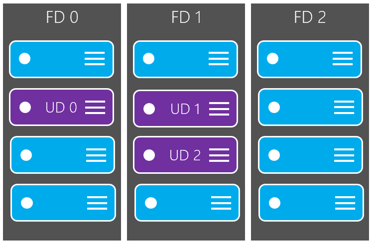
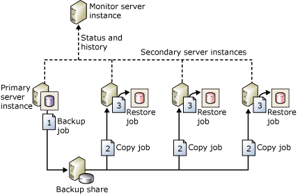

# High Availability and Disaster Recovery

## Describe recovery time objective and recovery point objective

Understanding recovery time and recovery point objectives are crucial to your high availability and disaster recovery (HADR) plan as they are the foundation for any availability solution.

### Recovery Time Objective

Recovery Time Objective (RTO) is the maximum amount of time available to bring resources online after an outage or problem. RTO can be specified for the whole solution, as well for individual components

### Recovery Point Objective

Recovery Point Objective (RPO) is the point in time to which a database should be recovered and equates to the maximum amount of data loss that the business is willing to accept.

## Defining Recovery Time and Recovery Point Objectives

RTOs and RPOs are driven by business requirements but are also based on various technological and other factors. While the business may want no downtime or zero data loss, that may not be realistic or possible. Determining RTO and RPO should be an honest discussion between all parties involved.

One of the aspects crucial for both RTO and RPO is knowing the cost of downtime. If you define that number and the overall effect being down or unavailable has to the business, it is easier to define solutions.

From a non-busines standpoint, RTO should be defined at a component level, as well as for the entire application architecture. The ability to recover from an outage is only as good as its weakest link.

RPO deals specifically with data and directly influences the design of any HADR solution as well as administrative policies and procedures. The features used must support both the RTO and RPO that are defined. If transaction log backups are scheduled every 30 minutes but there is a 15-minutes RPO, a database could only be recovered to the last transaction log backup which in a best case would be 30 minutes. Without doing at least periodic restores, there is no guarantee they are good. Running checks during the backup process can give some degree of confidence.

Specific features, such as Always On Availability Group (AG) or Always On Failover Cluster Instance (FCI) will also affect RTOs and RPOs. Depending on how the features are configured IaaS or PaaS solutions may or may not automatically failover to another location, which could result in longer downtime. By defining RTO and RPO, the technical solution that supports that requirement can be designed knowing the allowances for time and data loss. RTOs and RPOs must be adjusted accordingly. If there is a desiled RTO of two hours but a backup ill take three hours to copy to the destination server for restoring, the RTO is already missed. These types of factors must be accounted for when determining RTOs and RPOs.

There should be RTOs and RPOs for HA and DR. HA is considered a more localized event that can be recovered from more easily. One examplo of high availability would be an AG automatically failing over from one replica to another within an Azure region.

DR would be akin to bringing up a whole data center. Getting everything online may take hours or longer. This is why the RTOs and RPOs are separate.

All RTOs and RPOs should be formally documented and revised periodically.

## SQL Server HADR Features for Azure VM

When using IaaS, you can use the features provided by SQL Server to increase availability. In some cases, they can be combined with Azure-level features to increase availability even further.

| Feature | Protects |
| ------- | -------- |
| Always on Failover Cluster Instance (FCI) | Instance |
| Always On Availability Group (AG) | Database |
| Log Shipping | Database |

An instance of SQL Server in the entire installation of SQL Server (binaries, all objects inside the instance including logins, SQL Server Agent jobs, databases). Instance-level protection means that the entire instance is accounted for in the availability feature.

A database in SQL Server contains the data that end users and applications use. There are system databases that SQL Server relies on, as well as databases created for use by end users and applications. An instance of SQL Server always has its own system databases. Database-level protection means that anything that is in the database, or is captured in the transaction log for a user or application database, is accounted for as part of the availability feature. Anything that exists outside of the database such as SQL Server Agent jobs and linked servers must be manually dealt with to ensure the destination server can function like the primary if there is a failover event.

Both FCIs and AGs require an underlying cluster mechanism. For SQL Server deployments running on Windows Server, it is a Windows Server Failover Cluster (WSFC) and for Linux it is Pacemaker.

### Always On Failover Cluster Instances

An FCI is configured when SQL Server is installed. A standalone instance of SQL Server cannot be converted to an FCI. The FCI is assigned a unique name as well as an IP address that is different from the underlying servers, or nodes, participating in the cluster. The name and IP address must also be different from the underlying cluster mechanism. Applications and end users would use the unique name of the FCI for access. This abstraction enables applications to not have to know where the instance is running. One major difference between Azure-based FCIs versus on-premises FCIs, is that for Azure, an internal load balancer (ILB) is required. The ILB is used to help ensure applications and end users can connect to the FCI's unique name.

When an FCI fails over to another node of a cluster, whether it is initiated manually or due to a problem, the entire instance restarts on another node. That means the failover process is a full stop and a start of SQL Server. Any applications or end users connected to the FCI will be disconnected and only applications that can handle and recover from this interruption can reconnect automatically.

Upon starting on the other node, the instance goes through the recovery process. The FCI will be consistent to the point of failure, so there will be no data loss.

FCI require one copy of a database, but that is also its single point of failure. To ensure another node can access the database, FCIs require some form of shared storage. For Windows Server, this can be achieved via an Azure Premium File Share, iSCSI, Azure Shared Disk, Storage Spaces Direct (S2D), or a supported third-party solution like SIOS DataKeeper. FCIs using Standard Edition of SQL Server can have up to two nodes. FCIs also require the use of ACtive Directory Domain Services (AD DS) and Domain Name Services (DNS), so that means AD DS and DNS must be implemented somewhere in Azure for an FCI to work.

Using Windows Server 2016 or later, FCIs can use Storage Replica to create a native disaster recovery solution for FCIs without having to use another feature such as log shipping on AGs.

### Always On Availability Groups

AGs were introduced in SQL Server 2012 Enterprise Edition and as SQL Server 2016, are also in Standard Edition. In SE, an AG can contain one database whereas in EE, an AG can have more than one database. While AGs share some similarities with FCIs, in most ways they are different.

The biggest difference between an FCI and an AG is that AGs provide database-level protection. The primary replica is the instance participating in an AG that contains the read/write databases. A secondary replica is where the primary sends transactions over the log transport to keep it synchronized. Data movement between a primary replica can be synchronous or asynchronous. The databases on any secondary replica are in a loading state, which means they can receive transactions but cannot be a fully writeable copy until that replica becomes the primary. An AG in SE can have at most two replicas (one primary, one secondary) whereas EE supports up to nine (one primary, eight secondary). A secondary replica is initialized either from a backup of the database, or as of SQL Server 2016, you can use a feature called 'automatic seeding'. Automatic seeding uses the log stream transport to stream the backup to the secondary replica for each database of the availability group using the configured endpoints.

An AG provides abstraction with the listener. The listener functions like the unique name assigned to an FCI and has its own name and IP address that is different from anything else. The listener also requires an ILB and goes through a stop and start. Applications and end users can use the listener to connect, but unlike an FCI, if desired, the listener does not have to be used. Connections directly to the instance can occur. With EE, secondary replicas in EE can also be configured for read-only access if desired and can be used for other functionality such as database consistency checks (DBCC) and backups.

AGs can have a quicker failover time compared to an FCI, which is one reason they are attractive. AGs do not require shared storage, each replica has a copy of the data. which increases the total number of copies of the database and overall storage cost. The storage is local to each replica.

### Log Shipping

This feature is based on backup, copy and restore and is one of the simplest methods of achieving HADR for SQL Server. Log shipping is primarily used for disaster recovery, but it could also be used te enhance availability.

Provides database-level protection. There is no abstraction provided natively by log shipping, so a switch to another server must be able to tolerate a name change. There are methods such as DNS alias, which can be configured at the network layer to mitigate name change issues.

The log shipping is simple: take a full backup of the source database on the primary server, restore it in a loading state (STANDBY or NORECOVERY) on another instance known as secondary server. An automated process buit into SQL Server will then automatically backup the primary database's transaction log, copy the backup to the standby server, and finally restore the backup onto the standby.

## Azure high availability and disaster recovery features for Azure VMs

Azure provides three main options to enhance avilability for IaaS deployments:

### Availability sets

Provide uptime against Azure-related maintenances and single point of failure in a single data center. Can bu thought of as anti-affinity rules for VMs. This means if you had two SQL Server VMs in an availability set or log shipping pair, they would be guaranteed to never run on the same physical server.

Are separated in both fault domains and update domains to support both updates to the underlying Azure Infrastructure. Falut domains are sets of servers within a data center, which use the same power source and network. There can be up to three fault domains in a data center. Update domains, indicate groups of VMs and underlying physical hardware that can be rebooted at the same time.

Availability sets and zones do not protect againt in-guest failures, such as an OS or RDBMS crash; which is why you need to implement additional solutions such as AGs or FCIs. Both availabiliity sets and zones are designed to limit the impact of problems at the Azure level such as datacenter failure, physical hardware failure, network outages, and power interruptions.

For a multi-tier application, you should put each tier into its own availability set.

### Availability zones

Availability zones account for datacenter-level failure in Azure. Each Azure region consists of many data centers with low latency network connection. A zone is a unique physical location, that is, a datacenter, within an Azure region.

Zone numbers are logical representations.

### Azure Site Recovery

Azure Site Recovery provides enhanced availability for VMs at the Azure level and can work with VMs hosting SQL Server.
Azure Site Recoviry replicates a VM from one region to another to create a DR solution. This feature does not know that SQL Server is running in the VM. While Azure Site Recovery may meet RTO, it may not meet RPO since it is not accounting for where data is inside SQL Server. Azure site Recovery has a stated monthly RTO of two hours. While most database professionals may prefer to use a database-based methoud for DR, Azure Site Recovery works well if it meets your RTO and RPO needs.

## HADR options for PaaS deployments

PaaS is different when it come to availability, you can only configure the options that Azure provides.

For the SQL Server-based options for Azure SQL Database and Azure SQL Managed Instance, the options are active geo-replication (Azure SQL Database only) and autofailover groups (SQL Database and SQL Managed Instance).

Azure Database for MySQL has a SLA of 99.99. If a node-level problem happens such as hardware failure, a built-in failover mechanism will kick in. All transactional changes are written synchronously to storage upon commit. If a node-level interruption occurs, the database server automatically creates a new node and attaches the data storage.

From an application standpoint. a retry logic will be needed because all connections are dropped as part of spinning up the new node.

Azure Database for PostgreSQL uses a similar model to MySQL in its standard deployment model; however, Azure PostgreSQL also offers a scale-out hyperscale solution called Citus. Citus provides both scale-out and additional high availability for a server group. If enabled, a standby replica is configured for every node of a server group, which would increase cost since it would double the number of servers in the group. In the event, the original node becoming unresponsive, the standby takes its place. The data is kept in sync via PostgreSQL synchronous streaming replication.

Both Azure Database for MySQL and PostgreSQL supports the option for a read replica.

## IaaS HADR solution

There are many different combinations of features that could be deployed in Azure for IaaS HADR arhitectures.

### Single Region High Availability - Always On availability groups

If you only need high availability and not disaster recovery, configuring an AG is one of the most ubiquitous methods.

- Protects data by having more than one copy on different VMs
- Allows to meet RTO and RPO with minimal data loss if implemented properly
- Provides standardized method for applications to access both primary and secondary replicas
- Provides enhanced availability during patching
- Needs no shared storage

### Single Region High Availability - Always On failover Cluster Instance

FCIs, were designed when physical deployments were dominant. In a virtualized world, FCIs do not provide many of the same protections in the way they would on physical hardware. FCIs were designed to protect against things like network card failure or disk failure.

- Shared storage story is improving with Azure Shared Disk
- Meets RTO and RPO for HA
- Provides standardized methord for applications to access the clusterede instance for SQL Server
- Provides enhanced availability during patching

### Disaster Recovery - Multi-region or Hybrid Always On availability group

If using AG, one option is to configure AG across multiple regions or potentially as a hybrid architecture. This means that all nodes which contain the replicas participate in the same WSFC. This assumes good network connectivity. One of the biggest considerations would be the witness resource for the WSFC. This architecture would require AD DS and DNS to be available in every region.

- This architecture is a proven solutions; is no different than having two datacenters in an AG topology.
- Works with SE and EE editions of SQL Server.
- Provides redundancy with additional copies of data
- Makes use of one feature that provides both HA and DR

### Disaster Recovery - Distributed availability group

Is an Enterprise Edition only feature introduced in SQL Server 2016. It is different than a traditional AG. Instead of having one underlying WSFC where all nodes contain replicas participating in one AG, a distributed AG is made up of multiple AGs. The primary replica containing the read write database is known as the global primary. The primary of the second AG is known as a forwarder and keeps the secondary replicas of that AG in sync.

This architecture makes it easier to deal with things like quorum sinc each cluster would maintain its own quorum, meaning it also has its own witness. A distributed AG would work whether you are using Azure for all resources, or if you are using a hybrid architecture.

- Separates out the WSFC as a single point of failure if all nodes lose communication
- ONe primary is not synchronizing all secondary replicas.
- Provide failing back from one location to another.

### Disaster Recovery - Log shipping

Is one of the oldest HADR methods for SQL Server. The unit of measurement is the transaction log backup. Unless the switch to a warm standby is planned to ensure no data loss, data loss will most likely occur.

- Is a tried-and-true feature that has been around for over 20 years
- Easy to deploy and administer since it is based on backup and restore
- Is tolerant of networks that are not robust
- Meets most RTO and RPO goals for DR.
- Good way to protect FCIs.

### Disaster Recovery - Azure Site Recovery

For those who do not want to implement SQL Server-based disaster solution, Azure Site Recovery is a option.

- Will work with more than just SQL Server.
- may meet RTO and possibly RPO.
- Is provided as part of the Azure platform.

## Hybrid solutions

PaaS solutions by nature are not designed to allow traditional hybrid solutions. HADR is provided by the Azure Infrastructure. There are some exceptions. SQL Server's transactional replication feature can be configured from a publisher located on premises (or another cloud) to an Azure Managed Instance subscriber, but not the other way.

Hybrid solutions are IaaS-based since they rely on traditional infrastructure. Hybrid solutions can be used to help migrate to Azure, but the most common usage is to create a robust disaster recovery solution for an on premises system. A secondary replica for an AG can be added in Azure. That means any associated infrastructure must exist, such as AD DS and DNS.

The most important consideration for a hybrid HADR solution that extends to Azure is networking. Not having the righ bandwidth could mean missing your RTO and RPO. Azure has a fast networking option called ExpressRoute. If it's not something your company can or will implement, configure a secure site-to-site VPN so that Azure VMs will act as an extension of your on premises infrastructure.