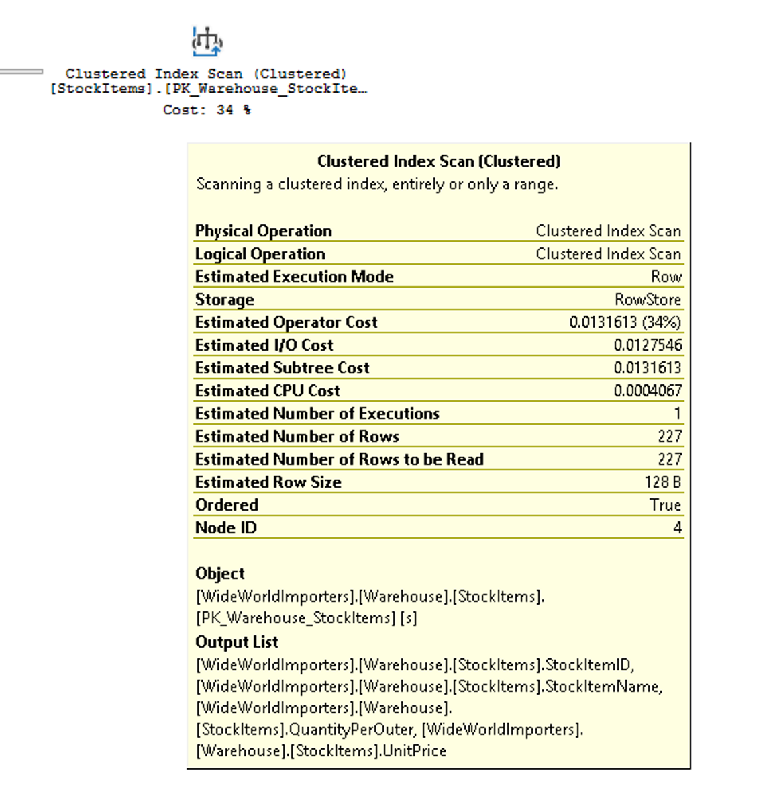
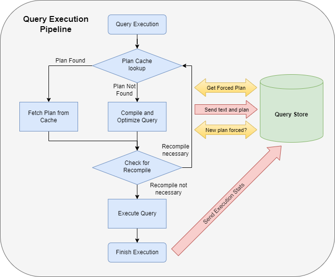
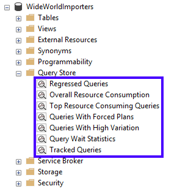
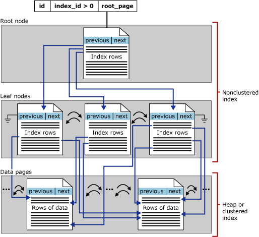

# Optimize query performance in Azure

## Query performance optimization

### Query plans

SQL Server uses what is know as cost-based query optimizer. The query optimizer calculates a cost for multiple possible plans based on the statistics it has on the columns and indexes that can be used for earch operation in each query plan. Based on this information, it comes up with a total cost for each plan. Complex queries can have thousands of possible execution plans. The optimizer doesn't evaluate every possible plan, but uses heuristics to determine plans that are likely to have good performance. Optimizer will choose the lowest cost plan of all the plans evaluated for a giver query.

The statistics SQL Server uses to track the distribution of data in colmuns and indexes need be kept up to date, or it can cause suboptimal execution plans to be generated. SQL Server automatically updates its statistics as data changes, however, more frequent updates may be needed for rapidly changing data.

Whe a query is submited to the database engine:

1. The query is parsed for syntax and a parse tree of database objects is generated.
2. Database engine uses parse tree as input for Algebrizer for binding to validate that columns and objects in the query exist and identifies the data types that are being processed. This outputs a query processor tree.
3. Because query optimization is a expensive process in terms of CPU, the database engine caches execution plans in a special area of memory called plan cache. The queries whose plans are stored in cache will each have a hash value generated based on the T-SQL. This value is referred to as the query_hash.The engine will generate a query_hash and look if it matches any existing queries in the plan cache.
4. If the plan doesn't exist, query optimizer uses it cost-based optimizer to generate several execution plan options based on the statistics of the columns, tables and indexes. The output of this is a query execution plan.
5. The query is then executed using an execution plan that is pulled from the plan cache, or a new plan generated.

Query plans combine a series of relational operators to retrieve the data, and also capture information about the data such as estimated row counts. Another element of the execution plan is the memory required to perform operations such as joining or sorting data. The memory needed by the query is called memory grant. The memory grant is a good example of the importance of statistics. If the statistics says an operator is going to return 10.0000.000 rows when it's only returning 100, a much larger amount of memory is granted to the query. A memory grant that is larger than necessary can cause twofold problem. First, the query may encounter a ```RESOURCE_SEMAPHORE``` wait, which indicates that query is waiting for SQL Server to allocate a large amount of memory. SQL Server defaults to waiting for 25 times the cost of the query (seconds), up to 24 hours. Second, when the query is executed, if there ins'n enough memory available, the query will spill to tempdb, which operates in disk and is much slower than operating in memory.

Execution plan also stores other metadata about the query, database compatibility level, degree of parallelism, and parameters.

Query plans can be viewed either in a graphical representation or in text-based format.

The text-based are invoked with ```SET``` commands and apply only to the current connection. It can be viewed anywhere you can run T-SQL queries.

The most common tool for graphical plan is SSMS, but estimated plans can also be viewed in Azure Data Studio, and third-party tools.

There are three different types of execution plans that can be viewed:

#### Estimated Execution Plan

This type is the execution plan as generated by the query optimizer. The metadata and size of query memory grant are based on estimates from the statistics as they exist in the database at the time of query compilation. To see a text-based estimate plan run the command ```SET SHOWPLAN_ALL ON``` before running the query. When you run the query, you'll see the steps of the execution plan, but the query will NOT be executed, and you won't see any results. The ```SET``` will stay in effect until you set it ```OF```.

#### Actual Execution Plan

This type is same plan as the estimated plan, however, this plan also contains the execution context for the query, which includes the estimated and actual row counts, execution warnings, actual degree of parallelism and elapsed and CPU times used during the execution. To see a text-based actual plan run the command ```SET STATISTICS PROFILE ON``` before running the query.

#### Live Query Statistics

This plan viewing combines the estimated and actual plans into an animated plan that displays execution progress through the operators in the plan. It shows the actual number of rows flowing through the operators. Live Query Statistics shows the handoff from operator to operator, which may be helpful in troubleshooting some performance issues. It's only available as a graphical plan.

### Estimated and actual query plans

The difference between estimated and actual query plans is the actual plan includes runtime statistics that aren't captured in the estimated plan. The operators used, and order of executon will be the same in nealy all cases. In order to capture an actual execution plan the query has to be executed, which can be time consuming, or not possible. If you need to see query results and the plan, you'll need to use one of teh actual plan options.

The Inculed EStimated Query Plan button responds immediately to any query highlighted, or the entire workspace, if nothing is highlighted.
There's overhead to both executing a query and generating an estimated execution plan.

You can use estimated execution plan while writing your query, to understand its performance, identify missing indexes, or detect query anomailies. The actual execution plan is best used to understand runtime performance and most importantly gaps in statistical data that cause the query optimizer to make suboptimal choices based on the data it has available.

### Query plan

Execution plans show what tasks the database engine is performing while retrieving the data needed to satisfy a query.

```SQL
SELECT [stockItemName]
 ,[UnitPrice] * [QuantityPerOuter] AS CostPerOuterBox
 ,[QuantityonHand]

FROM [Warehouse].[StockItems] s
 JOIN [Warehouse].[StockItemHoldings] sh ON s.StockItemID = sh.StockItemID
ORDER BY CostPerOuterBox;
```
This query is joining the StockItems table to the StockItemHoldings table. The database engine has to firs identify those rows before it can process the rest of the query.


Each icon shows a specific operation, each operator,has a cost percentage relative to the total cost of the query. Operations that shows a 0% costs still represents some cost, it's usually 0% due to rouding, but the real percentage is something less than 0.5%

The flow execution is from right to left, and top to bottom.



The Clustered Index Scan operation is the firs in the query. The widths of the lines that connect the operators are based on the estimated number of rows of data that flow onward to the next operator. A thick arrow is an indicator of large operator to operator transfer and may be indicative of an opportunity to tune a query.

The tooltip highlight the cost and estimates for the estimated plan, and for actual plan will include the comparisons to the actual rows and costs. If you right-click on a specific operator, you can select the Properties option from the context menu to see the full property list, or you can open the Properties pane by clicking on View in the main SSMS menu.

The properties includes additional information and shows the output list, which provides details of the columns being passed to the next operator. These columns may indicate that a nonclustered index is needed to improve query performance when analyzed with clustered index scan. Since clustered index scan operaion is reading the entire table, in this scenario a non-clustered index could be more efficient

### Lightweight query profiling

Capturing actual execution plans, using SSMS or Extended Events monitoring infrastructure can have a large amount of overhead, and is typically only done in live site troubleshooting efforts. Observer overhead, as it's known, is the cost of monitoring a running application. The legacy profiling infrastructure in SQL Server engine could produce up to 75% overhead for capturing query information, whereas the lightweight profiling infrastructure has a maximum overhead of around 2%.

In the first version of lightweight profiling, it collected row count and I/O utilization information. In addition a new extended event called query_thread_profile was introduced to allow data from each operator in a query plan to be inspected. In the initial version of lightweight profiling, using the feature requires trace flag 7412 to be enabled globally.

In newer releases (SQL Server 2016 SP2 CU3, SQL Server 2015 CU11, SQL Server 2019), if lightweight profiling isn't enabled globaly, you can use the ```USE HINT``` with ```QUERY_PLAN_PROFILE``` to enable lightweight profiling at the query level. When a query that has this hint completes execution plan, a query_plan_profile extended event is generated, which provides an actual execution plan.

```SQL
SELECT [stockItemName]
 ,[UnitPrice] * [QuantityPerOuter] AS CostPerOuterBox
 ,[ QuantityonHand]
FROM [Warehouse].[StockItems] s
    JOIN [Warehouse].[StockItems] sh ON s.StockItemID = sh.StockItemID
ORDER BY CostPerOuterBox 
OPTION(USE HINT  ('QUERY_PLAN_PROFILE'));
```

### Last query plans stats

SQL Server 2015 and Azure SQL DB support two further enhancements to the query profiling infrastructure. First, Lightweight profiling is enabled by default. Lightweight profiling is also available as a database scoped configuration option, called ```LIGHTWEIGHT_QUERY_PROFILING```. With the database scoped option, you can disable the feature for any of your databases independently.

Second, there's a new DMV called ```sys.dm_exec_query_plan_stats```, which can show the last know actual query execution plan. In order to see the last known actual query plan through the DMV, you can enable trace flag 2451 server-wide. You can enable this functionality using a database scoped configuration option called ```LAST_QUERY_PLAN_STATS```.

You can combine this function with other objects to get the last execution plan for all cached queries, letting you quickly identify the runtime stats for the last execution plan query in your system with minimal overhead.

```SQL
SELECT *
FROM sys.dm_exec_cached_plans AS cp
    CROSS APPLY sys.dm_exec_sql_text(plan_handle) AS st
    CROSS APPLY sys.dm_exec_query_plan_stats(plan_handle) AS qps; 
GO
```

### Dynamic management views and functions

SQL Server provides hundreds of dynamic management objects. These objects contain system information that can be used to monitor the health of a server instance, diagnose problems, and tune performance. Dynamic management vienw and functions rutern internal data about the state of the database or the instance. Dynamic Management Objects can be either views (DMV) or functions (DMF), but most people use the acronym DMV to both types of object.

There are two levels of DMVs

- Server scoped objects - require ```VIEW SERVER STATE``` permission on the server
- Database scoped objects - require the ```VIEW DATABASE STATE``` permission within the database.

The name of the DMVs are prefixed with sys.dm_ followed by the functional area and then the specific function of the object.

SQL Server supports three categories of DMVs

- Database-related dynamic management objects
- Query execution related dynamic management objects
- Transaction related dynamic management objects

For older version of SQL Server where the query store is not available, you can use the view ```sys.dm_exec_cached_plan```  in conjunction with ```sys.dm_exec_sql_text``` and ```sys.dm_exec_query_plan``` to return information about execution plans. However, you will not be able to see changes in plans for a given query.

Azure SQL Database has a slightly different set of DMVs available than SQL Server, some objects are available only in Azure, others are only available in SQL Server. Some are scoped at the server level and aren't applicable in the Azure model (the ```waits_stats``` DMV is an example of server-scoped DMV), while others are specific to Azure SQL Database, like ```sys.dm_db_resource_stats``` and provide Azure-specific information.

### Query Store

SQL Server Query Store is a per-database feature that automatically captures a history of queries, plans, and runtime statistics to simplify performance troubleshooting and query tuning. It also provides insight into database usage patterns and resource consumption.

Query store contains three stores:

- Plan store: used for storing estimated execution plan information
- Runtime stats store: used for storing execution statistics information
- Wait stats store - for persisting wait statistics information

#### Enable Query Store

Query Store is enabled by default in Azure SQL. If you want to use it with SQL Server and Azure Synapse Analytics, you need to enable it first.

```SQL
-- SQL Server
ALTER DATABASE <database_name> SET QUERY_STORE = ON (OPERATION_MODE = READ_WRITE);

-- Azynapse Analytics
ALTER DATABASE <database_name> SET ure SQUERY_STORE = ON;
```

#### How the Query Store collects data

Query Store integrates with the query processing pipeline at many stages. Within each integration point, data is collected in memory and written to disk asynchronously to minimize I/O overhead.

1. When a query executes for the first time, its query text and initial estimated execution plan are sent to Query Store
2. The plan updates in the Query Store when a query recompiles. If the recompile results in a newly generated execution plan, it also persists in the Query Store to augment the previous plans. Query Store keeps track of the execution statistics for each query plan for comparison purposes
3. During the compile and check for recompile phases, the Query Store identifies if there's a forced plan for the query to be executed. The query is recompiled if the Query Store provides a forced plan different from the plan in the procedure cache.
4. When a query executes, its runtime statistics persist in the Query Store. The Query Store aggegates this data to ensure an accurate representation of every query plan.



#### Common scenarios

The SQL Server Query Store provides insight into the performance of the operation performed in a database.

- Identifying and fixing performance regression due to inferior query execution plan selection
- Identifying and turning the highest resource consumption queries
- A/B testing to evaluate the impacts of database and application changes
- Ensuring performance stability after SQL Server upgrades
- Determining the most frequently used queries
- Audit the history of query plans for a query
- Identifying and improving ad hoc workloads
- Understand the prevalent wait categories of a database and the contributing queries and plan affecting wait times
- Analyze database usage patterns over time

#### Query Store views

One Query Store is enabled on a database, the Query Store folder is visible for the database in Object Explorer.For Azure Synapse Analytics, views are displayed under System Views.

The Query Store views provide aggregated, insights into the performance aspects of teh SQL Server database



##### Regressed Queries

Regressed Queries

A query that is experiencing performance degradation over time due to execution plan changes. Estimated execution plans change due to many factors, including schema changes, statistics changes, and index changes. Query Store persists several execution plans for each query, providing the flexibility to choose a specific plan in a concept known as plan forcing to solve the issue of a query performance regression caused by a plan change.

The regressed queries view allows filtering based on selecting a metric and a statistic. Then, the view lists the top 25 regressed queries based on the filter.

The plan summary displays the persisted query plans associated with the query over time after selecting a query. You'll see a graphical query plan in the bottom by selecting a query plan in the Plan Summary. Toolbar buttons are available in both plan summary and graphical query plan to force the selected plan.

Alternatively, you can use ```sp_query_store_force_plan``` to use plan forcing

```SQL
EXEC sp_query_store_force_plan @query_id=73, @plan_id=79
```
##### Overall Resource Consumption

This view allows for analyzing total resource consumption for multiple execution metrics for a specified timeframe. The details view provides the top 25 resource consumer queries that contribted to the metric that was seleceted.
This view is valuable when system resource contention becomes an issue.

##### Top Resource Consuming Queries

Is similar to the details drill down of the Overall Resource Consumption. It also allows for selecting a metrict and a statistic as a filter. The queries it displays are the top 25 most impactful queries based on the chosen filter and timeframe.
This View provides the first indication of the ad hoc nature of the workload when identifying and improving ad hoc workloads.

##### Queries With Forced Plans

This view provides a look into the queries that have forced query plans. This view becomes relevant if a forced plan no longer perform as expected and needs to be reevaluated.

##### Queries With High Variation

This view contains an analysis of queries that have the highest variation or standard deviation for a selected metric. Use this view to tune unpredictable queries into a more consistent performance pattern.

##### Query Wait Statistics

This view analyzes the most active cat categories for the database. It helps to identify queries that are affecting user experience across applications.

##### Tracked Queries

This view allows analyzing a specific query based on query ID. The view provides the complete execution history of the query. A checkmark on an execution indicaties a forced plan was used. This view can provide insight into queries such as thsoe with forced plans to verify that query performance is remaining stable.

#### Using the Query Store to find query waits

When the performance of a system begins to degrade, it makes sense to consult query wait statistics to identify a cause. In addition to identifying queries that need tuning, it can also help to identify that pontential infrastructure upgrades would be beneficial.

The Query Wait Statistics provides insight into the top wait categories for the database. Currently, there are 23 wait categories.

### Identify problematic query plans

To troubleshoot query performance the usual path to take is to first identify the problematic query, and then retrieve that query's execution plan. There are two scenarios.
One is that the query consistently performs poorly. Consistent poor performance can be caused by, hardware resource constraints(typically won't affect a single query), suboptimal query structure, database compatibility settings, missing indexes, or poor choice of plan by the query optimizer. This problem can be causde by other factors, the most common being data skew in a parameterized query that has an efficient plan for some executions, and poor for other executions.
The other common factors in inconsistent query performance are blocking, where a query is waiting on another query to complete in order to gain access to a table, or hardware contention.

#### Hardware constraints

Usually, won't manifest with a single query executions, but will be evident when production load is applied an there's a limited number of CPU threads and a limited amount of memory to be shared among the queries. When you have CPU contention, it will be detectable by observing the perfmon counter %Processor Time, which measures the CPU suage of the server. Looking deeper into SQL Server, you may see SOS_SCHEDULER_YIELD and CXPACKET wait types when the server is under CPU pressure. In some cases with poor storage system performance, even single executions of a query that is otherwise optimized can be slow. Storage system performance is best tracked at the operating system level using the perfmom counters Disk Seconds/Read and Disk Seconds/Write which measure how long an I/O operation takes to complete. SQL Server will wirte to its error log if it detects poor storage performance (I/O longer than 15 seconds to complete). If you look at wait statistics and see a high percentage of PAGEIOLATCH_SH waits in your SQL Server, you might have a storage system performance issue.

Inefficient queries will put under pressure on your hardware. Missing indexes could lead to CPU, storage, and memory pressure by retrieving more data than is required to process the query. It's recommended to address suboptimal queries before addressing hardware issue.

#### Suboptimal query constructs

Relational databases perform best when executing set-based operations. Set-based operations performn data manipulation in sets, where work is done on a set of values and produces either a single value or a result set. The alternative to set-based operations is to perform row-based work, using a cursor or a while loop. This type of processing is known as row-based processing, and its cost increases linearly with the number of rows impacted. That linear scale is problematic as data volumes grow for an application.

While detecting suboptimal use of row-based operations with cursors or WHILE loop is important, there are other SQL Server anti-patterns. Table-valued functions (TFV), particularly multi-statement table-valued functions, caused problematic execution plan patterns prior to SQL Server 2017. Many developers like to use MSTVF because they can execute multiple queries within a single function and aggregate the results into a single table.

SQL Server has two types of TVFs, inline and mult-statement. In inline TFV, the database engine treats it just like a view. MSTVF are treated just like another table when processing a query. Because TVFs are dynamic and as such, SQL Server doesn't have statistics on them, it used a fixed row count when estimating the query plan cost. A fixed count can be fine, if the number of rows is small however if the TVF returns thousands or millions of rows, the execution plan could be inefficient.

Another anti-pattern has been the use of scalar functions, which have similar estimation and execution problems. Microsoft has made significant performance improvement with Intelligent Query Processing, under compatibility levels 140 and 150.

#### SARGability

In relational databases refers to a predicate (WHERE clause) in a specific formant that can use an index to speed up execution of a query. Predicates in the correct format are called "Search Arguments" or SARGs. Using SARG means that the optimizer will evaluate using a nonclustered index on the column referenced in the SARG for a SEEK operation, instead of scanning the entire index to retrieve a value.

Some examples of expressions that aren't SARGs are those that include a ```LIKE``` clause with a wildcard at the beginning fo the string to be matched ```WHERE lastname LIKE '%SMITH%'```. Other predicates that aren't SARGs occur when using fucntions on a column ```WHERE CONVERT(CHAR(10), CreateDate, 121) = '2020-03-22'```. These queries with non-sargable expressions are typically identified by examining execution plans for index or table scans, where seeks should be otherwise be taking place.

Some other database development anti-patterns are treating the database as a service rather than a data store. Using a database to convert data to JSON, manipulate strings, or perform complex calculations can lead to excessive CPU use and increased latency. Queries that try to retrieve all records and then perform computations in the database can lead to excessive IO and CPU usage. Ideally, you should use the database for data access and operations and optimized database constructs like aggregation.

#### Missing indexes

The most common performance problems are due to a lack of useful indexes causing the engine to read far more pages than necessary to return the results of a query. While indexes aren't free in terms of resources, the performance gains they offer can offset the extra resource costs many times over. Execution plans with these performance issues can be identified by the query operator Clustered Index Scan or the combination of the Nonclustered Index Seek and Key Lookup (indicative of missing columns in an existing index).

The database engine attempts to help with this problem by reporting on missing indexes in execution plans. The names and details of the recommended indexes are available through a DMV called ```sys.dm_db_missing_index_details```. There are also other DMVs like ```sys.dm_db_index_usage_stats``` and ```sys.dm_db_index_operational_stats```, which highlight the utilization of existing indexes.

It may make sense to drop an index that isn't used by any queries in the database. The missing idex DMVs and plan warning should only be used as a starting point for tuning your queries. It's important to understand what your key queries are and build indexes to support those queries. Creating all missing indexes without evaluating indexes in the context of each other isn't recommended.

#### Missing and out-of-date statistics

Azure SQL default to having auto-update statistics set to ON. Prior to SQL Server 2016, the default behavior of auto-update statistics was to not update statistics until the number of modifications to columns in the index was equal to about 20% of the number of rows in a table. Because of this behavior, you could have data modifications that were significant enough to change query performance, but not update the statistics. Any plan that used the table with the changed data would be based on out-of-date statistics and would frequently be suboptimal.

Prior to SQL Server 2016, you had the option of using the trace flag 2371, which changed the required number of modifications to be a dynamic value, so as your table grew in size, the percentage of row modifications that was required to trigger a statistics update got smaller. Newer versions of SQL Server, Azure SQL support this behavior by default. There's also a DMV called ```sys.dm_db_stats_properties```, which shows you the last time statitics were updated and the number of modifications that have been made since the last update.

#### Poor optimizer choices

While the query optimizer does a good job of optimizing most queries, there are some edge cases where the cost-based optimizer may make impactful decisions that aren't fully understood. There are many ways to address this including using query hints, trace flags, execution plan forcing, and other adjustments in order to reach a stable and optimal query plan.

```SQL
DECLARE @city_name nvarchar(30) = 'Ascheim',
        @postal_code nvarchar(15) = 86171;

SELECT * 
FROM Person.Address
WHERE City = @city_name 
      AND PostalCode = @postal_code
OPTION (OPTIMIZE FOR (@city_name = 'Seattle'));
```

In the query above, a query hint is being used to tell the database optimizer to always use a city name of Seattle. This hint won't guarantee the best execution plan for all city values, but it will be predictable. The value of 'Seattle' for @city_name will only be used during optimization. During execution, the actual supplied value 'Ascheim' will be used.

The query uses a hint (```OPTION``` clause) to tell the optimizer to use a specific variable value to build its execution plan

#### Parameter sniffing

SQL Server caches query execution plans for future use. Since the execution plan retrieval process is based on the hash value of a query, the query has to be identical for every execution of the query for the cached plan to be used. In order to support multiple values in the same query, many developers use parameters, passed in through stored procedures.

```SQL
CREATE PROC GetAccountID (@Param INT)
AS

<other statements in procedure>

SELECT accountid FROM CustomerSales WHERE sales > @Param;

<other statements in procedure>

RETURN;

-- Call the procedure:

EXEC GetAccountID 42;
```
Queries can also be explicitly parameterized using ```sp_executesql```. However explicit parameterization of individual queries is usually done through the application with some form of PREPARE and EXECUTE. When the database engine executes that query for the first time, it will optimize the query based on the initial value of the parameter, in this case, 42. This behavior, called parameter sniffing, allows for the overall workload of compiling queries to be reduced on the server. However, if there's data skew, query performance could vary widely.

For example, a table that had 10 milion records, and 99% of those records have an ID equal and the other 1% are unique, performance will be based on with ID was initally used to optimize the query. This fluctuating performance is indicative of data skew and isn't an inherent problem with paramaters sniffing.
There are a few ways to address this problem, but they each come with tradeoffs.

- Use the ```RECOMPILE``` hint in your query or the ```WITH RECOMPILE``` execution option in your stored procedures - This hint will cause the query or procedure to be recompiled every time it's executed, which will increase CPU utilization, but will always use the current parameter value.
- Use the ```OPTIMIZE FOR UNKNOWN``` query hint - This hint will cause the optimizer to choose to not sniff parameters and compare the value with column data historgram. This option won't get you the best possible plan but will allow for a consistent execution plan.
- Rewrite you procedure or queries by adding logic logic around parameters values to only RECOMPILE for known troublesome parameters.
  ```SQL
    CREATE OR ALTER PROCEDURE GetSalesInfo (@SalesPersonID INT = NULL)
    AS
    DECLARE  @Recompile BIT = 0
            , @SQLString NVARCHAR(500)

    SELECT @SQLString = N'SELECT SalesOrderId, OrderDate FROM Sales.SalesOrderHeader WHERE SalesPersonID = @SalesPersonID'

    IF @SalesPersonID IS NULL
    BEGIN
        SET @Recompile = 1
    END

    IF @Recompile = 1
    BEGIN
        SET @SQLString = @SQLString + N' OPTION(RECOMPILE)'
    END

    EXEC sp_executesql @SQLString
        ,N'@SalesPersonID INT'
        ,@SalesPersonID = @SalesPersonID
    GO
    ```

### Blocking and locking

Database locking is essential to maintain the atomicity, consistency, and isolation properties of the ACID model. All RDBMSs will block actions that would violate the consistency and isolation of writes to a database. SQL programmers are responsible for starting and ending transactions at the right point, in order to ensure the logical consistency of their data.

Database engine provides locking mechanisms that protect the logical consistency of the tables affected by those queries.

On SQL Server, blocking occurs when one process holds a lock on a specific resource, and a second process attempts to acquire a lock with an incompatible lock type on the same resource. Typically, locks are held for a short period, and when the process holding the lock releases it, the blocked process can then acquire the lock and complete its transaction.

SQL Server locks the smallest amount of data needed to successfully complete complete the transaction. This behavior allows maximum concurrency. SQL Server tries to balance concurrency with cost. One technique used is called lock escalation, If SQL Server needs to lock more than 5000 rows on a single object in a single statement, it will scalate the multiple row locks to a single table lock.

Locking is normal behavior and only become a problem when it causes blocking that isn't quickly resolved. There are two types of performance issues caused by blocking:

- A process holds locks on a set of resources for an extended period of time before releasing them. These locks cause other processes to block, which can degrade query performance and concurrency.
- A process gets locks on a set of resources, and never releases them. This problem requires administrator intervention to resolve.

Another blocking scenario is deadlocking, which occurs when one transaction has a lock on a resource, and another another transaction has a lock on a second resource. Each transaction then attempts to take a lock on the resource, which is currently locked by the other transaction. This scenario would lead to an infinite wait, however, SQL Server engine has a mechanism for detecting these scenarios and will kill one of the transactions in order to alleviate the deadlock, based on which transaction has performed the least amount of work that would need to be rolled back. The transaction that is killed is known as the deadlock victim. Deadlocks are recorded in the system_health extended event session, which is enabled by default.

Auto-commit is the default mode of SQL Server and Azure SQL, which means the changes made by the statement would automatically be record in the database's transaction log.
```SQL
INSERT INTO DemoTable (A) VALUES (1);
```

In order to have more granular control over application code, SQL Server also allows to explicitly control your transactions.

```SQL
BEGIN TRANSACTION

INSERT INTO DemoTable (A) VALUES (1);
```
The query above would take a lock on a row in the table and wouldn't be released until a subsequent command to commit the transaction was added.

The proper way to write the query is:

```SQL
BEGIN TRANSACTION

INSERT INTO DemoTable (A) VALUES (1);

COMMIT TRANSACTION
```

The ```COMMIT TRANSACTION``` command explicitly commits a record of the changes to the transaction log. The changed data will eventually make its way into the data file asinchronously. These transactions represent a unit of work to the database engine.

Other mechanism the database engine uses to help the concurrency is row versioning. When a row versioning isolation level is enabled to the database, engine maintains versions of each modified row in TempDB. This is typically used in mixed use workloads, in order to prevent reading queries from blocking queries that are writing to the database.

#### Isolation levels

SQL Server offers isolation levels to allow to define the level of consistency and correctness you need guaranteed for your data. Isolation levels doesn't affect the locks taken to prevent data modification, a transaction will always get an exclusive lock on the data that is modifying. However, isolation level can affect the lenght of time that your locks are held. Lower isolation levels increase thte ability of multiple user process to access data at the same time, but increase the data consistency risks that can occur.

- Read uncommitted - Lowest isolation level - Dirty reads are allowed, which means one transaction may see changes made by another transaction that haven't yet been committed.
- Read committed - allows a transaction to read data previously read, but not modified by another transaction with wiwthout waiting for the first transaction to finish. This level releases read locks as soon as the select operation is performed. This is the default SQL Server level.
- Repeatable Read - This level keeps read and write locks that are acquired on selected data until the end of the transaction.
- Serializable - This is the highest level of isolation where transactions are isolated. Read and write locks are acquired on selected data and not released until the end of transaction
  
SQL Server also includes two isolation levels that include row-versioning.

- Read Committed Snapshot - Read operations take no row or page locks, and the engine presents each operation with a consistent snapshot of the data as it existed at the start of the query. This is typically used when users are running frequent reporting queries againt OLTP database, in order to prevent the read operations from blocking write operations.
- Snapshot - Provides transaction level read consistency through row versionnig. This level is vulnerable to update conflicts. If a transaction reads data modified by another transaction, an update will be termined and roll back. This isn't an issue with read committed snapshot isolation.

Isolation levels are set for each session with the T-SQL

```SQL
SET TRANSACTION ISOLATION LEVEL

 { READ UNCOMMITTED

 | READ COMMITTED

 | REPEATABLE READ

 | SNAPSHOT

 | SERIALIZABLE

 }
 ```

 There's no way to set a global isolation level all queries renning in a database, or for all queries run by a particular user.

 #### Monitoring for blocking problems

 Identifying blocking problem can be troublesome as they can be sporadic in nature. There's a DMV called ```sys.dm_tran_locks```, which can be joined with ```sys.dm_exec_requests``` in order to provide further information on locks that each session is holding.

 A better way to montior for blocking is using the Extended Events

 Blocking problems typically fall into two categories

 - Poor transaction design - Transaction that has no ```COMMIT TRANSACTION``` will never end. Trying to do too much work in a single transaction or having a distributed transaction, which uses a linked server connection, can lead to unpredictable performance.
 - Long running transactions caused by schema design - this can be an update on a column with a missing index, or poorly designed update query.

## Performance-based design

Database design is an important aspect of database performance. Many design decisions, such as choosing the right datatypes, can make large differences in the performance of your databases.

### Normalization

Database normalization is a design process used to organize a given set of data into tables and columns in a database. Each table should contain data relating to a specific "thing" and only have data that supports that same "thing" included in the table. The goal of this process is to reduce duplicate data contained within your database, to reduce performance degradation of database inserts and updates.

#### First normal form

First normal form specifications:

- Create a separate table for each set of related data
- Eliminate repeating groups in individual tables
- Identify each set of related data with a primary key

In this model, you shouldn't use multiple columns in a single table to store similar data. We also have a requirement that there's a unique key for the table, which is column whose value uniquely identifies the row. When multiple columns are needed, we call that a composite key.

#### Second normal form

Second normal form specification in addition to those required by first normal form:

- If the table has a composite key, all attributes must depend on the complete key and not just part of it.

The problem wiht violating second normal form is that if we have to update a column, we have to make sure we update it everywhere. If we update the colmun in first row, but not the second or third, we would have something called "update anomaly".

#### Third normal form

Third normal form is typically the aim for most OLTP databases.

The third normal form specification , in addition to those required by second normal form:

- All nonkey columns are non-transitively dependent on the primary key.

The transitive relationship implies that one column in a table is related to other columns, through a second column. Dependency means that a column can derive its value from another, as a result of a dependency. For example, a age can be determined from a date of birth column. Like second normal form, violating third normal form can lead to update anomalies.

### Denormalization

While the third normal form is theoretically desirable, it ins't always possible for all data. In addition, a normalized database doesn't always give you the best performance. Normalized data frequently requires multiple join operations to get all the necessary data returned in a single query. There's a tradeoff between normalizing data when the number of joins required to return query results has high CPU utilization, and denormalized data that has fewer joins and less CPU required, but opens up the possibility of update anormalies.

Denormalized data can be more efficient to query, especially for read heavy workloads like a data warehouse. Having extra columns may offer better query patterns and/or more simplistic queries.

Denormalized data is not the same as unnormalized. For denormalization, we start by designing tables that aro normalized. Then we can add additional columns to some tables to reduce the number of joins, but as we do, we are aware of the possible update anomalies. We then make sure we have triggers or other kinds of processing that will make sure that when we perform an update, all the duplicate data is also updated.

#### Star schema

While most normalization is aimed ot OLTP workloads, data warehouses have their own modeling structure, which is usually a denormalized model. This design uses fact tables, which record measurements or metrics for specific events like a sale, and joins them to dimension tables, which are smaller in terms of row count, but may have a large number of columns to describe the fact data. Some example of dimensions would include inventory, time, and/or geography. This design pattern is used to make the database easier to query and offer performance gains for read workloads.

#### Snowflake schema

This schema uses a set of more normalized tables for a single business entity. The main difference between star and snowflake schemas is that the dimensions in a snowflake schema are normalized to reduce redundancy, which saves storage space, but the tradeoff is that your queries require more joins, which can increase your complexity and decrease performance.

### Choose appropriate data types

SQL Server offers a variety of data types to choose, and your choice can affect performance. While SQL Server can convert some data types automatically (implicit conversion), conversion can be costly and ca negatively affect query plans. The alternative is an explicit conversion, where you use the CAST or CONVERT function to force data type conversion.

Choosing data types that are much larger than needed can cause wasted space and require more pages than is necessary to be read. It's important to choose the right data types for a given set of data, which will reduce the total storage required for the database and improve the performance of queries.

In some cases conversions are not possible, a date cannot be converted to a bit. Conversions can negatively impact query performance by causing index scans where seeks would have been possible, and additional CPU overhead from the conversion itself.

SQL Server allows the creation of user defined data types in T-SQL or .NET framework.

### Design indexes

At a high level, an index can be thought of as an on-disk structure that is associated with a table or a view, that enables SQL Server to more easily find the row with the index key.

#### Clustered indexes

A clustered index is the underlying table, stored in sorted order based on the key value. There can only be one clustered index on a given table, because the rows can be stored in one order. A table without a clustered index is called a heap, and heaps are typically only used as staging tables. An important performance design principle is to keep your clustered index key as narrow as possible. When considering the key columns for your clustered index, you should consider columns that are unique or that contain many distinct values. Another property of a good clustered index key is for records that are accessed sequentially, and are used frequently to sort the data retrieved from the table. Having the clustered index on the column used for sorting can prevent the cost of sorting every time that query executes, because the data will be already stored in the desired order.

#### Nonclustered indexes

Nonclustered indexes are a separate structure from the data rows. It contains the key values defined for the index, and a pointer to the data row that contains the key value. You can add another nonkey columns to the leaf level of the nonclustered index to cover more columns using the included columns feature. You can create multiple nonclustered indexes on a table.
Both clustered and nonclustered can be defined as unique, meaning there can be no duplication of the key values. Unique indexes are automatically created when you create a PRIMARY KEY or UNIQUE constraint on a table.

B-trees indexes in SQL Server, are also known as row store indexes.



Each page in an index b-tree is called an index node, and the top node of b-tree is called the root node. The bottem nodes in an index are called leaf nodes and the collection of loaf nodes is the leaf level.

A narrow index with a few columns in its key requires less time to update and has lower maintenance overhead, however, it may not be useful for as many queries as a wider index that includes more columns. The query optimizer will generally choose what it considers to be the best existing index for a query, however, that doesn't mean that there isn't a better index that could be built.

When plannig indexes for a table, keep a few basic principles in:

- Understand the workloads of the system. A table that is used mainly for insert operations will benefit far less from extra indexes than a table used for data warehouse operations that are 90% read activity.
- Understand what queries are run most frequently, and optimize your indexes around those queries.
- Understand the data types of the columns used in your queries. Indexes are ideal for integer data tyes, or unique or non-null columns.
- Create nonclustered indexes on columns that are frequently used in predicates and join clauses, and keep those indexes as narrow as possible to avoid overhead.
- Understand your data size/volume. A table scan on a small table will be a relatively cheap operation and SQL Server may decide to do a table scan simply because it's easy to do. A table scan on a large table would be costly.

SQL Server provides another option, which is the creatin of filtered indexes. Filtered indexes are best suited to columns in large tables where a large percentage of the rows has the same value in that column.
You can also create indexes on views, which can provide significant performance gains when views contain query elements like aggregations and/or table joins.

#### Columnstore indexes

Columnstore offers improved performance for queries that run large aggregation workloads. This type of index was originally targeted at data warehouses, but over time columnstore indexes have been used in many other workloads in order to help solve query performance issues on large tables. As of SQL Server 2014, there are both nonclustered and clustered columnstore indexes. Like b-tree indexes, a clustered columnstore index is the table itself stored in a special way, and nonclustered columnstore indexes are stored independently of the table. Clustered columnstore indexes inherently include all the columns in a given table. However, unlike rowstore clustered indexes, clustered columnstore indexes are NOT sorted.

Nonclustered columnstore indexes are typically used in two scenarios, first is when a column in the table has a data type that isn't supported in a columnstore index. Most data types are supported but XML, CLR, sql_variant, ntext, text, and image aren't supported in a columnstore index. Since a clustered columnstore always contains all the columns of table, a nonclustered is the only option. The second scenarion is a filtered index - this scenario is used in an architecture called hybrid transactional analytic processing (HTAP), where data is being loaded into the underlying table, and at the same time reports are being run on the table. By filtering the index, this design allows for both good insert and reporting performance.

Columnstore indexes are unique in their storage mechanism, in that each column in the index is stored independently. It offers a twofold benefit. A query using columnstore index only needs to scan the columns needed to satisfy the query, reducing the total IO performed, and it allows for greater compression, since data in the same column is likely to be similar in nature.

Columnstore indexes perform best on analytic queries that scan large amounts of data, like fact tables in a data warehouse. Starting with SQL Server 2016 you can augment a columnstore index with another b-tree nonclustered index, which can be helpful if some of your queries do lookups against singleton values.

Columnstore indexes also benefit from batch execution mode, which refers to processing a set of rows (typically around 900) at a time versus the database engine processing those rows one at time. Instead of loading eanch record indenpendently and processing them, the query engine computes the calculation in that group of 900 records. This processing model reduces the number of CPU instructions dramatically.

Batch mode can provide significant performance increase over traditional row processing. SQL Server 2019 also includes batch mode for rowstore data. While batch mode for rowstore doesn't have the same level of read performance as a columnstore index, analytical queries may see up to a 5x performance improvement.

The other benefit columnstore indexes offer to data warehouse workloads is an optimized load path for bulk insert operations of 102.400 rows or more. While 102.400 is the minimum value to load directly into the columnstore, each collection of rows, called a rowgroup, can be up to approximately 1.024.000 rows. Having fewer, but fuller, rowgroups makes your SELECT queries more efficient, because fewer row groups need to be scanned to retrieve the requested records. These loads take place in memory and are directly loaded to the index. for smaller volumes, data is written to a b-tree structure called a delta store, and asynchronously loaded into the index.

If you load less than 102.400 rows of data into a columnstore index in a single operation, it's loaded in b-tree structure known as a delta store. The database engine moves this data into the columnstore index using an asynchronous process called the tuple mover. Having open delta stores can affect the performance of your queries, because reading those records is less efficient than reading from the columnstore. You can also reorganize the index with the ```COMPRESS_ALL_ROW_GROUPS``` option in order to force the delta stores to be added and compressed into the columnstore indexes.

## Performance improvements

One of the challenges of DBA's role is to evaluate changes they make to code or data structures on a busy production system. Tuning a single query in isolation offers easy metrics, making minor tweaks on a busy systam may require deeper evaluation.

### Wait statistics

One way of monitoring server performance is to evaluate what the server is waiting on. Wait statistics are complex, and SQL Server is isntrumented with hundreds of waiting types, which monitors each running thread and logs what the thread is waiting on.

Wait statistics are broken down into three types:

- Resource waits - occur when a worker thread requests access to a resource that is currently being used by a thread. Examples are locks, latches, and disk I/O waits
- Queue waits - occur when a worker thread is idle and waitting for work to be assigned. Examples are deadlock monitoring, and deleted record cleanup.
- External waits - occur when SQL Server is waiting on an external process like a linked server query to complete. Example is a network wait related to returning a large result set to a client application.

You can check ```sys.dm_os_wait_stats``` DMV to explore all waits encountered by threads that executed, and ```sys.dm_db_wait_stats``` for Azure SQL Db. The ```sys.dm_exec_session_wait_stats``` lists active waiting sessions.

This data is persisted from the time of instance startup, but the data can be cleared as needed to identify changes.

Wait statistics are evaluated as a percentage of the total waits on the server.

The result from ```sys.dm_os_wait_stats``` shows the wait type, and the aggregation of percent of time waiting and the average wait time in seconds for each wait type.

As DMVs provide a list of wait types with the highest time accumulated since the last SQL Server startup, collecting and storing wait statistics data periodically could help to understand and correlate performance problems with other database events.

Commons wait types:

- RESOURCE_SEMAPHORE - is indicative of queries waiting on memory to become available, and may indicate excessive memory grants to some queries. This problem is typically observed by long query runtimes or even time outs. These wait types can be caused by out-dated statistics, missing indexes, and excessive concurrency.
- LCK_M_X - indicates a blocking problem, that can be solved by changing to the ```READ_COMMITED_SNAPSHOT``` isolation level, or making changes in indexing to reduce transaction times.
- PAGEIOLATCH_SH - indicates a problem with indexes, where SQL Server is scanning too much data. If the wait count is low, but the wait time is high, it can indicate storage performance problems. You can observe this behavior by analyzing the data in the waitting_tasks_count and the wait_time_ms columns in the ```sys.dm_os_wait_stats```, to calculate an average wait time for a given wait type.
- SOS_SCHEDULER_YIELD - indicate high CPU utilization, which is correlated with either high number of large scans, or missing indexes, and often with high numbers of CXPACKET waits.
- CXPACKET - can indicate improper configuration. Prior to SQL Server 2019, the max degree of parallelism default setting is to use all available CPUs for queries. Additionally, the cost threshould for parallelism setting is default to 5, which can lead to small queries being executed in parallel, which can limit throughput. Lowering MAXDOP and increasing the cost threshould for parallelism can reduce this wait type, but the CXPACKET wait type can also indicate high CPU utilization, which is typically resolved through index tuning.
- PAGEIOLATCH_UP - this wait type on data pages 2:1:1 can indicate tempDB contention on Page Free Space (PFS) data pages. Each data file has one PFS page per 64 MB of data. This wait is typically caused by only having one TempDB file, as prior to SQL Server 2016 the default behavior was to use one data file for TempDB. The best practice is to use one file per CPU core up to eight files. It's also important to ensure your TempDB data files are the same size and have the same autogrowth settings to ensure they're used evenly. SQL Server 2016 and higher control the growth of TempDB data files to ensure they grow in a consistent simultaneous fashion.

In addition to the DMVs, the Query Store also tracks waits associated with a given query. However, waits data tracked by Query Store isn't tracked at the same granularity as the data in the DMVs, but it can provide a nice overview of what a query is waiting on.

### Tune and maintain indexes

The most common method for tuning T-SQL queries is to evaluate and adjust your indexing strategy. Properly indexed databases perform fewer IOs to return query, and with fewer IO there's reduced pressure on both the IO and storage system. Reducing IO allows for better memory utilization.

Heavy write workload may indicate that the cost of writing rows to extra indexes isn't of much benefit. An exception would be if the workload performs mainly updates that also need to do lookup operations. Update operations that do lookups can benefit from extra indexes or columns added to an existing index. Your goal should be to get the most benefit out of the smallest number of indexes.

A common performance tuning is:

- Evaluate existing index usage using ```sys.dm_db_index_operational_stats``` and ```sys.dm_db_index_usage_stats```
- Consider eliminating unused and duplicate indexes. Some indexes may only be used during monthly/annual operations, you may considor creating indexes to support those operations just before the operations are schedule.
- Review and evaluate expensive queries from the Query Store, or Extended Events capture, and work to manually craft indexes to better serve those queries.
- Create the index in a non-production environment, and test query execution and performance and observer performance changes. It's important to note any hardware differences between your production and non-production environmets.
- After testing carefully, implement the changes to your production system

Verify the column order of your indexes - the leading column drives column statistics and usually determines whether the optimizer will choose the index. Ideally, the leading column will be selective and used in the ```WHERE``` clause of many of your queries. Consider using a change control process for tracking changes that could affect application performance. Before dropping and index, save the code in your source control, so the index can be quickly recreated if an infrequently run query requires the index to perform well.

Columns used for equality comparisons should precede columns used for inequality comparisons and that columns with greater selectivity precede columns with fewer distinct values.

### Resumable index

Resumable index allows index maintenance operations to be paused, or take place in a time window, and be resumed later. A good example of use of resumable index is to reduce the impact of index maintenance in a busy production environment.

Furthermore, creating an index for a large table can negatively affect the performance of the entire database system. The only way to fix this issue in versions prior to SQL Server 2019 is to kill the index creation process, and start the process over from the beginning if the system rolls back the session.

```SQL
-- Creates a nonclustered index for the Customer table

CREATE INDEX IX_Customer_PersonID_ModifiedDate 
    ON Sales.Customer (PersonID, StoreID, TerritoryID, AccountNumber, ModifiedDate)
WITH (RESUMABLE=ON, ONLINE=ON)
GO
```

pause index operation

```SQL
ALTER INDEX IX_Customer_PersonID_ModifiedDate ON Sales.Customer PAUSE
GO
```
The statement uses the ```PAUSE``` to temporarily stop the creation of the resumable index

You can check the current execution status for a resumable online index by querying ```sys.index_resumable_operations```

Resumable index is only supported with online operations.

### Query hints

Query hints are options that can be applied to enforce the query to use a particular operator in the execution plan. Query hints override any execution plan the query processor might select for a given query with the ```OPTION``` clause.

In most cases, query optimizer selects an efficient execution plan based on the indexes, statistics, and data distribution.

You can change the execution plan of the query by adding query hints to the end of the query. For example, ```OPTION (MAXDOP <int>)``` change a query that uses a single CPU to use multiple CPUs dependening on the value you choose. Or, you can use ```OPTION (RECOMPILE)``` to ensure that the query generates a new temporary plan each time it's executed.

```SQL
--With maxdop hint
SELECT ProductID, OrderQty, SUM(LineTotal) AS Total  
FROM Sales.SalesOrderDetail  
WHERE UnitPrice < $5.00  
GROUP BY ProductID, OrderQty  
ORDER BY ProductID, OrderQty  
OPTION (MAXDOP 2)
GO

--With recompile hint
SELECT City
FROM Person.Address
WHERE StateProvinceID=15 OPTION (RECOMPILE)
GO
```

Although query hints may provide a localized solution to performance-related issues, you should avoid using them in production environment for the following reasons:

- Having a permanent query hint on your query can result in structural database changes that would be beneficial to that query not being applicable
- You can't benefit from new and improved features in subsequent versions of SQL Server if you bind a query to a specific execution plan.

Most commonly used query hints:

- ```FAST <int>``` - retrieves the first <int> number of rows while continuing query execution. It works better with small data sets and low value for fast query hint. As row count is increased, query cost become higher.
- ```OPTIMIZE FOR``` - provides instructions to the query optimizer that a particular value for a local variable should be used when a query is compiled and optimized.
- ```USE PLAN``` - the query optimizer will use a query plan specified by the xml_plan attribute
- ```RECOMPILE``` - creates a new temporary plan for the query and discards it immediately after the query is executed
- ```{ LOOP | MERGE | HASH } JOIN``` - specifies all join operations are performed join in the whole query. The optimizer chooses the least expensive join strategy from among the options if you specify more than one join hint.
- ```MAXDOP <int>``` - overrides the max degree of parallelism value of ```sp_configure```. The query specifying this option also overrides the Resource Governor.

You can apply multiple query hints in the same query.
```SQL
SELECT ProductID, OrderQty, SUM(LineTotal) AS Total  
FROM Sales.SalesOrderDetail  
WHERE UnitPrice < $5.00  
GROUP BY ProductID, OrderQty  
ORDER BY ProductID, OrderQty  
OPTION (HASH GROUP, FAST 10);  
GO
```

#### Query Store hints

Query Store hints feature in Azure SQL DB provides a simple method for shaping query plans without modifying application code.

Query Store hints are useful when the query optimizer doesn't generate an efficient execution plan, and when developer can't modify the original query text. In some applications, the query may be hardcoded or automatically generated.

To use Query Store hint, you need to identify the Query Store query_id of the query you with to modify through Query Store catalog, Query Store reports, or Query Performance Insight for Azure SQL DB. Then, execute sp_query_store_set_hints with the query_id and query hint string you wish to apply to the query.

```SQL
SELECT q.query_id, qt.query_sql_text
FROM sys.query_store_query_text qt 
    INNER JOIN sys.query_store_query q 
        ON qt.query_text_id = q.query_text_id 
WHERE query_sql_text like N'%ORDER BY CustomerName DESC%'  
  AND query_sql_text not like N'%query_store%'
GO

--Assuming the query_id returned by the previous query is 42
EXEC sys.sp_query_store_set_hints @query_id= 42, @query_hints = N'OPTION(RECOMPILE, MAXDOP 1)'
GO
```
Scenarios where Query Store hints can help with query-level performance issues

- Recompile a query on each execution
- Limit the MAXDOP for a statistic update operation
- Use a Hash join instead of a Nested Loops join
- Use compatibility level 110 for a specific query while keeping the database at the current compatibility.

Query Store hints are also supported by Azure SQL Managed Instance
