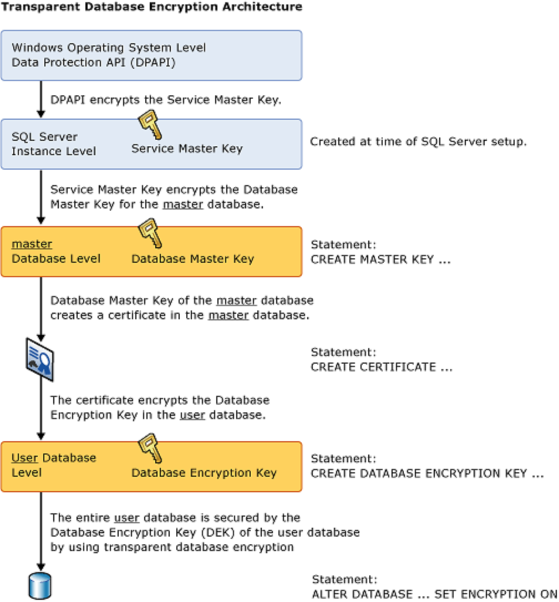

# Database Authentication and authorization

Azure SQL has several authentication and authorization options which are different from the options in SQL Server. Azure SQL rely on Azure Active Directory instead of Windows Server Active Directory

## Active Directory and Azure Active Directory

Windows Servec Active Directory uses  Kerberos protocol to provide authentication using tickets, and it's queried by the Lightweight Directory Access Protocol (LDAP). Azure Active Directory uses HTTPS protocols like SAML and OpenID Connect for authentication and uses OAuth for authorization.

You cannot join a Windows Server to an Azure Active Directory domain and work together to provide a single set of user identities. A service called Azure Active Directory Connect connects your Active Directory identities with your Azure Active Directory.

## Authentication and identities

Both on-premises SQL Server and Azure SQL on VM support two modes of authentication:

- SQL Server authentication - SQL Server-specific login name and password is stored within SQL Server, either in the master database, or in the case of contained users, within the user database.
- Windows Authentication - users connect to the SQL Server using the same Active Directory account they use to log into their computer.

Active Directory authentication is considered to be more secure because SQL Server authentication allows for login information to be seen in plain text while being passed across the network. Active Directory authentication makes it easier to manage user turnover, if a user leaves the company, the administrator would only have to lock the single Windows account of that user.

Azure SQL Database supports two modes of authentication:

- SQL Server - same authentication method supported in SQL Server
- Azure Active Directory - allows the user to enter the same username and password , which is used to access other resources as the Azure portal or Microsoft 365

Azure AD can be configured to sync with on-premises Active Directory allowing users to have the same usernames and passwords to access on-premises resources as well as Azure resources.

Azure AD adds on additional security measures by allowing to configure multi-factor authentication (MFA). With MFA, after the correct username and password is supplied, a second level of authentication is required. MFA can be configured to use the Windows Authenticator app, which will send a push notification to the phone. Additional options for MFA includes sending a text message with an access code, or enter an access code that was generated with Microsoft Authenticator app.

If a user has MFA enabled, they have to use the Universal Authentication with MFA option in Azure Data Studio and SQL Server Management Studio (SSMS).

Both Azure SQL Database and Azure Database for PostgreSQL support configuring the server that is hosting the database to use Azure AD Authentication. This login allows the admin access to all of the databases in the server. It is a best practice to make this account an Azure AD group, so access is not dependent on a single login. The Azure AD Admin account grants special permissions and allwos the account or group to have sysadmin like access to the server and all of the databases within the server. The admin account is only set using Azure Resource Manager (ARM) and not at the database level.

## Schemas and securables

SQL Server and Azure SQL have three scopes for securables. Securables are resources within the database which the authorization system manages access scopes. For example, a table is a securable. SQL Server contains securables in nested hierarchies called scopes. The three securable scopes are the server, the database and the schema. A Schema is a collection of objects whithin a dabatabes, which allows objects to be grouped into a separate namespace.

Every user has a default schema. If a user tries to access an object without specifying a schema name, as in ```SELECT name FROM customers```, it's assumed the object is in the user's default schema. If there's no such object in the default schema, SQL Server will check to see if the object is in the pre-defined dbo schema. If there's no object of the specified name in either user's default schema or in the dbo schema, the user will receive an error message. It's considered best practice to always specify the schema name when accessing objects ```SELECT name FROM Schema.customers``` If a user hasn't been given a default schema, it will be set to dbo.

If no schema is specified when a user creates an object, SQL Server will attempt to create it in the user's default schema. If the user hasn't been granted permission to create objects in their default schema, the object can't be created.

## Security Principals

Security principals are entities that can request SQL Server resources and to which you can grant permissions. Security principals exist at either the server level or the database level and can be individuals or collections. Some sets have a membership controlled by the SQL Server administrators, and some have a fixed membership.

At the database level there are users, database roles, application roles.

New logins ca be added by administrators on Azure SQL Database, but new server roles cannot be created.

## Logins and users

A login name used to access your SQL database is set up as a login within the instance. Those login are set up at the instance level of SQL Server and stored in the master database. You can configure contained users, which are added at the database level. These users can be configured as SQL Server Authentication users as well as either Windows Authentication users or Azure AD users. In order to create these users, the database must be configured for partial containment, which is configured by defaul in Azure SQL DB and optionally configurable in SQL Server.

These users only have access to the database that the user is set up with. For the purposes of Azure SQL DB, it's considered a best practice to create users at the scope of the user database, not in the master database.

```SQL
CREATE USER [dba@contoso.com] FROM EXTERNAL PROVIDER;
GO
```

The ```CREATE USER``` is executed in the context of the user database, the user is an Azure AD user as indicated with the ```FROM EXTERNAL PROVIDER```.

If the logins are created at the instance level in SQL Server, a user should then be created within the database, which maps the user to the server-based login.

```SQL
USE [master]
GO

CREATE LOGIN demo WITH PASSWORD = 'PASSWORD'
GO

USE [WideWorldImporters]
GO

CREATE USER demo FROM LOGIN demo
GO
```

Logins are used to access the SQL Server or the Azure SQL DB, but to do any work within a database, the login must be mapped to a username. The username is used for all authentication.

## Database roles

In order to make database security easier for administrator and auditors, most database applications use role-based security. Roles are security groups that share a common set of permissions. Combining permissions into a role allows a set of roles to be created for a given application. Some examples of roles would be administrators who had full access to all of the databases and servers, reporting users who only read the database, and an application account that had access to write data into the database.

The roles can be defined and then users can be assigned to those roles as they need access to the database. Role-based access control is a common architecture across computer systems and is how authorization is managed in Azure Resource Manager.

SQL Server and Azure SQL DB include built-in roles that are defined by Microsoft, and provide the option to create custom roles. Custom roles can be created at the server or database level. Server roles can't be granted access to objects within a database directly. Server roles are only available in SQL Server and Azure SQL Managed Instance, not in Azure SQL DB.

Within a database, permissions can be granted to the users that exist within the database. If multiple users need the same permissions, you can create a database role within the database and grant the needed permissions to this role and then users can be added as members of the role. Members of the database role will inherit the permissions of the database role.

```SQL
CREATE USER [User1] WITH PASSWORD = 'PASSWORD'
GO

CREATE USER [User2] WITH PASSWORD = 'PASSWORD'
GO

CREATE ROLE [Reader]
GO

ALTER ROLE [Reader] ADD MEMBER [User1]
GO

ALTER ROLE [Reader] ADD MEMBER [User2]
GO

GRANT SELECT, EXECUTE ON SCHEMA::Sales TO [Reader]
GO
```

## Application roles

Can also be created within a SQL Server database or Azure SQL DB. Unlike database roles, users aren't made members of an application role. An application role is activated by the user, by supplying the pre-configured password for the application role. Once the role is activated the permissions that are applied to the application role are applied to the user until that role is deactivated.

### Built-in database roles

Microsoft SQL Server contains fixed database roles within each database for which the permissions are predefined. Users can be added as members of one or more roles. These roles give their members a pre-defined set of permissions.

| Database role | Permission |
| ------------- | ---------- |
| db_accessadmin | Allows users to create other users within the database. Doesn't grant access to the schema or database. |
| db_backupoperator | Allows to back up a database in SQL Server or Azure SQL Managed Instance. Doesn't grant any permissions in Azure SQL DB. |
| db_datareader | Allows to read from every table and view within the database. |
| db_datawriter | allows to ```INSERT, UPDATE, DELETE``` data from every table within the database. |
| db_ddladmin | Allows to create or modify objects within the database. Members of this role can change the definition of any object, but aren't granted access to read or write data within the database |
| db_denydatareader | prevent from reading data in the database. |
| db_denydatawriter | Prevent from writing data in the database. |
| db_securityadmin | Allows to grant access to other users in the database. Members aren't granted access to the data, however members of this role can grant themselves access to the tables in the databases. Should be limited to only trusted users. |
| db_owner | Allows to perform any action in the database. However, unlike the actual database owner, who has the username dbo, users in the db_owner role can be blocked from accessing data by placing them in other database roles, such as db_denydatareader. Should be limited to noly trusted users. |

All users within a databse are automatically members of the public role. By default, this role has no permissions granted to it. Permissions can be granted to the public role. Granting permissions to the public role would grant these permissions to any user, including guest account.

By default, users in roles like db_owner can always see all of the data in the database. Applications can take advantage of encryption options like Always Encrpyted to protect sensitive data from privileged users.

Azure SQL DB has two roles that are defined in the master database of Azure SQL Server.

| Database role | Pemission |
| ------------- | --------- |
| dbmanager | Allows to create extra databases within the Azure SQL DB environment. This role is the equivalent of the dbcreator in on-premises SQL Server. |
| loginmanager | Allows to create extra logins at the server level. This role is equivalent of the securityadmin in on-premises SQL Server. |

### Fixed server roles

SQL Server and Azure SQL Managed Instance provide fixed server roles. These roles assign permissions at the scope of the entive server. Server level principals, which include SQL Server logins, Windows accounts, and Windows group can be added into fixed server roles. Fixed server roles are predefined, and no new server roles can be added.

| Fixed server role | Permission |
| ----------------- | ---------- |
| sysadmin | Allows to perform any activity on the server. |
| serveradmin | Allows to change server-wide configuration settings, and can shut down the server. |
| securityadmin | Allows to manage logins and their properties (changing password for example). Can also grant and revoke server and database level permissions. Should be treated as being equivalent to the sysadmin role. |
| processadmin | Allows to kill processes running inside the SQL Server. |
| setupadmin | Allows to add and remove linked servers using T-SQL. |
| bulkadmin | Allows to run the ```BULK INSTERT``` T-SQL. |
| diskadmin | Allows to manage backup devices. |
| dbcreator | Allows to create, restore, alter, and drop any database. |
| public | Every SQL Server login belongs to the public user role. Unlike the other fixed server roles, permissions can be granted, denied, or revoked from the public role. |

## Database and object permissions

All Relational Database Management platforms have four basic permissions, which control data manipulation language (DML) operations. These permissions are ```SELECT, INSERT, UPDATE, DELETE```, and they apply to all SQL Server platforms. All of these permissions can be granted, revoked or denied on tables and views. If a permissions is granted using ```GRANT```, then the permissions is given to the user or role referenced in the ```GRANT```. Users can also be denied using ```DENY```. If a user is granted a permission and denied the same permission, the ```DENY``` will always supersede the grant.

### Table and view permissions

Tables and views represent the objects on which permissions can be granted within a database. Within those tables and views, you can additionally restrict the columns that are accessible to a given security principal (user, or login). SQL Server and Azure SQL DB include row-level security, which can be used to further restrict access.

Azure SQL Db and SQL Server have other permissions which can be granted, revoked or denied.

| Permission | Definition |
| ---------- | ---------- | 
| CONTROL | Grant all rights to the object. Allows to perform any action againt the object. |
| REFERENCES | Grant the ability to view the foreign keys on the object. |
| TAKE OWNERSHIP | Allows o take ownership of the object. |
| VIEW CHANGE TRACKING | Allows to view the change tracking setting for the object. |
| VIEW DEFINITION | Allows to view the definition of the object. |

### Function and stored procedure permissions

| Permission | Definition |
| ---------- | ---------- | 
| ALTER | Grant the ability to change the definition of the object. |
| CONTROL | Grant the all right to the object. |
| EXECUTE | Allows to execute the object. |
| VIEW CHANGE TRACKING | Allows to view the change tracking setting for the object. |
| VIEW DEFINITION | Allows to view the definition of the object. |

### EXECUTE AS

The ```EXECUTE AS [user name]```, or ```EXECUTE AS [login name]``` (only available in SQL Server and Azure SQL Managed Instance) allows for the user context to be changed. Subsequent statements will be executed using the new context with the permissions granted to that context.

If user has a permission and no longer needs that permissions, it can be removed (either grants or denies) using ```REVOKE```. The revoke will remove any ```GRANT``` or ```DENY``` permissions.

### Ownership Chains

Allows users to inherit permissions from other objects. If the procedure has the same owner as the table, the stored procedure is able to be executed and access the table, even though the user executing the stored procedure doesn't have rights to access the table directly. This access is available because the user inherits the rights to access the table from the stored procedure, but only during the execution of the stored procedure, and only within the context of the stored procedures execution.

```SQL
USE AdventureWorks2016;
GO

CREATE USER [DP300User1] WITH PASSWORD = 'Pa55.w.rd';
GO

CREATE ROLE [SalesReader];
GO

ALTER ROLE [SalesReader] ADD MEMBER [DP300User1];
GO

GRANT SELECT, EXECUTE ON SCHEMA::Sales TO [SalesReader];
GO

CREATE OR ALTER PROCEDURE Sales.DemoProc
AS
SELECT P.Name, 
    SUM(SOD.LineTotal) AS TotalSales,
    SOH.OrderDate 
FROM Production.Product P
    INNER JOIN Sales.SalesOrderDetail SOD ON (SOD.ProductID = P.ProductID)
    INNER JOIN Sales.SalesOrderHeader SOH ON (SOH.SalesOrderID = SOD.SalesOrderID)
GROUP BY P.Name, 
    SOH.OrderDate
ORDER BY TotalSales DESC;

GO

EXECUTE AS USER = 'DP300User1';

SELECT P.Name, 
    SUM(SOD.LineTotal) AS TotalSales,
    SOH.OrderDate 
FROM Production.Product P
    INNER JOIN Sales.SalesOrderDetail SOD ON (SOD.ProductID = P.ProductID)
    INNER JOIN Sales.SalesOrderHeader SOH ON (SOH.SalesOrderID = SOD.SalesOrderID)
GROUP BY P.Name, 
    SOH.OrderDate
ORDER BY TotalSales DESC;

/* FAIL, USER DOESN'T HAVE DIRECT ACCESS TO THE TABLE*/

EXECUTE AS USER = 'DP300User1';

EXECUTE Sales.DemoProc;

/* SUCCESS, USER INHERITS PERMISSIONS FROM THE STORED PROCEDURE */
```

Permission changes don't apply when dynamic SQL is being used within stored procedures. Dynamic SQL breaks the permission chain because the dynamic SQL is executed outside of the context of the calling stored procedure.

```SQL
CREATE OR ALTER PROCEDURE Sales.DemoProc
AS
DECLARE @sqlstring NVARCHAR(MAX)

SET @sqlstring = '
SELECT P.Name, 
    SUM(SOD.LineTotal) AS TotalSales, 
    SOH.OrderDate 
FROM Production.Product P
    INNER JOIN Sales.SalesOrderDetail SOD ON (SOD.ProductID = P.ProductID)
    INNER JOIN Sales.SalesOrderHeader SOH ON (SOH.SalesOrderID = SOD.SalesOrderID)
GROUP BY P.Name, SOH.OrderDate'

EXECUTE sp_executesql @sqlstring
GO

--

EXECUTE AS USER = 'DP300User1'

EXECUTE Sales.DemoProc
```

### Principle of leat privilege

The concept is that users and applications should only be given the permissions needed in order for them to complete the task. Applications should only have permissions that they need to do in order to complete the task at hand.

If an application accesses all data through stored procedures, the application should only have permissions to execute stored procedures, with no access to the tables.

### Dynamic SQL

It is a concept where a query is built proframmatically. Dynamic SQL allows T-SQL statements to be generated within a stored procedure or a query itself.

```SQL
SELECT 'BACKUP DATABASE ' + name + ' TO DISK =''\\backup\sql1\' + name + '.bak'''
FROM sys.databases
```
This generated T-SQL typically will be executed using ```sp_executesql``` or passed to another program to execute.

## Identify authentication and authorization failures

A connection failure can result from reconfiguration, firewall settings, connection timeouts, or incorrect login information. If some Azure SQL DB, or Managed Instance resources are over capacity, you will not be able to connect.

### Transient fault

When heavy workloads increase in the SQL Database service, the Azure infrastructure is able to dynamically reconfigure servers, and the client application may lose connection to the database.

Transient faults occur during database reconfiguration of a planned or unplanned event.

List of a few transient errors:

- Cannot open database "%.*ls" requested by the login. The login failed.
- Cannot process request. Not enough resources to process request.
- Cannot process request. Too many operations in progress for subscription "%ld"

#### How to monitor transient connectivity errors

| Error | Action |
| ----- | ------ |
| Login failures | Look for any outages during the time when the application reported the errors at Microsoft Azure Service Dashboard |
| Database reaches resource limits | Monitor your database's compute and storage resources carefully, and take action when it reaches its resource limits to prevent transient failures. |
| Extended authentication failures | File an Azure support request through the Azure portal if your application encounters connectivity error for longer than 60 seconds or if it occurs more than once in a given day. |

### Retry logic

Developers should antecipate periodic transient failures when integrating with cloud services, and implement a retry logic. Setting a maximum number of retries before the program terminates.

The recommendation is to wait for 5 seconds at a minimum on the firs retry. Each subsequential retry should increase the delay exponentially, up to a maximum of 60 seconds.

If a SELECT fails with a transient error, don't directly retry it, instead, retry the SELECT in a new connection.

### Unable to log in to the server

When the error Login failed for user < Username> happens, the service administrator can follow the steps:

1. Check if the login is disabled by using the ```sys.sql_logins``` catalog view.
2. If the login is disabled, run ```ALTER LOGIN <user name> ENABLE;```
3. If the login does not exist, create it using ```CREATE LOGIN```
4. Connect to the database, nad run the ```CREATE USER```
5. Either assign the user a role usig ```ALTER ROLE``` or grant user access to database objects using ```GRANT```

### Connection string

When receive connectivity errors, it is a good practice to mke sure your connection string is working properly.

To retrieve the connection string:

1. Go to Azure portal
2. All services and then SQL databases
3. Connection strings

# Protect data in-transit and at rest

| Scenario | Definition |
| -------- | ---------- |
| Data at rest | Encrpyting while it's on file storage |
| Data in transit | Encrypting while it travels through network |
| Data in use | Encrypting while it's in RAM or CPU caches |

## Transparent Data Encryption

Transparent Data Encryption (TDE) encrypts all the data within a database at the page level. The data is encrypted as the data is written to the data page on disk and decrypted when the data page is read into memory. The result is that all data pages on disk are encrypted.

TDE doesn't encrypt data at the table or column level. Anyone with the appropriate permissions can read and copy the data. Encryption at rest provides protection against restoring a backup to an unsecured server or making a copy of the database transaction log filest and attaching them to another server. No decryption is done during the backup operation.

TDE protect data at rest, enabling software to encrypt data using the AES and 3DES algorithms without having to change existing applications.



Azure SQL DB created after May 2017 have TDE enabled automatically. Databases created before May 2017 will have TDE disabled by default and TDE will need to be manually enabled. TDE in enabled in databases created after February 2019 with Azure SQL Managed Instance.

By default, Azure SQL databases are encrypted using a Microsoft provided certificate, however Microsoft Azure does provide a Bring Your Own Key option. If the Azure certificate is removed, then the database connections will be closed and there will be no access to the database.

Enabling TDE:

1. Set a master key in the master database ```CREATE MASTER KEY ENCRYPTION```
2. Create a certificate in the master database ```CREATE CERTIFICATE```
3. Create a database encryption key ```CREATE DATABASE ENCRYPTION KEY```
4. Enable database encryption key ```ALTER DATABASE```

```SQL
USE master;
GO

CREATE MASTER KEY ENCRYPTION BY PASSWORD = 'Pa55.w.rd';
GO

CREATE CERTIFICATE MyServerCert
    WITH SUBJECT = 'TDEDemo_Certificate';
GO

USE [TDE_Demo];
GO

CREATE DATABASE ENCRYPTION KEY
    WITH ALGORITHM = AES_256 ENCRYPTION BY SERVER CERTIFICATE MyServerCert;
GO

ALTER DATABASE TDE_Demo SET ENCRYPTION ON;
GO
```

After TDE is enabled, it will take some time in order to encrypt the database as each database page must be read, encrypted and written back to disk. This process is a background process and is run at a low priority in order to not overload the I/O or the CPU.

Once the certificate has been created, it must be mannually backed up and stored in a safe place. SQL Server integrates with Enterprise Key Managers (EKMs) such as Azure Key Vault.

If the certificate is lost and the database needs to be restored from a backup, the restore will fail.

To use TDE with databases in an Always On Availability Group, the certificate used to encrypt the dasabase must be backed up and restored to the other servers.

### Azure disk encryption

Azure VMs include a feature called Azure Disk Encryption which adds an extra layer of security that helps to protect and safeguard data and meet compliance commitments.

## Server and database firewall rules

Firewalls are used to prevent unauthorized users from accessing protected resources. Each Azure SQL DB maps to a public IP address. Each Azure region will have one or more public IP addresses that can reach database gateway, which will lead to the database.


### Server-level firewall rules

Both server and database level firewalls use IP Address rules and allow users at the same public IP Address to acces the SQL Server. For most use-cases, this is the outbound IP Address.

Server-level firewalls are configured to allow users to connect to all databases on the server.

Server level firewall rules can be configured using the Azure portal or using the ```sp_set_firewall_rule``` stored procedure from within the master database.

The "Allow Azure Services and resources to access this server" setting counts as a single firewall rule when enabled.

### Database-level firewall rules

Database-level firewall rules are configured through T-SQL only using the ```sp_set_database_firewall_rule``` stored procedure from within the user database.

Upon connection, Azure SQL DB will look first for a database-level firewall rule for the database name specified in the connection string. If it does not exist, the firewall will check the server-level IP firewall rules. Server-level IP firewall rules apply to all databases on the server.

If neither exist and the user is connecting through SSMS or Azure Data Studio, they'll be prompted to create a firewall rule.

## Virtual network endpoints

Virtual network endpoints allow traffic from a specific Azure Virtual Network. These rules apply at the server level.

The service endpoint applies to only one region.

The virtual network that is connecting to the Azure SQL Db must have outbound access to the public IP address for Azure SQL Db, which can be configured using service tags for Azure SQL Db.

### Private link

Private link feature allows to connect to Azure SQL DB using a private endpoint.

A private endpoint allows for a connection to go entirely over the Azure backbone and not oner the public internet.

This feature provides a private IP address on the Virtual Network. It allows for Azure Express Route connections through that circuit.

Private link offers cross-region private connectivity and protection against data leakage by allowing connections to specific resources.

## Object encryption and secure enclaves

SQL Server supports encrypting data within columns using Always Encrypted. Once data is encrypted, the application accessing the database must have the correct certificate in order to view the plain text data.

### Always Encrypted

Allows for the encryption of data within the client application, protecting sensitive data from malware and high-privileged users, such as Database Administrators, server admins, cloud admins, or those who manage the data but should have no access. This encryption happens automatically based on the settings within the SQL Server database, which tell the application what the encryption settings on the database columns are.

Scenarios for usage:

- Client and data on-premises - need to protect on-premises database from high-privileged users.
- Client on-premises with data in Azure - ensure cloud administrators have no access to the data, Always Encrypted keys are stored in key store hosted on-premises.
- Client and Data in Azure - while doesn't isolate data from cloud administrators, still benefits from the fact that the data is encrypted in the database.

Always Encrypted is based on a master and a columnn encryption key. Having both keys allows each column to be encrypted using a different encryption key for maximum data protection.

There are two different types of encryption:

- Deterministic - always encode a value as the same string, which allows to compare columns to a constant using equality and inequality operations, and to compare columns with each other to perform joins, grouping, and indexing.
- Randomized - the same value isn't always encrypted the same way. The only thing you can do with columns with Randomized encryption is to return them in the results.

Randomized encryption is more secure than Deterministic, but is more limited. The type of encryption can't be changed after the column is created. It's recommended to use Randomized encryption for columns that had a few well-known distinct values that could pottentially be guessed by someone with access to the encrypted values.

Each column being encryted may have its own key which is the key that actually performs the data encryption

You create the column master key, which is used to encrypt the column encryption keys. You can supply your own key, if you're using T-SQL to encrypt the columns. This key must be stored in a key store such as Windows Certicicate Store, Azure Key Vault, or a hardware security module. The database engine never stores the column master key, and only contains the metadata about where it's stored. Not storing the master key protects data access from users who have full access to the database.

Never generate the keys on teh server hosting your database, as the key could pontentially be extracted from memory on that server.

In order to decrypt data from Always Encrypted column, the application needs an Always Encrypted driver to connect to the database

1. The application has access to the key store where the Always Encrypted keys are stored
2. The application then retrieves the data
3. Data that is written back to the database is encrypted at the client through the driver

In addition to the driver, the application's connection string needs to have the setting Column Encryption Setting=enabled. This setting will cause a metadata lookup to be made for each column that is used by the application

### Secure enclaves

Always Encrypted supports a feature called secure enclaves, which allows more robust querying of encrypted data.

A secure enclave is a secured region of memory within the SQL Server process that acts as a trusted execution environment for processing encrypted data. This enclave appears as a black box to SQL Server, and it isn't possible to view any data or code, even with a debugger.

It also addresses some of the limitations of Randomized encryption, which enables pattern matching, comparison operations, and indexing on columns using the encryption type.


## Encrypted connections

It is possible to encrypt data in-transit between an instance of SQL Server and a client application with Transport Layer Security (TLS). 

### Transport Layer Security (TLS)

TLS is a protocol for encryting connections, and it increases the security of data being transmittted across networks.

Once a private certificate is issued by a certificate authority, and it has been assigned to a server running a SQL Server instance, the server can then use it to securely validate client requests. Such validation requires that the computer running the client application is configured to trust the certificate used by SQL Server.

For Azure SQL DB, it is possible to enforce a minimal TLS version at the server level. The TLS versions currently supported are 1.0, 1.1 and 1.2. It's rocommended to set to the latest TLS version supported.

| Scenario | Option |
| -------- | ------ |
| TLS not supported | Leave the minimum TLS version at the default |
| Latest TLS version supported | Set the minimum TLS version to 1.2 |
| Older TLS version supported | Set the minimum TLS version to 1.0 or 1.2. Evaluate your workloads for TLS 1.2 readiness and develop a migration plan |

When the fraffic between SQL Server and a client application is encrypted with TLS, an extra network roundtrip and additional processing are required at connect time.

For Azure Managed Instance, use ```az sql mi update``` or ```AzSqlInstance``` to configure the minimum TLS version.

By default Azure SQL DB does not require a specific minimum TLS version. Once you enforce a version of TLS, you can no logner revert to the default

### Certificates

You must run SQL Server Configuration Manager with a local administrator account in order to install certificates for use by SQL Server.

The certificate must satisfy the conditions:

- The certificate must be located in the local computer certificate store or the current user certificate store.
- The SQL Server service account must have permission to access the certificate
- The certificate must be within a valid period

If the correct access is not provided, restarting SQL Server service will fail.

### Configure SQL Server instance

To configure SQL Server instance to use encrypted connections:

1. Open the SQL Server Configuration Manager, and expand SQL Server Network Configuration, right-click Protocols for <instance> and select Properties
2. Select Certificate
3. On the Flags tab, in ForceEncryption property secet YES and click OK
4. Restart SQL Server service

To test the connection through the SSMS

1. In the Connect to Server, fill the connection information and click Options
2. On the Connection Propertios, click Encrypt connection and the Connect

## SQL injection

The core of the attack in that an SQL command is appended to the back end of a form field in the web or application front end, with the intent of breaking the original SQL Script and then executing the SQL script that was injected into the form field. Most often happens when you have dynamically generated SQL within your client application.

One technique used to prevent SQL injection attacks is to inpect the text of the parameters, or values entered into the form fields, looking for vairous keywords. However this solution only provides minimum protection as there are may ways to force these attacks to work, some techniques include passing in binary data, having the database engine convert back to a text string, and then executing the string.

One way to ensure that the value won't be used for an SQL injection is to validate that the data was entered is of the expected data type. If a string is expected, then ensure that the text string is of the correct length, and it does not contain any binary data within it.

## Azure Key Vault

Azure Key Valut is a tool used for storing and accessing secrets. Whether they be passwords, certificates or keys, Key Vault acts as a secure area for those secrets to be accessed in a secure fashion, typically programmatically. Key Vault data has its own RBAC policies, separate from the Azure subscription. This means someone who is the role of subscription admin will not have access to the Key Vault unless explicitly granted.

SQL Server, supports Azure Key Vault to store certificates for TDE, Backup Encryption and Always Encrypted.

In order to configure Key Vault integration, you need to set the Key Vault URL, the Principal name, the Principal secret, and the name of the credential.

Configuring SQL Server to connect to Key Vault requires creating a normal SQL Server Login within the instance, a credential needs to be created and mapped to the login. For the identity of the credential, the name of the key vault should be used. For the secret of the credential, use the application ID from Azure Key Vault

Once the credential is created, an asymmetric key can be created within the Azure Key Vault. An asymmetric key can be created within the SQL Server database. The key in database can be mapped to the Azure Key Vault asymmetric key using the ```CREATE ASYMMETRIC KEY``` with the ```FROM PROVIDER```. Once an asymmetric key is created within the database, that key can be used for TDE, Backup Encryption or Always Encrypted.

## Data classification

Confidential data stored within SQL Server, should eb classified within the database. This classification allows users as well as other applications to know the sensivity of the data that is being stored.

Data classification is done on a column by column basis. It is possible for a single table to have some columns be public, some columns be confidential, and some columns highly confidential.

With SQL Server 2019 this metadata is stored in a catalog view called ```sys.sensitivity_classification```.

You can access data classification by selecting Data Discovery and Classification, under Security section in the Azure portal.

The classification engine scans the database and locates columns with names that indicate that the column could have sensitive information.

Columns can also be classified using the sensitivity wizard in SSMS or by using ```ADD SENSIVITY CLASSIFICATION``` T-SQL

```
ADD SENSITIVITY CLASSIFICATION TO
    [Application].[People].[EmailAddress]
WITH (LABEL='PII', INFORMATION_TYPE='Email')

GO
```
Classification of data allows to easily identify the sensitivity of data. Knowing what columns contain sensitive data allows for easier audits and to more easily identify columns for data encryption.

### Customize classification

Data Discovery & Classification is part of Microsoft Defender for Cloud. You can customize the taxonomy of sensitivity lobels and define a set of classification rules.

You can create and manage sensivity labels as part of policy management by selecting Data Discovery and Classification and then Configure.

Once you define patterns, they are added automatically to the discovery logic.

Only users with administrative rights on the organization's root manaagement group can create and manage sensitivity labels.

## Server and database audit

Azure SQL auditing tracks database events and writes them to an audit log in Azure Storage account, Log Analytics workspace or Event Hubs. It enables to maintain regulatory compliance, analyze activity patterns, and identify deviations that may indicate security violations.

You can define server-level and database-level policies. Serever policies automatically cover new and existing databases

- If server auditing is enabled, the database will be audited, regardless of the database settings
- You can also enable it on the database. This allows both audits to exist simultaneously.

It is best not to enable both, unless:

- A different storage account, retention period or Log Analytics Workspace is used for a specific database
- An audit is needed for a specific database that differs from the rest on the server.

For all other cases, is recommended to enable only server-level auditing.

| Action group | Definition |
| ------------ | ---------- |
| BATCH_COMPLETED_GROUP | Audits all the queries and stored procedures executed against the database |
| SUCCESSFUL_DATABASE_AUTHENTICATION_GROUP | Indicates that a principal succeed to log into the database. |
| FAILED_DATABASE_AUTHENTICATION_GROUP | Indications that a principal failed to log into the database |

To enable auditing, select Auditing in the Security section. The Auditing page allows to set the audit log destination and whether track Microsoft support engineer operations no the same log destinantion.

You can review the audit logs of Microsoft Support operations in your Analytics workspace:

```
AzureDiagnostics
| where Category == "DevOpsOperationsAudit"
```

The auditing services are optimized for availability and performance. SQL Server may not record some audited events when there is a high rate of activity or high network load.

Auditing on Read-ONly replicas is automatically enabled.

### Audit sensitive labels

When combined with data classification, you can also monitor access to sensitive data. Auditing han been enhanced to include a new field in the audit log called ```data_sensitivity_information```

Auditing consists of tracking and recording events that occur in the database engine.

## Dynamic Data Masking

Dynamic Data Masking works by obfuscating data in order to limit its exposure. Users who donot need to see sensitivy data can view the column that contains the data, but no the actual data itself. Dynamic Data Masking works at the presentation layer, and that unmasked data will always be visible by high privileged users.

Dynamic Data Masking has the advantage that it doesn't require many modifications to the application or database.

```
ALTER TABLE [Application].[People] ALTER COLUMN [PhoneNumber] ADD MASKED WITH (FUNCTION = 'partial(0, "XXX-XXX-", 4)`)
```

In addition to  T-SQL, if you are using Azure SQL DB, you can create dynamic masking rules in the Azure portal.

Dynamic Data Masking suppots the following masking patterns:

| Making function | Definition | T-SQL example |
| --------------- | ---------- | ------------- |
| Default | Masks the data in the column without exposing any part of the values to the user. The user would see XXXX for string values, 0 for numbers, and 01.01.1900 for date values. | ALTER TABLE [Customer] ALTER COLUMN Address ADD MASKED WITH (FUNCTION = 'default()') |
| Credit card | Masks all but the final four characters, allowing users to view the final four digits. This masking can be useful for customer service agents who need to view the last four digits of a credit card number but who do not need to see the entire number. The data is shown in the usual format of a credit card number XXXX-XXXX-XXXX-1234. | ALTER TABLE [Customer] ALTER COLUMN Address ADD MASKED WITH (FUNCTION = 'partial(0,"XXXX-XXXX-XXXX-",4)') |
| Email | Only the first letter and the trailing domain suffix are not masked; for example, “aXXX@XXXXXXX.com
" | ALTER TABLE [Customer] ALTER COLUMN Email ADD MASKED WITH (FUNCTION = 'email()') |
| Number | This masking format should be used on numeric columns. It shows a random number as the masked value instead of the actual value. With each query, a different number is displayed. | ALTER TABLE [Customer] ALTER COLUMN [Month] ADD MASKED WITH (FUNCTION = 'random(1, 12)') |
| Custom string | This option allows text to be masked with any value, and to display a custom number of characters at either end of the masked value. If the length of the value being masked is equal to or less than the number of characters which the mask specifies are to be displayed, then only the masked characters are displayed. | ALTER TABLE [Customer] ALTER COLUMN [PhoneNumber] ADD MASKED WITH (FUNCTION = 'partial(1,"XXXXXXX",0)') |

To enable users to retrieve unmasked data from the columns, you need to explicitly grant ```UNMASK``` permission.

It is possible to identify masked data using inference based on the results. If you are using data masking, you should also limit the ability of the user to run ad hoc queries. For that reason it is highly recommended to use dynamic data masking in conjunction with other security features, such as auditing, encryption, row level security in order to better protect sensitive data.

### Use case

Data masking is a simple and lightweight feature:

- Mask data from application users who have no direct access to the database
- Restricting private information for a group of users
- Provide masked data to external vendors, where you need to protect sensitive information while still preserving the relationship among items in the data
- Export a copy of your production database to a lower environment to a lower environment for development purpose with a user who doesn't have ```UNMASK``` permission. The export of the data will be in a masked format.

### Import and export data

Copying data from a masked column to another table using ```SELECT INTO``` or ```INSERT INTO``` results in masked data in the target table. 
When a user without ```UNMASK``` privilege runs SQL Server Import and Export, the exported data file will contain masked data, and the imported database will contain inactively masked data.

## Row level security

Row-level security (RLS) doesn't use encryption and operates at the database level to restrict access to a table by using a security policy based on group membership or authorization context. This functionally is equivalent to a ```WHERE``` clause.

The security policy invokes an inline table-valued function to protect access to the rows in a table

Depending on the attribute of a sure, the predicate determines if that user has to the relevant information. When you run a query against a table, the security policy applies the predicate function.

There are two types of security policies supported by row-level security

Filter predicates - restrict data access that violates the predicate

| Access | Definition |
| ------ | ---------- |
| SELECT | Can't view rows that are filtered |
| UPDATE | Can't update rows that are filtered |
| DELETE | Can't delete rows that are filtered |
| INSERT | Not Applicable |

Block predicates - restrict data changes that violate the predicate

| Access | Definition |
| AFTER INSERT | Prevent users from inserting rows with values that violate the predicate |
| AFTER UPDATE | Prevents users from updating rows to values that violate the predicate |
| BEFORE UPDATE | Prevents users from updating rows that currently violate the predicate |
| BEFORE DELETE | Blocks delete operations if the rows violates the predicate |

Because access control is configured and applied at the database level, application changes are minimal. Users can directly have access to the tables and can query their own data.

Row-level security is implemented in three main steps:

1. Create the users or groups you want to isolate access
2. Create the inline table-valued function that will filter the results based on the predicate defined
3. Create a security policy for the table, assigning the function created above.

```
-- Create supporting objects for this example
CREATE TABLE [Sales] (SalesID INT, 
    ProductID INT, 
    TenantName NVARCHAR(10), 
    OrderQtd INT, 
    UnitPrice MONEY)
GO

INSERT INTO [Sales]  VALUES (1, 3, 'Tenant1', 5, 10.00);
INSERT INTO [Sales]  VALUES (2, 4, 'Tenant1', 2, 57.00);
INSERT INTO [Sales]  VALUES (3, 7, 'Tenant1', 4, 23.00);
INSERT INTO [Sales]  VALUES (4, 2, 'Tenant2', 2, 91.00);
INSERT INTO [Sales]  VALUES (5, 9, 'Tenant3', 5, 80.00);
INSERT INTO [Sales]  VALUES (6, 1, 'Tenant3', 5, 35.00);
INSERT INTO [Sales]  VALUES (7, 3, 'Tenant4', 8, 11.00);

-- View all the rows in the table  
SELECT * FROM Sales;

CREATE USER [TenantAdmin] WITH PASSWORD = '<strong password>'
GO
CREATE USER [Tenant1] WITH PASSWORD = '<strong password>'
GO
CREATE USER [Tenant2] WITH PASSWORD = '<strong password>'
GO
CREATE USER [Tenant3] WITH PASSWORD = '<strong password>'
GO
CREATE USER [Tenant4] WITH PASSWORD = '<strong password>'
GO

GRANT SELECT ON [Sales] TO [TenantAdmin]
GO
GRANT SELECT ON [Sales] TO [Tenant1]
GO
GRANT SELECT ON [Sales] TO [Tenant2]
GO
GRANT SELECT ON [Sales] TO [Tenant3]
GO
GRANT SELECT ON [Sales] TO [Tenant4]
GO

CREATE SCHEMA sec;  
GO  

--Create the filter predicate

CREATE FUNCTION sec.tvf_SecurityPredicatebyTenant(@TenantName AS NVARCHAR(10))  
    RETURNS TABLE  
WITH SCHEMABINDING  
AS  
    RETURN	SELECT 1 AS result
			WHERE @TenantName = USER_NAME() OR USER_NAME() = 'TenantAdmin';  
GO

--Grant users access to inline table-valued function

GRANT SELECT ON sec.tvf_SecurityPredicatebyTenant TO [TenantAdmin]
GO
GRANT SELECT ON sec.tvf_SecurityPredicatebyTenant TO [Tenant1]
GO
GRANT SELECT ON sec.tvf_SecurityPredicatebyTenant TO [Tenant2]
GO
GRANT SELECT ON sec.tvf_SecurityPredicatebyTenant TO [Tenant3]
GO
GRANT SELECT ON sec.tvf_SecurityPredicatebyTenant TO [Tenant4]
GO

--Create security policy and add the filter predicate
CREATE SECURITY POLICY sec.SalesPolicy  
ADD FILTER PREDICATE sec.tvf_SecurityPredicatebyTenant(TenantName) ON [dbo].[Sales]
WITH (STATE = ON);  
GO

EXECUTE AS USER = 'TenantAdmin';  
SELECT * FROM dbo.Sales;
REVERT;  
  
EXECUTE AS USER = 'Tenant1';  
SELECT * FROM dbo.Sales;
REVERT;  
  
EXECUTE AS USER = 'Tenant2';  
SELECT * FROM dbo.Sales;
REVERT;

EXECUTE AS USER = 'Tenant3';  
SELECT * FROM dbo.Sales;
REVERT;

EXECUTE AS USER = 'Tenant4';  
SELECT * FROM dbo.Sales;
REVERT;
```

There is a risk of information leakage if an attacker writes a query with a specially crafted ```WHERE``` clause and, for example , a divide-by-zero error, to force an exception if the ```WHERE``` condition is true. This is known as a side-channel attack. It is wise to limit the ability of users to run ad hoc queries when using row-level security.

### Use case

- When you need to isolate department access at the row level
- When you need to restrict customer's data access to only the data relevant to their company
- When you need to restrict access for compliance purposes

### Best practice
- It's recommended to create a separate schema for predicate functions, and security policies
- Whenever possible, avoid type conversions in predicate functions
- To maximize performance, avoid using excessive table joins and recursion in predicate functions.

## Microsoft Defender for SQL

Microsoft Defender for SQL offers a suite of protections for Azure SQL DB and Managed Instance as part of the advanced SQL security features, including SQL vulnerability assessment and Advanced Threat Protection

### SQL vulnerability assessment

SQL vulnerability assessment is a service that uses a knowledge base of security rules to flag items that don't comply when they're scanned. It checks your database for security best practices, and providing visibility into your security state, such as misconfigurations, excessive permissions, and exposure of sensitive data.

To see recommendations, you must enable Microsoft Defender for SQL at the subscription level. You also need to provide a storage account.

The vulnerability assessment feature can detect potential risks in your environment, and enhance database security. It also provides insight into your security state and actionable steps to resolve security alerts.

### Advanced Threat Protection

Advanced Threat Protection monitors the database connections and the queries that are executed in order to detect potentially harmful activities.

| Alerts | Definition |
| ------ | ---------- |
| Vulnerability to SQL injection | This alert looks for T-SQL code coming into your database that may be vulnerable to SQL injection attacks. An example would be a stored procedure call that didn't sanitize user inputs. |
| Potential SQL injection | This alert is triggered when an attacker is actively attempting to execute a SQL injection attack. |
| Access from unusual location | This alert is triggered when a user logs in from an unusual geographic location. |
| Access from unusual Azure data center	| This alert is looking for attacks from an Azure data center that isn't normally accessed. |
| Access from unfamiliar principal | This alert is raised when a user or applications log on to a database that they haven't previously accessed. |
| Access from a potentially harmful application	| This alert detects common tools that are used to attack databases. |
| Brute force SQL credentials | This alert is triggered when there a high number of log in failures with different credentials. |

To get maximum benefit out of it you'll want to enable auditing on the databases. Enabling auditing will allow for deeper investigation into the source of the problem if Advanced Threat Protection detects an anomaly.

### How to enable Microsoft Defender for SQL

You must belong to either the SQL security manager role, or one of the database or server admin role to manage Microsoft Defender for SQL settings

Enable Microsoft Defender for SQL from the main blade selection Microsoft Defender for Cloud and then the Configure.

## Azure SQL Database Ledger

The ledger feature provides tamper-evidence capabilities in your database. You can cryptographically attestto other parties, such as aditors or other business parties, that your data hasn't been tampered with

### How it works

Using the ledger feature of the Azure SQL DB, you can provide concrete proof to auditors, business partners or any  interested parties what data has been changed or tampered with.

A traditional ledger is defined as a collection of accounts of a particular type. It provides transparent protection of your data from bad actors including but not limited to attackers or even database or cloud administrators. 

Each transaction that the database receives is cryptographically hashed (SHA-256). The function cryptographically links all transactions together, like a blockchain.

Azure Ledger function currently exists for tables in two forms: The Updatable ledger and the Append-only ledger.

#### Updatable ledger tables

Can be used for applications that issue updates, deletes and inserts. It works well for system of record applications and transactional systems where matter of fact record keeping and auditing is required and happen. The updatable ledger tables track history of changes to any rows and uses the built-in system versioning to create a history table that stores the previous version of the row for full history is kept for any updates or deletes.

#### Append-only ledger tables

Works well with insert only applications such as an accounting system, which still needs auditing or security information and event management (SIEM) applications. The append-only ledger tables blocks all updates and deletes at the API level so not only does it provide certainty, it aides in management.

### Benefits

- Ease Audits - audits are frquently enacted to ensure that proper security controls are in place to reducte potential attacks, bacup and restore practices are as required and thorough disaster recovery procedures are in place. Ledger provides documented proof that your data hasn't been altered.
- Increased trust - can help establish trust between multiple-party business processes without the complexity and performance implications that network consensus can introduce
- Data integrity - Querying the data on a blockchain network without socrificing performance can be a serious challenge. Ledger provides data integrity for off-chain storage of blockchain networks, which helps ensure complete data trust through the entire system.


The setting "Enable for all future tables in this database" ensures that all future tables in the database will be ledger tables. For this reason, all data in the database will show any evidence of tampering. By default new tables will be created as updatale ledger tables, even if you don't specify ```LEDGER = ON``` in the ```CREATE TABLE```
You can leave this option unselected. You're then required to enable ledger functionality on a per-table basis when you create new tables by using T-SQL

## Azure Purview

Microsoft Purview is a unified data governance service that helps you manage and govern you on-premises, multi-cloud, and SaaS data. Create a map of your data landscape with automated data discovery, sensitivy data classification, and end-to-end data lineage.

### How it works

Microsoft Purview automates data discovery by providing data scanning and classification as a service for assets across your data estate. Metadata and descriptions of discovered data assets are integrated into a map of your data estate. Atop this map, there are apps that create environments for data discovery, access management and insights about your data landscape

### Create a unified map of data across the entire data domain

- Automate and manage hybrid resource metadata
- Classify data using integrated and custom classifications and information protection sensitivity labels
- Ensure consistent labeling of sensitive data across SQL Server, Azure, Microsoft 365, Power BI
- Easily integrate all your data systems using Apache Atlas APIs

### Make data easy to find

- Ensure optimal business value for your data user's data with Microsoft Purview Data Catalog
- Eliminate the need for data dictionaries in Excel with a business-level business dictionary
- Gain insight into the origin of your data with interactive visualization of data origin.
- Provide data scientists, engineers, and analysts with the data they need for BI, analytics, AI, and machine learning.

### Get an overview of sensitive data

- View your entire data domain and its distribution by asset dimension, such as source type, classification, and file size
- Receive status updates on the number of scans that passed, failed, or canceled.
- Get key insights to add or redistribute glossary terms for better search results

## Requirements

- Access to Microsoft Azure
- Ability to create Azure resources
- Access to data sources
  - For Data Lake Storage, the Reader role is required
  - For Azure SQL, the identity must be able to query tables
- Access to Microsoft Defender for Cloud or ability to collaborate with Defender for Cloud ADmin for data labeling
- Active Microsoft Purview account
- Data Source Administrator and Data Reader to register a source and manage it in the Microsoft Purview governance portal

## Security considerations

### Firewall settings

- ALlow Azure connections through the firewall
- Install self-hosted integration runtime - install a self-hosted integration runtime on a machine in your network and give it access through the firewall. If you have a private VNet, or have any other closed network, using a self-hosted integration runtime within that network will allow you to fully manage traffic flow and utilize your existing network.
- Use a managed virtual network - You can use the Azure integration runtime in a closed network by setting up a managed virtual network using your Microsoft Purview account to connect to Azure SQL

### Authentication

To scan your data source, you'll need to configure an athentication method in the Azure SQL Database.
- System-assigned managed identity (recommended) - this is an identity associated directly with your Microsoft Purview account that allows to authenticate directly with other AZure resources without needing to manage a go-between user or credential set. The system-assigned managed identity is created when your Microsoft Purview resource is created, is managed by Azure, and uses your Microsoft Purview account's name. The system-assigned managed identity can't currently be used with a self-hosted integration runtime for Azure SQL.
- User-assigned managed identity (preview) - Similar to system-assigned identity, a user-assigned managed identity is a credential resources that allows Microsoft Purview to authenticate against Azure Active Directory. The user-assigned managed by users in Azure, rather than by Azure itself, which gives your more control over security. The user-assigned managed identity can't currently be used with a self-hosted integration runtime for Azure SQL. 
- Service Principal - is an application that can be assigned permissions like any other group or user, without being associated directly with a person. Their authentication has an expiration date
- SQL Authentication - Connect to the SQL database with a username and password

If you are using a self-hosted integration runtime to connect to your resource, you need to use service principal or SQL authentication.

### Data lineage

Generally, data lineage represents the journey the data takes from its origin to where it moves across the data estate over time. Among its many uses are troubleshooting, tracing the root cause in data pipelines and debugging.

Microsoft Purview Data Catalog connects with other data storage, processing, and analytics platforms to collect lineage information. As a result, the Catalog contains a generic, scenario-specific lineage experience.

At the time of setting up a scan, you can enable lineage extraction toggle button to extract lineage information.